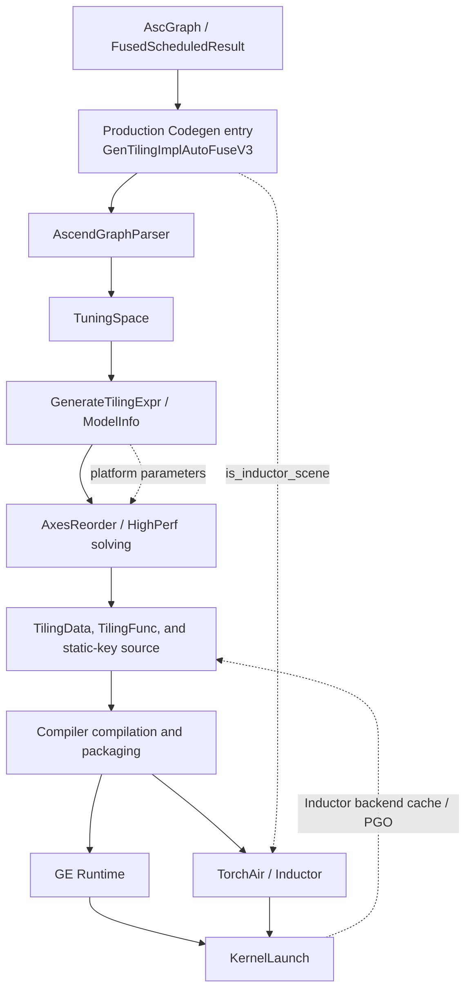
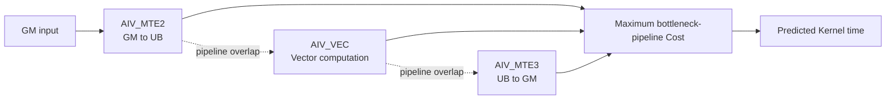
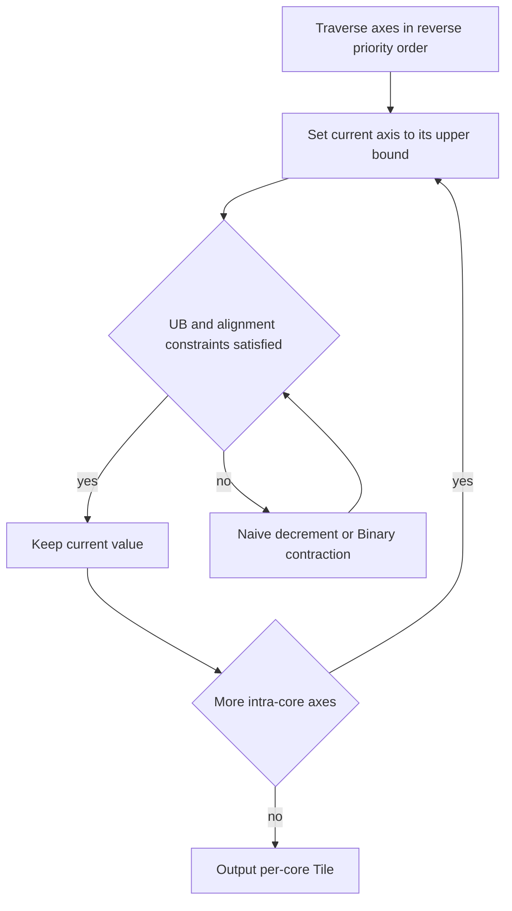
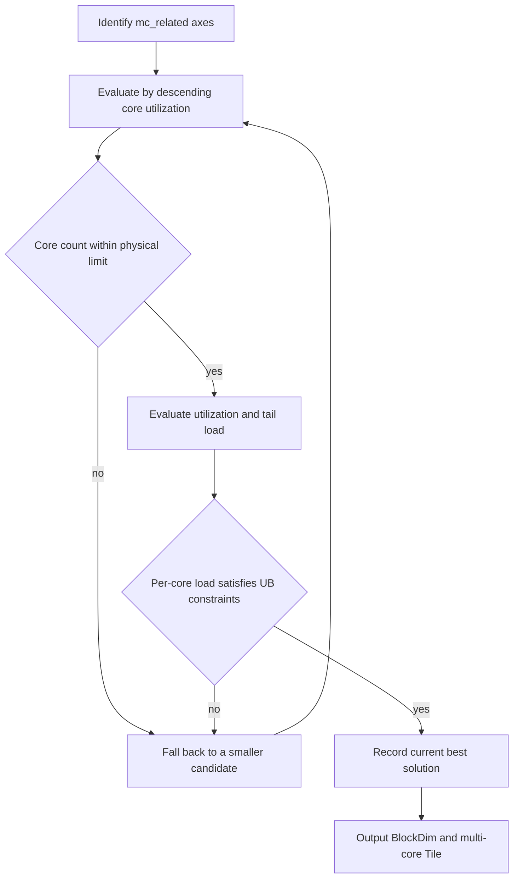
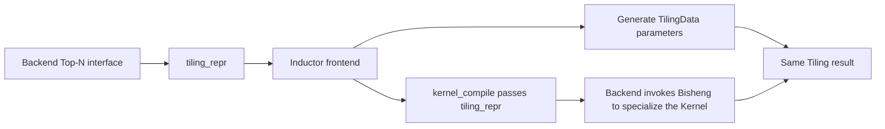
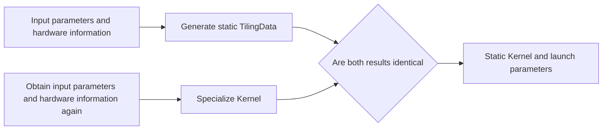

# Auto Tiling (ATT) Feature Design

## 1. Background

### 1.1 Objective

This document describes the design, implementation boundaries, and cross-component constraints of Auto Tiling (ATT). It is intended for developers of Autofuse, GE, TorchAir/Inductor, Runtime, and operators. It focuses on constraints that cannot be inferred from code alone, including chip adaptation, static Tiling determinism, the TilingData size limit, and cross-repository ABI compatibility.

### 1.2 Scope

This document covers ATT-related flows in `autofuse/att`, `autofuse/v35/att`, `autofuse/codegen`, and `autofuse/common/autofuse_config`, and explains their relationships with Autofuse graph optimization, GE Runtime, TorchAir Inductor, and CANN packaging. Auto Tiling currently solves only Vector+Vector (VV) fusion. For CV fusion, the Cube Tiling module provides the basic Cube tiling block; Auto Tiling handles only the Vector tiling within its responsibility and the integration of combined generated code. OOTD offline chip selection, which has not been designed, and an ABI for user-provided Tiling shared libraries are outside the scope.

## 2. User Scenarios

### 2.1 Software Overview

#### 2.1.1 Positioning

ATT converts an ASCIR fusion graph and its scheduling result into a Tiling function, a TilingData definition, and auxiliary interfaces. At compile time, it enumerates ScheduleGroup/TilingCase candidates and solves them using hardware resource constraints and API performance models. At runtime, the generated Tiling function selects TilingData from the actual inputs, after which GE or TorchAir launches the Kernel.

ATT is part of Autofuse Codegen and does not rewrite the graph. The upstream optimization phase controls the fusion scope. ATT generates compilable and executable Tiling code with deterministic selection for the given fused graph.

#### 2.1.2 Product Environment

For online execution, `PlatformContext` queries the Runtime platform capability interface for the chip. The current implementation obtains the SoC architecture through `rtGetSocSpec("version", "NpuArch", ...)` and also queries the number of Vector Cores and the UB and L2 sizes. In offline ATC scenarios, the chip is specified using the ATC `--soc_version` option. Offline OOTD scenarios have not been designed or implemented.

Generated code is delivered with CANN/Autofuse and loaded by GE Runtime or TorchAir Inductor. GE and graph-autofusion are normally released as a matching set. TorchAir and Autofuse are released in the torch_npu and CANN packages respectively, so the ABI between generated code and frontend loading logic must remain compatible.

### 2.2 Main Functions

- Generate Tiling functions and TilingData definitions from `AscGraph` or `FusedScheduledResult`.
- Parse tensors, axes, memory, Workspace, BlockDim, and scheduling information to build the feasible region and performance objective.
- Select Tiling with the default AxesReorder solver. HighPerf is retained only for experiments and may be removed later.
- Generate auxiliary interfaces required for single Group, multiple Groups, Inductor constant TilingData, and PGO in VV fusion. In CV fusion, integrate the basic Cube tiling block supplied externally instead of solving that block in Auto Tiling.
- Provide Tiling cache, symbolic Shape diagnostics, and PGO candidate search.

- Online inference or training: GE Runtime invokes the generated `TilingFunc`/`TilingFuncVec`, while TorchAir/Inductor invokes `AutofuseTiling`. The generated function selects TilingData from platform information and Shape, and the corresponding runtime then launches the fused Kernel.
- Static Shape compilation: Inductor or GE invokes static-key and constant-TilingData interfaces at compile time and specializes the result into the Kernel. Re-running Tiling with the same input must not produce a different key or TilingData.
- Dynamic Shape: One Kernel may contain multiple candidate keys. For each concrete input, symbolic Shape caching and Tiling logic must select one deterministic result.
- PGO/Top-N tuning: Only static Shape is currently supported. GE/TBE collects hardware timings through a separate PGO flow. TorchAir/Inductor uses Split-Compile to generate candidates and selects one at runtime based on `modeled_perf`, optionally with a measurement callback. If tuning fails, the system falls back to ordinary ATT and reports a warning.
- CV/UBFuse and multi-Group integration: Codegen combines the basic Cube tiling block from the Cube Tiling module with the Vector result produced by Auto Tiling, and generates combined TilingData, Cube keys, and Vector keys. Auto Tiling does not choose the basic Cube block, but its Group-level results and the final combined key must remain stable.

## 3. Special Constraints and Current Implementation Status

### 3.1 Status Definitions

This section is the single authoritative source for capability boundaries and implementation status in this document. Later sections explain rationale, flows, and modification locations only. If descriptions conflict, this section takes precedence.

- Intentional design: The implementation conforms to a design constraint that must be preserved.
- Current limitation: The capability boundary is defined, and the current version does not support the scope.
- Implementation gap: The design constraint is defined, but the current code does not fully enforce it and cannot provide it as a current guarantee.
- Planned capability: No complete design or implementation exists, and the capability is not committed for the current version.

### 3.2 Authoritative Status Table

| ID | Topic | Current implementation | Design constraint or target | Status |
|----|-------|------------------------|-----------------------------|--------|
| S1 | Chip identification and enablement | In online scenarios, `PlatformContext` queries Runtime platform information. ATC uses `--soc_version`. For chips other than 910B2/950PR, upstream `GetAutofuseBackendSpec` disables fusion. | Select chip capabilities through platform interfaces and registration. Do not hard-code chip branches at ATT entry points or reuse an existing model on an unsupported chip. | Intentional design |
| S2 | Performance-model coverage | MTE2/MTE3 parameters are mainly collected on 910B2/950PR. V1/V2 identify parameter-table versions only. Vector models are also chip-specific. Independent MTE1, Cube, and Pipe models and performance-data provenance are not supported. | Preserve the model interface and registration mechanism when adapting a chip. Treat calibration error greater than 5x as a modeling defect. | Current limitation |
| S3 | Fusion scope | Auto Tiling solves VV fusion only. In CV fusion, the Cube Tiling module provides the basic Cube block; ATT handles only its Vector responsibility and combined integration. | ATT must not derive or replace the basic Cube block. Its model view must match the schedule description used by Codegen. | Current limitation |
| S4 | TilingData size | The known Runtime `KernelLaunch` limit is 32768 bytes and has only been verified on 910B. Autofuse currently generates a `sizeof(TilingData)` query interface but does not enforce the 32768-byte limit during generation. | Check the total size while generating TilingData. If it exceeds the limit, report the reason and fail. Also control structure size through fusion scope and field reuse. | Implementation gap |
| S5 | Static Tiling determinism | Static Kernel source may contain multiple candidate keys. For the same concrete input, runtime Tiling must select the same key and complete TilingData. | The result must remain stable for a single Group, multiple ScheduleGroups, CV/UBFuse, Inductor constant TilingData, and PGO. In multi-Group cases, each Group result and the final combined result must be stable. | Intentional design |
| S6 | Common source for static compilation | Inductor uses one `tiling_repr` both to generate launch parameters and to specialize the Kernel. GE currently obtains input parameters and hardware information separately when generating TilingData and specializing the Kernel. | Both paths must use the same immutable Tiling result. Until GE uses a common source, it must at least validate the key, BlockDim, and complete TilingData, with particular attention to BlockDim when core count is constrained. | Implementation gap in GE |
| S7 | Default Tiling cache setting | GE Runtime does not depend on the Autofuse backend cache and disables it by default. Inductor depends on the backend cache and enables it by default. | Select the scenario default using `is_inductor_scene` or equivalent information. Explicit configuration takes precedence. | Intentional design |
| S8 | Tiling cache identity | The symbolic Shape cache key currently excludes dtype, fused graph structure, chip model, and configuration. | A cache hit must reuse the same layout and key. Extend the key before introducing reuse across additional conditions; do not interpret the current key as a complete compilation identity. | Current limitation |
| S9 | PGO scope | Only static Shape is supported. Candidate collection, cache keys, and result specialization for dynamic Shape and CV have not been defined. | Do not reuse PGO results for dynamic Shape or CV until reliable identity and specialization rules are defined. On tuning failure, fall back to ordinary ATT and report a warning. | Current limitation |
| S10 | PGO result identity | GE/TBE currently reuses a result when `<pgo_dir>/<graph_name>_config.txt` exists. It does not validate the sampled device, AIV count, UB, or Kernel name on a hit. The Inductor protocol includes candidate hashes/reprs, but that does not prove that the complete runtime environment is bound. | At minimum, bind PGO results to the chip model, hardware inputs that affect execution, and operator hash. If identity is incomplete, do not promise safe reuse across processes, machines, or chips. | Implementation gap |
| S11 | TilingData and ABI | Field order, alignment, and type width are not an independent cross-version ABI. Type names, generated function names, and namespaces are generated automatically; user customization and user-injected Tiling shared libraries are not supported. | TilingData, TilingFunc, and Kernel must be released as a version-matched set. The formal ABI is defined by symbols actually loaded by GE/TorchAir. | Intentional design |
| S12 | Configuration | `AutoFuseConfig` is a process-wide singleton and cannot be changed during compilation. Precedence is call options, environment/configuration object, then defaults. `force_*` and HighPerf are debugging/experimental capabilities; Golden is not exposed. | Production code must not depend on the stability of experimental settings. ATT options are planned for removal. | Current limitation |
| S13 | Offline OOTD | No mechanism for injecting chip information has been designed or implemented. | Do not promise offline OOTD compatibility until the platform-information source, model selection, and delivery protocol are designed. | Planned capability |
| S14 | Failure semantics | Invalid input or no feasible solution returns `false`/`af::FAILED`; no invalid Tiling stub is generated. Host/Device compilation errors are propagated to the TBE or Inductor frontend. | PGO failure is recoverable and must report a warning. Once the S4 gap is closed, oversized TilingData must fail early. | Intentional design, except S4 |

### 3.3 Assumptions and Dependencies

- GE, TorchAir, and Autofuse use matching versions. When packages are mixed, the integrator is responsible for matching formal ABIs and the TilingData/TilingFunc/Kernel set.
- The Runtime TilingData limit is currently treated as 32768 bytes. If it later varies by chip or interface version, generation-time validation and tests must be updated together.
- The complete mapping between the product names 910B2/950PR and `NpuArch` values in code is supplied by platform or release documentation. This document does not infer product mapping from numeric identifiers.
- Offline OOTD chip identification and PGO extensions for CV/dynamic Shape require independent designs before their status can change.

## 4. Overall Architecture

### 4.1 Layered Architecture

The ATT data flow is:

`AscGraph/FusedScheduledResult -> GraphParser -> TuningSpace -> GenerateTilingExpr -> ModelInfo -> Solver -> TilingData/TilingFunc source -> Compiler compilation and packaging -> GE/TorchAir loading and KernelLaunch`



Both GE and Inductor production Codegen flows invoke `GenTilingImplAutoFuseV3` and use `is_inductor_scene` to distinguish scenarios. This entry accepts a scheduled `FusedScheduledResult` and reuses Codegen scheduling results and two-dimensional descriptions, preventing the ATT model view from diverging from generated Kernel code. `GenTilingImpl` remains a legacy AscGraph/compatibility entry and is not the default location for changing the GE production flow. Codegen assembles Host/Device source and generates static and dynamic entries; `autofuse/compiler` performs compilation and packaging.

ATT consists of five layers:

| Layer | Main components | Responsibility |
|-------|-----------------|----------------|
| Input | `AscGraph`, `FusedScheduledResult`, `PlatformContext` | Provide the fused graph, scheduling result, and hardware resource information. |
| Modeling | `AscendGraphParser`, `ModelInfo`, `GenerateTilingExpr`, API performance registries | Convert graph and hardware constraints into solvable resource constraints and performance expressions. |
| Solving and generation | `TilingCodeGenerator`, `solver_pass`, cache, PGO, TilingData generator | Search TilingCases, combine multi-Group results, and generate Host/Device Tiling code. |
| Compilation and delivery | `autofuse/codegen`, `autofuse/compiler` | Assemble source, compile it, and package shared libraries and Kernel artifacts. |
| Runtime integration | GE Runtime, TorchAir/Inductor | Load formal ABIs and execute Tiling, caching, PGO, and KernelLaunch. |

### 4.2 Compile-Time and Runtime Boundary

At compile time, ATT determines the TilingData type, candidate Cases, Group composition rules, and Kernel implementations. At runtime, generated code only fills TilingData from input Shapes, platform resources, and optional PGO/cache state, and then invokes the Kernel. Runtime must not replace the generated TilingData type or interpret its field layout independently.

### 4.3 Lifecycle and Control Flow

1. Upstream fusion and scheduling produce an `AscGraph` or `FusedScheduledResult`.
2. ATT initializes process-wide configuration and platform information, parses TuningSpace, and generates ModelInfo.
3. The solver generates candidate TilingData, and Codegen assembles Host/Device source. Only the size query interface is currently generated; generation-time limit validation is described in S4.
4. Compiler compiles and packages Host/Device artifacts. GE/TorchAir loads the corresponding symbols for static, dynamic, cached, or PGO flows.
5. GE Runtime invokes `TilingFunc`/`TilingFuncVec` before launching the Kernel. Inductor invokes `AutofuseTiling` to obtain parameters and launches the Kernel through `AutofuseLaunch`.

## 5. Core Subfeature Design

This chapter explains why the six key ATT subfeatures are designed as they are, how they are implemented, and where their boundaries lie. Graph parsing, modeling, and solving are shared by the Torch and GE entry paths. Code generation and PGO branch because the frontend loading mechanisms differ. Chapter 3 is the authoritative source for capability status and terminology.

### 5.1 Graph Parsing and ModelInfo Generation

#### Design Objective and Rationale

ATT does not search directly on ASCIR. `AscendGraphParser` first converts the graph into `TuningSpace`, after which `GenerateTilingExpr` and `GetModelInfoMap` produce `ModelInfo` consumed by the solver. This separates graph semantics and scheduling relationships from parameter search: parsing preserves tensors, axes, Queue/Buf, reuse, and memory-coexistence relationships, while the solver operates only on explicit variables and constraints. This prevents the model view from diverging from final Kernel code.

#### Processing Flow

```text
AscGraph/ImplGraph
  -> ParserOriginAxis (original axes and parent-child relationships)
  -> ParserSchedInfo (schedule, loops, and mc_related information)
  -> CreateSubAxisInfo (split axes and reduce/broadcast properties)
  -> ParseTensorMemInfo (Queue, Buf, temporary/builtin reserve, Workspace)
  -> SetAxisPriority (axis priorities)
  -> ConvertToTuningSpace
  -> GenerateTilingExpr/GetModelInfoMap
  -> ModelInfo (ScheduleGroup/TilingCase/resource constraints/performance expressions)
```

The hierarchy is `AscGraph -> ImplGraph -> ScheduleResult -> ScheduleGroup -> TilingCase -> ModelInfo`. `ImplGraph` represents an executable implementation, `ScheduleGroup` represents a reusable scheduling group, `TilingCase` is a candidate within a group, and `ModelInfo` aggregates candidate constraints and cost. `ReuseScheduleGroup` reuses ModelInfo only when `EquivalentGraphRecognizer` determines that graphs are strictly equivalent.

#### Key Constraints

- Available UB space is not merely tensor size. Queue, Buf, temporary buffers, builtin reserve, and SIMT dcache reservations must be deducted. Container/Queue/Buf reuse and coexistence must agree with Codegen.
- Axis priority is determined by rules for parent axes, reduction axes, broadcast axes, and non-innermost axes. Ordering must be stable and must not depend on unordered-container iteration.
- In combined CV/UBFuse scenarios, the Vector part handled by Auto Tiling uses the two-dimensional schedule description produced by Codegen. Modeling a raw one-dimensional view is a design defect because it diverges from the Kernel. The basic Cube block is outside Auto Tiling parsing and solving.
- ModelInfo is internal to the solver and is not a cross-repository ABI. Only generated extern C symbols and the version-matched artifact set require cross-repository compatibility.

#### Torch/GE Paths

Both GE and TorchAir/Inductor production Codegen paths pass a scheduled `FusedScheduledResult` to `GenTilingImplAutoFuseV3`, and use `is_inductor_scene` to select later generation behavior. `GenTilingImpl` is the legacy AscGraph/compatibility entry. Both production paths share the parser and ModelInfo rules, but generate different loading entries and static-specialization flows.

#### Boundary Classification

This layering is intentional. Current limitations include the lack of offline platform information for OOTD and dependence on Codegen descriptions for specialized parsing of some higher-level APIs. Reuse misclassification or a missing schedule description is a parser/equivalent-graph-recognition defect and must not be handled by relaxing solver constraints.

### 5.2 Performance Modeling System

#### Design Objective and Rationale

ATT must eliminate clearly inferior Tiling candidates at compile time without executing every candidate on hardware. It therefore uses a three-level ASCIR -> AscendC API -> Micro API modeling system to progressively refine estimates within an acceptable compilation time and approximate the actual pipeline bottleneck. The model ranks candidates; independent resource checks still determine hard feasibility.

#### Layered Model and Calculation Flow

```text
ASCIR layer: graph operators, Shape/Stride, and loop counts
  -> AscendC API layer: transfer and scheduling cost of Load/Store/Nddma APIs
  -> Micro API layer: Vf/Regbase instruction latency, throughput, and repeat
  -> PerfOutputInfo.pipe_res[PipeType]
  -> bottleneck-pipeline cost, normally the maximum across Pipes
```

The following diagram shows overlap among MTE2, Vector, and MTE3. The overall Cost currently approximates the bottleneck pipeline, assuming it hides most execution time of non-bottleneck pipelines:



The three levels are designed to depend only on information observable at that level and propagate symbolic costs upward through common `Expr`/`PerfOutputInfo` structures:

- The ASCIR layer operates on graph semantics. It extracts dtype, Shape, Stride, merged axes, and outer-loop counts, without depending on hardware instructions.
- The AscendC API layer maps callable Load, Store, and Nddma APIs to MTE2/MTE3 transfer costs. It handles blockDim bandwidth contention, 32-byte/CacheLine alignment, GM/UB strides, tails, and Nddma multi-axis penalties.
- The Micro API layer expands compute APIs such as Add, Sigmoid, Reduce, and Cast into Vf/Regbase instruction sequences and computes Vector Pipe cost from latency/throughput and repeat counts.

With this separation, adding an ASCIR operator requires only a graph-level mapping; adding an AscendC transfer API does not change graph parsing; and adapting instruction parameters for a chip changes only Micro API parameter tables. This is the purpose of decoupling API-level and instruction-level models. MTE2 represents GM-to-UB transfer, and MTE3 represents UB-to-GM transfer. Auto Tiling currently does not support independent MTE1, Cube, or Pipe performance models. The Cube Tiling module owns the basic Cube block and its performance information. The transfer model has the form `((DataSize / T + h) x Count) + H`, where `T` varies with blockDim/bandwidth, `h` is the per-instruction header cost, `H` is the Pipe header cost, and `Count` is the loop count.

V1/V2 are registry parameter versions rather than chip models. Compute APIs in V1 mainly use SimpleLinear empirical formulas at the ASCIR/AscendC layer with a 512-byte CacheLine. V2 descends further to Micro API and decomposes compute into Vf instruction sequences with a 128-byte CacheLine. Both use a 256-byte vector length. MTE2/MTE3 parameters are mainly collected and calibrated on 910B2 and 950PR. Error greater than 5x is considered a modeling defect. Model metadata currently cannot record data provenance.

#### Torch/GE Paths

GE and TorchAir share the same ModelInfo and modeled cost. GE PGO may further calibrate selection using hardware measurement. Inductor Top-N mainly filters candidates using `modeled_perf`; its PGO runner performs measurements through callbacks without changing the model definition.

#### Boundary Classification

The ASCIR -> AscendC API -> Micro API layering and V1/V2 registry mechanism are intentional, allowing operators or chips to be added without changing the upper-level registration interface. Independent MTE1, Cube, and Pipe models and performance-data provenance are unsupported capabilities rather than promised backlog items. Upstream `GetAutofuseBackendSpec` disables fusion on chips other than 910B2/950PR instead of generating code with an unverified model.

### 5.3 Tiling Algorithms and Solvers

#### Design Objective and Rationale

The solver aims to find a feasible, near-optimal Tiling within bounded compilation time, rather than enumerate all integer solutions. The default `AxesReorder` mode uses deterministic axis ordering, local greediness, and constraint contraction. `HighPerf` retains a more aggressive experimental search and is not a formal user capability.

#### Current Algorithm Inventory

| Algorithm | Stage/implementation | Main characteristics | Use cases and boundaries |
|-----------|----------------------|----------------------|--------------------------|
| `AxesReorder` | Default solver orchestration | Solves by axis priority with stable results, a small search space, and controlled compile-time cost | General Vector/Elementwise/Reduce fusion; does not seek a global optimum over the full space. |
| `LocalBufferTiling` | Intra-core splitting | Determines a per-core Tile under UB/LocalBuffer constraints; can use `NaiveLocalBufTiling` or `BinaryLocalBufTiling` | All Groups requiring UB blocking. Binary suits large monotonic search intervals; Naive suits simple regular constraints. |
| `MultiCoreTiling` | Multi-core splitting | Identifies `mc_related` axes and selects BlockDim using physical-core count, tail load, and UB load | Fused graphs with parallelizable outer work. Benefit is limited for small Shapes or when no axis can be distributed. |
| Dual-threshold algorithm | LocalBuffer/MultiCore coordination | Uses `att_ub_threshold` and `att_corenum_threshold` together to trade per-core UB utilization against core utilization | Medium and large operators where UB footprint conflicts with parallelism. It is not an independent solver and depends on the first two stages. |
| Equal-priority Tiling | Special AxesReorder branch | Jointly searches two axes of equal priority and considers alignment and dual-threshold policy | Currently for the two trailing Load/Store axes of Transpose. Only two axes are supported. |
| `AutoTuning` | Post-solve refinement | Searches BlockDim/neighboring Tiles with bounded steps using the performance formula | Enabled when `att_accuracy_level > 0` and multi-core UB trade-off is disabled. This is compile-time tuning, not hardware PGO. |
| `HighPerf`/`GeneralSolver` | Experimental solver | Does not depend on axis ordering; uses LocateRegion exponential coarse tuning, FineTune linear refinement, and early stopping. It has a higher performance ceiling but greater compile-time cost and model sensitivity. | Experimental performance-focused scenarios with trusted models. It is not guaranteed in formal releases and may be removed. |

These algorithms are not mutually exclusive entry points. They form a combination of solver mode, splitting stages, and specialized policies: `AxesReorder` or `HighPerf` defines the overall search, LocalBuffer/MultiCore defines the feasible resource region, and dual-threshold, equal-priority, and AutoTuning policies optimize local conflicts.

#### Processing Flow

```text
Axis ordering and equal-priority detection
  -> LocalBufferTiling (UB greedy/binary search)
  -> MultiCoreTiling (mc_related and BlockDim)
  -> dual-threshold trade-off (att_ub_threshold/att_corenum_threshold)
  -> equal-priority two-axis search (Transpose and similar cases)
  -> generate Group TilingCases
  -> select by Cost across ImplGraphs/ScheduleGroups
```

LocalBufferTiling first attempts to enlarge the Tile. If UB constraints are violated, `NaiveLocalBufTiling` or `BinaryLocalBufTiling` reduces it. The Binary path uses monotonic feasibility to locate the boundary, while the Naive path adjusts progressively in axis order.



MultiCoreTiling identifies `mc_related` variables from intra-core loops. The core count cannot exceed the physical limit, and WorkloadBalance handles uneven tails.



The dual-threshold algorithm explicitly trades UB utilization against core utilization. If both thresholds are met, it continues enlarging the Tile. If UB utilization is insufficient, it prioritizes a larger Tile. If core utilization is insufficient, it reduces the Tile to use more cores. Equal-priority handling currently targets two Transpose axes. AutoTuning performs bounded-step refinement around the resulting solution.

#### Stability and Failure Semantics

Results are numbered in stable ScheduleGroup/Case order to produce ATT tiling keys. Cube keys have independent semantics and must not be assumed to share a bit field with ATT keys. For static Shape and the same concrete input, the key and complete TilingData must be stable. Multi-Group scenarios require stability both within each Group and in the final combination. If no feasible solution exists, the system returns `false/af::FAILED` and does not generate an invalid stub.

#### Torch/GE Paths and Boundaries

Both frontend paths share the solver. GE can execute dynamic Tiling directly, whereas Inductor may enumerate and statically compile several candidates. Dynamic Shape allows multiple candidate keys, but each concrete symbolic instance must still select one result. Fusion scope, LocalBuffer binary search, dual thresholds, and caching intentionally bound compile time when the candidate space is large. HighPerf is experimental and may be removed. Equal-priority handling currently covers only two Transpose axes and cannot be generalized to arbitrary multi-axis or Cube-specific splitting.

### 5.4 Code Generation and TilingData

#### Design Objective and Rationale

Code generation must keep the TilingData definition, Tiling function, and Kernel field layout identical while providing common support for static, dynamic, cached, CV/Cube, and PGO flows. The generator assembles templated Head/Body/Tail fragments instead of hand-writing every operator combination and emits size query interfaces for integration checks. Generation-time limit checking is not yet implemented, as recorded in S4.

#### Processing Flow

```text
ATT solution
  -> `TilingDataGenerator` creates structure fields
  -> organize substructures and API-specific fields by Group/Case
  -> `codegen_tiling.cpp` generates Tiling functions, static keys, and helpers
  -> generate cache/diagnostic/PGO wrappers
  -> Codegen assembles Host/Device source
  -> Compiler compiles and packages shared libraries and Kernel artifacts
```

`codegen_tiling_data.cpp` owns TilingData definitions and field serialization. `codegen_tiling.cpp` generates Tiling function bodies, Group composition, static keys, constant TilingData, and cache/diagnostic interfaces. PGO wrappers are in `codegen_tiling_pgo_*.cpp`. A single Group can use flat fields; multiple Groups use nested Group fields. Higher-level APIs such as Transpose and Pad have specialized fields. CV/Cube generation provides combined Vector/Cube entries.

#### ABI and Size Constraints

S11 defines compatibility for the TilingData artifact set. S4 defines the size constraint and current generation-time gap. The code currently generates `GetTilingDataSize`/`GetTilingDataSizeVec` to return the actual structure size but does not enforce the limit during Autofuse generation.

#### Static Kernel Compilation Flow

Inductor and GE use different static Kernel compilation flows. The key difference is whether TilingData parameters and Kernel specialization use the same Tiling result.

Inductor uses `tiling_repr` as the common input for both paths:



The Top-N interface returns `tiling_repr` to the frontend. The frontend uses it both to generate TilingData parameters for KernelLaunch and to call backend `kernel_compile`, which passes the same `tiling_repr` back for Bisheng Kernel specialization. Input parameters, hardware information, tiling key, BlockDim, and field values therefore share one source.

GE currently generates TilingData and specializes the Kernel separately:



Both GE paths independently obtain input parameters and hardware information and currently lack a common representation equivalent to `tiling_repr`. This is not the intended long-term design. In core-control scenarios in particular, different core counts, UB values, or Tiling results can make the static Kernel inconsistent with launch parameters. A future design should reuse one immutable Tiling result, or an equivalent intermediate representation, for GE TilingData generation and Kernel specialization, and validate the key, BlockDim, and TilingData during compilation.

#### Torch/GE Paths and Boundaries

GE uses a Host Tiling shared library to fill the structure at runtime. Inductor exchanges candidates through `GetTilingDataRepr`/Top-N and uses the same `tiling_repr` for TilingData parameters and the static Kernel. Both paths share structure-generation rules but differ in transfer and specialization. Field additions and size handling follow S11 and S4 respectively. Oversized TilingData must be addressed by reducing fusion scope and fields, never by silent truncation.

### 5.5 PGO Mechanism

#### Design Objective and Common Constraints

PGO uses hardware feedback to correct model ranking. Candidate generation, compilation, and specialization are expensive, so only static Shape is currently supported: compile-time input and sampled input have a one-to-one relationship, allowing measured TilingData to be specialized deterministically into a static Kernel. With dynamic Shape, one symbolic range may have several optimal keys, while candidate collection, cache identity, and specialization rules remain undefined. Unsafe reuse could make an incorrect selection. CV is unsupported for the same reason. See S9.

PGO result identity should at least include the chip model, hardware inputs that affect execution, and operator hash. The current implementation does not fully enforce this constraint and cannot promise safe cross-environment reuse. See S10.

#### GE/TBE Path

```text
GE compilation subprocess
  -> ATT generates candidates and a PGO runner
  -> `asc_pgo_exec`/Runtime wrapper executes candidates
  -> hardware sampling writes search.txt
  -> second optimization searches sampled results
  -> write config.txt and generate the final Kernel
```

This path selects from actual hardware timings. `core_select` is the default algorithm, and `pruning` prunes candidates. If the process fails or candidate count exceeds 10000, it falls back to ordinary ATT and reports a warning. A `config.txt` file is named by graph name, and its existence skips tuning without validating chip, AIV count, UB, or operator hash. Therefore, the caller may reuse the file only after ensuring that the environment matches.

#### TorchAir/Inductor Path

```text
Inductor Split-Compile
  -> `GenerateTopnSolutions` enumerates candidates
  -> `GetTilingDataRepr` deduplicates and serializes them
  -> statically compile candidate Kernels
  -> PGO runner invokes candidates through `SetTopnPgoContext` callbacks
  -> `FindBestTilingKey` selects and specializes the best key
```

The Inductor path uses separate DSO loading and a protocol file. Top-N records contain TilingData, workspace, block_dim, hash, and repr and are constrained by Top-N count and protocol version. Current candidate ordering mainly uses `modeled_perf`, while measurement callbacks validate and select. Candidate hash/repr is not a complete environment identity. The protocol is also distinct from the GE `search.txt/config.txt` flow, so results cannot be shared across paths.

#### Boundary Classification

S9 defines the static-only and dynamic/CV boundaries. Falling back to ordinary ATT with a warning on candidate or measurement failure is an intentional availability strategy. PGO identity completeness is the implementation gap in S10; developers must not interpret current cache-hit behavior as satisfying that design constraint.

### 5.6 Diagnostics and Maintainability

#### Design Objective and Principles

ATT diagnostics target problem triage within one hour and root-cause localization within two hours. The flow first distinguishes functional issues, Tiling latency, and Kernel performance, then collects evidence along graph parsing -> TuningSpace -> ModelInfo -> model cost -> TilingCase -> Codegen -> Compiler -> Runtime. High-frequency logging is disabled by default. Explicit switches, structured files, and symbol interfaces expose diagnostics without affecting normal compilation and execution.

#### Observation Points and Localization Flow

1. Graph parsing: Inspect axis merging, parent-child axes, Stride, Swap, Queue/Buf coexistence, and ReuseGroup equivalence in `AscendGraphParser`. Use `att_analyze` to parse graph and scheduling logs.
2. Modeling and solving: Record the API model version, MTE2/MTE3/Vf cost, Pipe bottleneck, UB/Core thresholds, candidate rejection reasons, and final Cost. Prioritize a modeling investigation when error exceeds 5x.
3. Code generation: Check Group/Case fields, actual TilingData size, Workspace, BlockDim, static key, and Kernel type. Confirm that TilingData/TilingFunc/Kernel come from one version. See S4 for the missing limit check.
4. Runtime: Use `DfxInputSymbolInfo` to print symbolic inputs and `GetSymbolTilingCacheKey` to inspect cache keys and hits. Confirm that the Runtime TilingData size agrees with `GetTilingDataSize`.
5. Forced reproduction: Use `force_tiling_case`, `force_schedule_result`, and `force_template_op_name` to fix a template and compare the unfused Kernel, different Cases, and PGO results. These options exist in release packages but are not guaranteed stable.
6. PGO: For GE, inspect `search.txt/config.txt` and hardware sampling. For Inductor, inspect the Top-N protocol, candidate repr, DSO loading, and warnings. If repeated static-Shape Tiling produces different keys or TilingData, escalate it as a functional risk.

#### Torch/GE Paths and Boundaries

GE diagnostics primarily use symbolic caching, Runtime/TBE logs, and `att_analyze`. TorchAir/Inductor additionally uses Python compilation logs, Top-N reprs, candidate measurements, and DSO lifecycle information. Both paths share parser/model logs, but GE PGO files cannot directly diagnose Inductor. Performance-data provenance is not supported in model metadata, so collection versions and external records must be used.

### 5.7 Mapping Subfeatures to the Authoritative Status Table

Graph parsing and performance modeling map to S1-S3. Code generation and static specialization map to S4-S6 and S11. Cache and PGO map to S7-S10. Configuration and failure semantics map to S12-S14. This chapter does not redefine capability status; consult Chapter 3 before development.

## 6. Tiling Design Mechanism

### 6.1 Responsibility Boundary Between Schedule and ATT

Schedule generates multiple `ImplGraph` candidates that satisfy basic execution conditions and describe axis splitting, memory placement, tensor reuse, and scheduling relationships. ATT does not redefine graph semantics. It searches Tiling parameters over these candidate plans and outputs the best Tiling for each plan and the predicted best result across all plans.

This boundary is intentional. Separating graph transformation from parameter search bounds the ATT search space and ensures that the performance model uses the schedule description consumed by Codegen. If ATT rewrote an ImplGraph, ModelInfo, TilingData, and Kernel could diverge, so graph rewriting is outside ATT's current responsibility.

### 6.2 ATT Main Flow

```text
ImplGraph candidates
    -> graph parsing
TuningSpace (axes, tensors, memory, reuse, Workspace, BlockDim)
    -> modeling
hard constraints + pipeline performance expressions
    -> solving
intra-core Tile -> multi-core split -> candidate Tiling evaluation
    -> selection
best Tiling per ImplGraph -> selection across candidate ImplGraphs
    -> generation
TilingData, TilingFunc, Tiling key, and Kernel
```

ATT first rejects non-executable solutions and then compares predicted latency among feasible solutions. A performance model cannot replace resource constraints. This order guarantees feasibility before speed comparison.

### 6.3 Splitting Strategies

#### 6.3.1 Intra-Core Tiling

The solver attempts larger Tiles in axis-priority order and enlarges each split value within UB, alignment, and loop constraints. When a constraint is exceeded, it reduces the corresponding variable. Continuous axes can be merged to shrink the search space and reduce non-contiguous transfers, but the merged result must agree with the actual two-dimensional description in Codegen.

#### 6.3.2 Multi-Core Splitting

After determining intra-core loops, ATT derives the multi-core split and BlockDim from the workload. Core count cannot exceed the physical platform count. More cores do not necessarily improve performance because Kernel launch overhead, uneven tails, and UB footprint must also be included. Multi-core solving therefore considers both core and UB utilization.

#### 6.3.3 Candidate Template Selection

The same input may correspond to multiple `ImplGraph` candidates, multiple `ScheduleGroup` objects, and multiple Tiling keys. ATT solves and evaluates each graph independently before choosing the global best template. For static Shape, the final selection must be stable; the number of candidate keys does not have to be one.

### 6.4 Modeling Mechanism

#### 6.4.1 Hard Constraints

Solver hard constraints determine whether a solution can execute. They cover LocalBuffer/UB, Workspace, BlockDim/CoreNum, parent-child axes, alignment, tensor coexistence and reuse, Reduce/Broadcast conflicts, and CacheLine requirements. A candidate that violates any solving constraint is rejected before performance ranking. Total TilingData size is a generation and Runtime-integration constraint rather than an implemented solver filter; see S4.

#### 6.4.2 Performance Objective

The performance model describes MTE2, Vector, MTE3, intra-core loops, the core-count/UB trade-off, pipeline waits, and Kernel launch overhead. MTE2/MTE3 models are mainly derived from measurements on 910B2 and 950PR. V1/V2 identify versioned parameter tables rather than complete SoC coverage. Calibration error should normally remain within 5x; larger error is treated as a modeling defect.

#### 6.4.3 Consistency Between Model and Kernel

ATT must use the final ScheduleResult and dimensional description selected by Codegen. For the Vector part of combined CV/UBFuse scenarios, modeling raw one-dimensional structure while Codegen emits fixed two-dimensional access prevents the model from representing the real Kernel. This is a design defect rather than ordinary performance variance. The basic Cube block model is outside ATT scope.

### 6.5 Solver Selection

`AxesReorder` is the default solver. Axis priorities, greedy expansion, and constraint contraction provide a stable result within bounded compilation time. `HighPerf` explores the performance ceiling experimentally rather than serving as a formal user interface and may be removed. ATT fails early when no feasible solution exists and does not generate an invalid Tiling stub.

### 6.6 Key Design Decisions

| Design decision | Rationale | Status reference |
|-----------------|-----------|------------------|
| Schedule generates executable ImplGraphs before ATT selects one | Decouples graph transformation from parameter search and reduces search complexity. | S3 |
| Apply hard-constraint filtering before performance ranking | Prevents non-executable candidates from entering comparison and prevents CostModel from hiding resource errors. | S14 |
| Merge continuous axes | Reduces search space and improves access continuity, while requiring agreement with Codegen descriptions. | S3 |
| Keep static-Shape key/TilingData deterministic | Prevents mismatch between static compilation and KernelLaunch parameters. | S5 |
| Register V1/V2 performance models | Keeps upper-level model interfaces and registration stable during chip adaptation. | S1, S2 |
| Select cache defaults by frontend scenario | GE Runtime does not depend on the backend cache; Inductor uses it to control Tiling latency. | S7, S8 |
| Use Inductor `tiling_repr` as the single source for specialization | Keeps launch parameters and the static Kernel consistent. | S6 |
| Restrict PGO to static Shape | Static inputs allow deterministic specialization of measured results; dynamic/CV lacks reliable specialization rules. | S9, S10 |

### 6.7 Platform Identification and Performance-Model Implementation

#### 6.7.1 Platform Identification

In online scenarios, `PlatformContext` queries Runtime platform interfaces for SoC architecture, Vector Core count, UB, and L2 size. The current code uses `rtGetSocSpec` to query `NpuArch`. In offline ATC scenarios, the upper-level interface specifies the SoC. Offline OOTD is not implemented. SoC identification and model-version selection are decoupled: performance models obtain parameters from V1/V2 registries without hard-coded chip branches at ATT entry points.

`AscendGraphParser` converts `ImplGraph` to `TuningSpace`, `GenerateTilingExpr` creates resource and pipeline expressions, and the API performance-registration factory selects a versioned parameter table through `GetApiRegisterVerName`. V1 uses a 512-byte cache line and a 256-byte vector length; V2 uses a 128-byte cache line and a 256-byte vector length. V1/V2 metadata cannot currently record data provenance. Calibration error should normally stay within 5x.

See S1, S2, and S13 for chip identification, model coverage, and OOTD status.

#### 6.7.2 Tiling Solving and Code Generation

The solver consumes ModelInfo, scheduling results, platform resources, and strategy configuration. `AxesReorder` searches according to axis priority and hard constraints, produces candidate Tilings for each Group, and combines them into Kernel-level keys. Equivalent ScheduleGroups can reuse TilingData. No feasible solution returns failure without an invalid stub. See S4 for generation-time TilingData size checking.

Static scenarios additionally generate `GetTilingKeyForStatic`, `GetTilingKeyKernelTypeForStatic`, and constant TilingData. Dynamic scenarios allow several keys but must make a deterministic selection for each concrete input. Codegen produces source, and Compiler performs Host/Device compilation. Compilation errors are propagated to the TBE or Inductor frontend.

#### 6.7.3 Cache and PGO

Tiling cache reuses TilingData already solved for a symbolic Shape. A hit must reuse the same layout and key. The frontend flow determines whether the cache is enabled by default:

| Flow | Depends on backend Tiling cache | Current default | Rationale |
|------|---------------------------------|-----------------|-----------|
| GE Runtime | No | Disabled | GE Runtime does not rely on the Autofuse backend cache for Tiling reuse. Enabling it by default would add state and lookup overhead. |
| TorchAir/Inductor | Yes | Enabled | Inductor relies on the Autofuse backend to reuse solved TilingData. Disabling it repeats solving and increases Tiling latency. |

Therefore, "Tiling cache is enabled by default" is not a global rule. Documentation, configuration, and tests must carry `is_inductor_scene` or equivalent scenario information. The current cache key excludes dtype, fused graph structure, chip model, and configuration; it must be extended before reuse across those conditions is introduced.

PGO uses heuristics and CostModel to select Top-N from the full Tiling space, measures candidates, and selects the best result. S9, S10, and S14 define support scope, fallback semantics, and result identity. Current code cannot guarantee that results bind all environment information.

#### 6.7.4 Configuration Management

ATT configuration is held by the process-wide `AutoFuseConfig` singleton. Precedence is call `options`, `AUTOFUSE_DFX_FLAGS`/configuration object, then defaults. Environment variables use semicolon-separated `key=value` items and permit the `--` prefix. Configuration cannot change after initialization in a process.

| Configuration | Current values or range | Default | Description |
|---------------|-------------------------|---------|-------------|
| `autofuse_att_algorithm` | `AxesReorder`, `HighPerf` | `AxesReorder` | HighPerf is experimental only. |
| `att_accuracy_level` | 0-1 | 1 | A larger value requests higher solver accuracy. |
| `att_ub_threshold` | 0-100 | 20 | Threshold for the multi-core/UB trade-off. |
| `att_corenum_threshold` | 0-100 | 40 | Core-utilization threshold. |
| `autofuse_enable_tiling_cache` | `true`, `false` | GE: `false`; Inductor: `true` | GE Runtime does not depend on the backend cache; Inductor does. Explicit configuration overrides the scenario default. |
| `autofuse_enable_pgo` | `true`, `false` | `false` | Enables PGO candidate search. |
| `force_tiling_case` | Case ID | Empty | Forces a selection for debugging only. |
| `force_schedule_result` | 0-100 | -1 | Forces a schedule result for debugging only. |
| `force_template_op_name` | Operator name | Empty | Restricts a forced template to one operator for debugging only. |

When an environment configuration value is outside its declared range, `AutoFuseConfigValue` restores the corresponding default. A generation interface returns failure for an unregistered option or invalid format. `Golden` is not a valid algorithm and is not exposed as a user interface.

### 6.8 Engineering Properties and Cross-Feature Impact

#### Maintainability

ATT keeps model registration, graph parsing, expression generation, solving, and code generation separated. A new chip must reuse the existing registration factory and interface implementation rather than add a chip-string branch at an entry point. Documentation references filenames, structures, and functions rather than line numbers.

#### Testability

UT covers VV graph parsing, model registration, configuration validation, and key stability. Implementing S4 generation-time size validation requires an oversized-data regression case. ST/E2E covers Host/Device compilation and execution on 910B2/950PR and covers GE Runtime, TorchAir Inductor, multiple Groups, dynamic Shape, and static-Shape PGO. CV/UBFuse validates integration between Auto Tiling and the external Cube tiling block rather than accepting the basic Cube solver as an Auto Tiling capability. Dynamic-Shape PGO is tested as unsupported and is not expected to generate measured specialized results.

#### Portability

Current hardware validation focuses on 910B2/950PR. Autofuse is disabled by default on unsupported chips. Runtime, CANN Toolkit, GE, and TorchAir versions must follow repository compatibility tables. TorchAir maintains its mainline compatibility table in its README; for example, master tracks development CANN/TorchNPU, while released versions align with the corresponding CANN release.

#### Reliability

All sizes, indices, and offsets from graphs, Shapes, configuration, and Runtime must be validated before use in allocation or KernelLaunch. No-solution errors, symbolic cache-key failures, and missing shared-library symbols must return clear errors. Generation-time oversized TilingData validation is not implemented; see S4. Process-wide configuration cannot be changed at runtime; see S12.

#### Cross-Feature Impact

| Scenario | Applicability | Analysis |
|----------|---------------|----------|
| SuperKernel Python interface | Not applicable | ATT does not modify SuperKernel Python APIs, wheels, or pytest paths. |
| SuperKernel C++/AOT interface | Not applicable | It does not change `libascendsk.so` or AOT ABIs. Whole-package builds only need to ensure dependencies remain intact. |
| Autofuse graph optimization | Applicable | Fusion scope, ScheduleResult ordering, and deterministic graph rewriting directly determine ModelInfo and TilingData. Data and control edges must remain equivalent. |
| Autofuse Codegen/Backend | Applicable | ATT generates VV Tiling, static keys, and symbols required by KernelLaunch. CV/Cube wrappers only combine the externally supplied basic Cube block. |
| AscendC API / Runtime interaction | Applicable | Runtime queries SoC, validates TilingData size, and executes KernelLaunch. Asynchronous-resource lifetime and error-code constraints apply. |
| Python/C++ mixed binding | Applicable | TorchAir Inductor generates and loads Host implementations through Python and propagates compilation/Tiling errors. |
| Build and packaging | Applicable | ATT and v35 ATT are compiled into `aihac_codegen`; CMake, run-package, and `--no-autofuse` paths require verification. |
| Tests and coverage | Applicable | ATT UT, Codegen E2E, GE Runtime, and TorchAir compatibility verification are required. |
| Performance and logging | Applicable | Model solving, cache, PGO, and diagnostic logging affect compile time, runtime, and artifact size. |
| Compatibility | Applicable | extern C symbols, the version-matched TilingData set, configuration precedence, and cross-package release compatibility must be preserved. |

## 7. Performance Targets

The metrics in this chapter guide future design and optimization. They do not state that the current version has achieved them and are not present-capability commitments. Use test reports for the corresponding release as the source of current measurements.

### 7.1 Compilation Time

Future designs target enabling the Tiling cache by default for Inductor to reduce repeated solving, while GE Runtime does not depend on the backend cache. VV fusion should avoid a separate Tiling-file compilation step. Model expressions and solvers should constrain fusion scale so that candidate count does not become a host-side bottleneck. An average of approximately 3 us per TilingCase is a directional target; its benchmark definition must be specified separately.

### 7.2 Execution Performance

Using PGO Kernel performance as the reference, future design targets a best-solution hit rate greater than 85% and elimination of cases where Tiling causes performance to degrade by more than 50% relative to an unfused implementation. These values do not describe current achievement. An unstable Tiling key for the same input can mismatch a statically compiled Kernel and KernelLaunch TilingData and may select a different compute path or precision policy. This is a functional risk, not merely performance variation.

### 7.3 Memory and Artifact Size

The Runtime TilingData size constraint and its generation-time implementation status are defined in S4 and are not performance targets. Future designs should reuse and reduce fields in multi-Group structures and control temporary artifacts introduced by Tiling source, cache, and PGO candidates. Debug dumps must require explicit configuration and must not generate high-volume logs by default. No current quantitative target is defined for these artifacts or memory usage.

## 8. External Interfaces

### 8.1 Compile-Time Entry Points

The main compile-time C++ ATT entry points are:

- `att::GenTilingImplAutoFuseV3(op_name, fused_schedule_result, options, tiling_func, is_inductor_scene)`: the current production Codegen entry, generating Tiling code from scheduled results for both GE and Inductor.
- `att::GenTilingImpl(op_name, graphs, options)`: a legacy AscGraph/compatibility entry, not the current GE production path.

Both return a Boolean success status. An empty graph, graph validation failure, unregistered option, or ModelInfo without a feasible solution fails early. No invalid Tiling stub is delivered. Generation-time failure for oversized TilingData remains the S4 implementation gap.

### 8.2 Invocation Sequence and Constraints

After loading the Host Tiling shared library, GE Runtime calls `GetTilingDataSize`, or `GetTilingDataSizeVec` for combined CV/Cube cases, and then invokes `TilingFunc`, or `TilingFuncVec` for combined CV/Cube cases, to obtain TilingData, Workspace, BlockDim, and the Tiling key. Dynamic-Shape flows also load `TilingParse`, `InferShape`, `GetSymbolTilingCacheKey`, and `DfxInputSymbolInfo`. GE does not load `AutofuseTiling` as a formal entry. In the GE static compilation path, TilingData generation and Kernel specialization independently obtain input and hardware information; see S6.

TorchAir Inductor Top-N/PGO uses `GenerateTopnSolutions` to enumerate candidates and `GetTilingDataRepr` to deduplicate and serialize them. The frontend uses the resulting `tiling_repr` both to generate TilingData parameters and as an input to backend `kernel_compile`, after which Bisheng specializes the Kernel. More than 10000 candidates or a PGO measurement failure falls back to ordinary ATT and reports a warning. The GE symbolic-Shape path generates a cache key through `GetSymbolTilingCacheKey` and exposes diagnostics through `DfxInputSymbolInfo`.

See S5, S4, and S11 for static determinism, size, and artifact-set compatibility respectively.

### 8.3 Formal ABI of Generated Code

A formal ABI is defined by symbols actually loaded by GE or TorchAir/Inductor, not merely by the presence of `extern "C"` in generated code.

#### 8.3.1 GE Formal Loading Interfaces

| Interface | Signature category | Purpose and constraints |
|-----------|--------------------|-------------------------|
| `GetTilingDataSize` | `size_t ()` | Returns the ordinary TilingData byte size and is loaded by GE before Tiling. |
| `GetTilingDataSizeVec` | `size_t ()` | Returns the Vector TilingData byte size in combined CV/Cube scenarios. |
| `TilingFunc` | `ge::graphStatus (gert::TilingSymbolEvalContext *)` | Formal GE Host Tiling entry for ordinary scenarios. |
| `TilingFuncVec` | `ge::graphStatus (gert::TilingSymbolEvalContext *)` | Formal GE Vector Tiling entry for combined CV/Cube scenarios. |
| `TilingParse` | `ge::graphStatus (gert::SymbolTilingParseContext *)` | Parses the platform and context required by symbolic Tiling. |
| `InferShape` | `ge::graphStatus (InferShapeSymbolEvalContext *)` | Dynamic-Shape inference entry. |
| `GetSymbolTilingCacheKey` | `ge::graphStatus (gert::TilingSymbolEvalContext *)` | Generates the GE symbolic-Shape cache key. |
| `DfxInputSymbolInfo` | `ge::graphStatus (gert::TilingSymbolEvalContext *, char *, size_t)` | Exposes GE symbolic-input diagnostic information. |

#### 8.3.2 TorchAir/Inductor Formal Loading Interfaces

| Interface | Signature category | Purpose and constraints |
|-----------|--------------------|-------------------------|
| `AutofuseTiling` | `int64_t (<shape parameters>, TilingData *, uint32_t *, uint32_t *, ResLimit *)` | Inductor Host Tiling entry that produces TilingData, Workspace, and BlockDim. Shape parameters and TilingData types are generated per fused graph. |
| `AutofuseLaunch` | Generated from fused Kernel inputs and outputs | Inductor dynamic/static Kernel launch entry. The caller must maintain parameter memory and Stream lifetime. |
| `GenerateTopnSolutions` | C++ container-parameter interface | Enumerates Top-N TilingData, Workspace, and BlockDim candidates. |
| `GetTilingDataRepr` | `std::string (const TilingData *)` | Serializes a candidate as constructible `tiling_repr` for deduplication and common-source static compilation. |

`GenerateTopnSolutions` uses C++ types such as `std::vector<std::map<std::string, std::string>>` and `std::vector<TilingData>`, and `GetTilingDataRepr` returns `std::string`. Although C linkage fixes the symbol names, these are C++ ABIs and require matching compiler, libstdc++, and `_GLIBCXX_USE_CXX11_ABI` configuration. `extern "C"` does not remove C++ binary-compatibility constraints.

#### 8.3.3 Main Internal Generated Interfaces

The following table is for development navigation, not a complete stable ABI list.

| Interface | Internal purpose |
|-----------|------------------|
| `GetTiling` | Executes a specified or default TilingCase inside generated Host code. |
| `AutofuseTilingWithConfig` | Executes Tiling from configuration in GE PGO search code. |
| `GetTilingKeyCount`, `FindBestTilingKey` | Enumerate and combine keys between PGO runner and candidate DSO. |
| `GetTilingKeyForStatic`, `GetTilingKeyKernelTypeForStatic` | Let Compiler obtain the key and Kernel type for specialization. |
| `GenConstTilingData` | Generates the internal constant-TilingData representation for Compiler. |
| `AutofuseIsStaticShape` | Lets Compiler determine whether an artifact has static Shape. |
| `GetCVUBFusionStageSizeName`, `GenCVFusionTilingKey`, `GenTilingDataValueBlockDimAndWss` | Support Compiler CV/UBFuse specialization and combined data. |
| `GenerateMeasuredTopnSolutions` | Measurement protocol between the Inductor PGO runner and candidate DSO. |
| `SetTopnPgoContext`, `ClearTopnPgoContext` | Manage the Inductor PGO measurement callback context. |

These internal symbols are not formal GE/TorchAir frontend ABIs and have no independent cross-version guarantee. Current source neither generates nor loads `AutofuseTilingWithConfigFile`; this document treats it as a removed historical symbol. Restoring it requires a new cross-repository interface review. Any new symbol loaded by an external repository also requires ABI review and an update to this section.

### 8.4 Interface Checklist

| Check | Sub-check | Applicable | Description |
|-------|-----------|------------|-------------|
| Interface documentation | Interface review required | Yes | GE, TorchAir, and Autofuse jointly review formally loaded symbols and C++ ABIs. |
| Interface documentation | Documentation update required | Yes | This document records purpose, sequence, and failure semantics. |
| Interface compatibility | Behavior compatible | Yes | Generated code and frontend must use one TilingData/TilingFunc/Kernel version. |
| Interface compatibility | ABI/API compatible | Yes | Symbols actually loaded externally are formal ABIs; others are not guaranteed. |
| Interface constraints | Clear error on violation | Yes | No-solution, compilation, and missing-symbol failures return an error message. See S4 for oversized data. |
| Interface tests | Independent interface cases required | Yes | Cover GE Runtime, TorchAir Inductor, static keys, and Top-N/PGO. |

## 9. Core Implementation

### 9.1 Key Data Structures

- `ModelInfo`: Describes TilingCases, expressions, resources, and performance information for a ScheduleGroup.
- `TuningSpace`: Axes, tensors, Queue/Buf, Workspace, BlockDim, and reuse constraints extracted from ASCIR by `AscendGraphParser`.
- Generated `AutofuseTilingData`, or an automatically named equivalent: Carries Tiling parameters, keys, Workspace, and BlockDim for Groups. Its layout is not an independent ABI but must match the same-version TilingFunc and Kernel.
- Platform information: The `PlatformContext` singleton stores SoC, AIV count, UB, and L2, supporting online queries and offline ATC injection.

### 9.2 Key Technologies and Algorithms

Axis priority favors parent, reduction, broadcast, and non-innermost axes. Intra-core Tiling enlarges variables within resource constraints, while multi-core Tiling balances core and UB utilization within the physical-core limit. Expressions include MTE2/MTE3, Vector, bottleneck-pipeline aggregation, CacheLine, Workspace, Reduce/Broadcast splitting, and the multi-core UB trade-off. Independent MTE1, Cube, and Pipe models are not provided. Cube keys use independent bit-field semantics; ATT keys are Group/Case combination indices and must not be assumed to share Cube encoding space.

### 9.3 Module Implementation

- `gen_tiling_impl.*`: Validates input graphs or scheduling results, initializes configuration and platform information, and invokes `TilingCodeGenerator`.
- `gen_model_info/`: `AscendGraphParser` extracts axes, tensors, memory, and scheduling constraints. `GenerateTilingExpr` creates resource and performance expressions. `GetModelInfoMap` aggregates ScheduleGroups and handles reuse.
- `codegen_tiling.*`: Assembles ATT results into Host/Device source and generates static-key, symbolic-cache, diagnostic, CV/Cube, and Inductor Top-N entries.
- `autofuse/compiler/python/asc_codegen_compile.py`: Invokes Host/Device compilers, manages PGO files, and packages compiled artifacts.
- `common/autofuse_config/`: `AutoFuseEnvConfigParser` parses `AUTOFUSE_FLAGS`/`AUTOFUSE_DFX_FLAGS`, and process-wide `AutoFuseConfig` stores configuration.

### 9.4 Flow Design

The main flow is input validation -> singleton configuration initialization -> platform-information acquisition -> ASCIR parsing -> TuningSpace -> ModelInfo/performance expressions -> solving and candidate combination -> Tiling/static/cache/PGO source generation -> Compiler compilation and packaging -> GE/TorchAir loading. Generation-time TilingData limit checking is not part of the current flow; see S4.

Exception flows include immediate failure for an empty graph or invalid options; early failure for no feasible solution; fallback to non-PGO with a warning on PGO failure or candidate overflow; full error propagation to the frontend on Host/Device compilation failure; and blocking KernelLaunch when Runtime symbols are absent or TilingData size does not match. Early failure for oversized TilingData is planned and is not a current guarantee.

### 9.5 Development Navigation

Before making a change, developers and Agents must check the capability status in Chapter 3 and start from the primary entry in this table. Coupled checks in each row belong to the same change; they do not authorize unrelated refactoring.

| Change scenario | Primary entry | Required coupled checks | Minimum verification |
|-----------------|---------------|-------------------------|----------------------|
| Change graph parsing, axes, or memory semantics | `autofuse/att/gen_model_info/parser/`, `gen_model_info.cpp` | `TuningSpace` fields, `GenerateTilingExpr`, ReuseGroup equivalence, and the Codegen two-dimensional schedule description | `autofuse/tests/ut/att/testcase/gen_model_info/`; add ATT ST if generated results change |
| Add or change a V1 performance model | `autofuse/att/gen_model_info/api_perf_register/v1/` | `api_perf_factory.*`, `PerfParamTable`, ASCIR/AscendC API registration, and version registration in `autofuse/ascir/generator/ascir_builtin_ops_v1.cpp` | `autofuse/tests/ut/att/testcase/gen_model_info/api_perf_register/`, plus calibration on hardware for the registered NpuArch |
| Add or change a V2/Micro API model | `autofuse/v35/att/api_perf_register/` | `ascir_api_perf_v2.*`, AscendC API models, `ascendc_regbase_perf.*`, `perf_param_v2.*`, and version registration in `autofuse/v35/ascir/generator/ascir_builtin_ops_v2.cpp` | `autofuse/tests/v35/ut/att/gen_model_info/api_perf_register/`, plus calibration on hardware for the registered NpuArch |
| Add a solver or SolverPass | `autofuse/att/generator/solver_pass/`, `solver_pass_gen/` | `SolverPassManager` registration and generation entry, configuration enum/validation, stable TilingCase numbering, and PGO candidate generation | `autofuse/tests/ut/att/testcase/solver_pass*` and `generator/`; add ATT ST when needed |
| Change intra-core or multi-core splitting | `solver_pass/axes_reorder_solver_code/`, `solver_pass_gen/axes_reorder_solver/` | UB/Core hard constraints, tails, BlockDim, dual thresholds, and static-key stability | Corresponding solver UT; 910B2/950PR ATT ST and Kernel performance comparison |
| Add or change TilingData fields | `autofuse/att/generator/tiling_data_gen/`, `autofuse/codegen/codegen_tiling_data.cpp` | Serialization and constant repr in `codegen_tiling.cpp`, consumers in `codegen_kernel.cpp`, static compilation parameters, S4 size, and S11 artifact consistency | TilingData generation UT, Codegen UT/E2E, and GE/Inductor loading and accuracy verification |
| Change GE formal ABI | `autofuse/codegen/codegen_tiling.cpp`, `codegen_infershape.cpp` | Loading names, signatures, invocation sequence, and error codes in GE `op_tiling_rt2.cc` and `autofuse_op_kernel.cc` | Codegen symbol-generation UT, GE dynamic-loading ST/E2E, and backward compatibility |
| Change Inductor formal ABI | `codegen_tiling.cpp`, `codegen_tiling_inductor_topn.cpp`, `codegen_kernel.cpp` | TorchAir `_asc_codegen.py` typedef/dlsym, C++ standard-library ABI, and common-source `tiling_repr` | Inductor Top-N/static-Kernel E2E and cross-package compatibility |
| Change GE/TBE PGO | `codegen_tiling_pgo_*.cpp`, `autofuse/compiler/python/asc_codegen_compile.py` | `search.txt/config.txt` protocol, S10 cache identity, fallback, and temporary-file cleanup | `autofuse/tests/st/backend_e2e/pgo_*`; verify invalidation when hardware inputs change |
| Change Inductor PGO | `codegen_tiling_inductor_pgo_proxy.cpp`, `codegen_tiling_inductor_topn.cpp`, `codegen_tiling_inductor_pgo_runner.cpp` | Top-N protocol version, candidate hash/repr, DSO lifecycle, and TorchAir caller | Inductor PGO E2E, protocol errors, timeout, and fallback |
| Change Tiling cache or configuration | `autofuse/att/generator/cache/`, `autofuse/common/autofuse_config/` | `GenTilingCacheFunc`, cache-key identity, GE/Inductor defaults, and singleton initialization order | Configuration UT, default-setting ST for both frontends, and repeated Tiling comparison for the same input |
| Change diagnostics | `autofuse/tools/att_analyze/`, `DfxInputSymbolInfo` generation | Logging switches, evidence format, symbolic-information bounds, hot-path overhead, and GE/Inductor logging differences | `att_analyze` unit/integration tests and error-log samples |

Cross-repository ABI changes require checking caller-version compatibility first. Chip adaptation requires registration, data calibration, and corresponding hardware verification in addition to parameter-table changes. After implementation, recheck S1-S14 so that no implementation gap is documented as complete.

### 9.6 Submodule Responsibilities

- `autofuse/att/gen_model_info`: Graph parsing, TuningSpace, ModelInfo, and performance expressions.
- `autofuse/att/gen_model_info/api_perf_register`, `autofuse/v35/att/api_perf_register`: V1/V2 performance-model registration and parameter tables.
- `autofuse/att/generator`: AxesReorder/HighPerf solving, Group composition, caching, PGO, and TilingData generation.
- `autofuse/codegen`: Host/Device source assembly, formal loading symbols, internal interfaces, CV/Cube wrappers, and Inductor Top-N proxies.
- `autofuse/compiler`: Host/Device compilation, PGO file management, and artifact packaging.
- `autofuse/common/autofuse_config`: Environment parsing, configuration precedence, and the process-wide singleton.
- GE/TorchAir external repositories: Load formal ABIs and execute Tiling/cache/KernelLaunch. A formal ABI change requires synchronized review with callers.

### 9.7 Error Handling

#### 9.7.1 System Errors

Memory, file, Runtime-query, shared-library-loading, and Host/Device compilation failures retain the underlying error context and convert it to an ATT/Codegen status. The system must not suppress errors or continue producing a non-executable Kernel. TilingData, Workspace, and input/output memory used by asynchronous KernelLaunch must remain valid until execution completes.

#### 9.7.2 Interface Errors

Generation failures return `false`/`af::FAILED`. Runtime Tiling returns nonzero on failure, and GE/TorchAir converts it into a frontend error message. PGO fallback remains executable but must report a warning. Invalid forced-debug configuration must identify the configuration name and value.

## 10. Security Check

- Do not hard-code chip strings to choose core logic. Chip capabilities come from PlatformContext or upstream BackendSpec.
- Validate all Shape, TilingData, Workspace, and BlockDim sizes before using them for indexing, offsets, allocation, or copies to prevent integer overflow and zero-length allocation. See S4 for generation-time TilingData limit validation.
- Release shared-library handles, Runtime resources, temporary files, and asynchronous memory correctly on exceptional paths and according to lifecycle requirements.
- Use stable ordering for static keys, Group composition, and cache keys. Do not depend on unordered-container iteration or pointer addresses.
- Synchronize formal loading-symbol changes with GE/TorchAir. Interfaces with STL types and C linkage also require a matching C++ ABI. User-provided Tiling shared libraries are not supported.
- Disable high-volume hot-path logs by default and expose diagnostics only through explicit configuration and controlled interfaces.

## 11. Compatibility Check

- GE and graph-autofusion are released as matching versions. TorchAir and CANN/torch_npu follow their version compatibility table. The deployed Runtime must not be older than the model-conversion environment requires.
- Interfaces actually loaded by external repositories are formal ABIs whose signatures and invocation sequences must remain compatible. Top-N/repr interfaces are additionally constrained by the C++ standard-library ABI. Test-only and internal extension interfaces may change.
- TilingData compatibility follows S11. An old Kernel must not load a new layout.
- `AutoFuseEnvConfigParser` accepts both `--key=value` and `key=value`, removes the optional `--` prefix, and separates multiple items with semicolons. Internal options are still checked against generation-interface allowlists.
- Current environment defaults are defined by code and listed in 6.7.4. Scenario-specific Tiling cache behavior follows S7.
- See S1, S2, and S13 for chip coverage and the OOTD boundary.

## 12. Test Design

### 12.1 Test Boundary

Test entries include `autofuse/tests/ut/att`, `autofuse/tests/ut/common`, `autofuse/tests/st/att`, `autofuse/tests/st/backend_e2e`, and corresponding tests in the GE/TorchAir repositories. Hardware verification focuses on 910B2/950PR with Runtime, GE, and TorchAir versions matching the release package.

### 12.2 Test Cases

| Category | Key item | Method | Type |
|----------|----------|--------|------|
| Function | VV single/multi-Group, static/dynamic Shape, TilingData generation, and CV/UBFuse integration | Assert generated code, compile, and execute the Kernel. Do not accept basic Cube-block solving as an Auto Tiling result. | UT/ST/E2E |
| Error | Empty graph, invalid option, no solution, missing symbol, and oversized TilingData after S4 is implemented | Check return value, error message, and absence of invalid stub artifacts. | UT/ST |
| Performance | Model solving, cache hits, PGO, and VV fusion | Measure Tiling/Kernel time and degradation ratio. | Benchmark |
| Compatibility | GE/TorchAir formal ABI, C++ standard-library ABI, version compatibility, and static-key stability | Cross-repository compilation, dynamic loading, and repeated Tiling comparison. | ST/E2E |
| Cross-feature | Runtime size validation, symbolic-Shape diagnostics, and configuration precedence | Execute end to end and inspect logs. | ST/E2E |
| Scenario defaults | Backend cache disabled for GE and enabled for Inductor | Initialize each frontend flow and inspect configuration and cache behavior. | UT/ST |
| Common-source static compilation | Dual use of Inductor `tiling_repr`; consistency of the two GE parameter-acquisition paths | Compare tiling key, BlockDim, and complete TilingData. | ST/E2E |

### 12.3 Test Commands

```bash
sh build.sh -u --module=autofuse_framework -j 8
sh build.sh -s --module=autofuse_e2e -j 8
```

Expected results: UT/ST compile and run successfully; no-solution and ABI-mismatch cases return expected errors; 910B2/950PR hardware E2E verifies accuracy and performance. Oversized TilingData becomes a required passing case after S4 is implemented.

## 13. Acceptance Criteria

### 13.1 Current Capability Acceptance

- On supported chips, ATT-generated TilingData, TilingFunc, and Kernel load and execute through the formal GE/Inductor interfaces in Chapter 8. Upstream disables fusion on unsupported chips.
- Auto Tiling solves VV fusion only. CV integration uses the basic block supplied by the Cube Tiling module instead of solving it again in ATT.
- No feasible solution fails early without an invalid Tiling stub. PGO failure or candidate overflow falls back to non-PGO and reports a warning.
- For the same input, key/TilingData selection is stable for single Group, multiple Groups, CV/UBFuse, Inductor constant data, and PGO. Cache hits reuse the same layout.
- GE Runtime disables the Autofuse backend Tiling cache by default; Inductor enables it. Inductor static Kernels and TilingData parameters share one `tiling_repr`.
- Complete 910B2/950PR hardware verification and GE/TorchAir cross-repository compatibility testing. Other chips and OOTD are delivered through separate version plans.

### 13.2 Criteria for Closing Implementation Gaps

- S4: Generation rejects TilingData exceeding the Runtime limit with a clear reason and includes boundary and oversized UT/ST cases.
- S6: GE TilingData generation and Kernel specialization use one result, or compilation completely validates the key, BlockDim, and TilingData.
- S10: PGO cache identity records and validates the chip model, execution-affecting hardware inputs, and operator hash; an environment change invalidates the result and retriggers tuning.

### 13.3 Future Directional Targets

- Reach a PGO Kernel best-solution hit rate above 85% and eliminate clear cases with performance degradation greater than 50% relative to an unfused implementation.
- Avoid a separate Tiling-file compilation process for VV fusion, support trade-offs between Tiling and Kernel time, and target average per-TilingCase time around 3 us.
- Provide logging, symbolic-Shape diagnostics, and PGO information sufficient to triage a Tiling performance issue within one hour and localize it within two hours.

These values guide future design and do not state current achievement. Refer to release-specific test reports for actual measurements.

## 14. Design Document Checklist

- [x] Cross-feature impact: Autofuse graph optimization, Codegen/Backend, Runtime, Python/C++, build and delivery, tests, performance, and compatibility were checked against `cross_feature_check.md`; see 6.8.
- [x] Coding red lines: Size/index handling, resource lifecycle, ABI/API, graph determinism, Runtime interfaces, and hot-path logging were checked. S4, S6, and S10 are explicitly identified as implementation gaps.
- [x] Test design: ATT UT/ST, Codegen E2E, GE/Inductor cross-repository verification, and new cases required when gaps are closed are defined.
- [x] Performance assessment: Compilation time, execution performance, memory, and artifact metrics are future directional targets rather than statements of current achievement.
