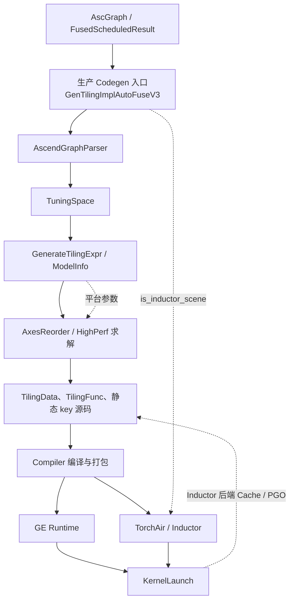
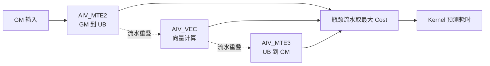
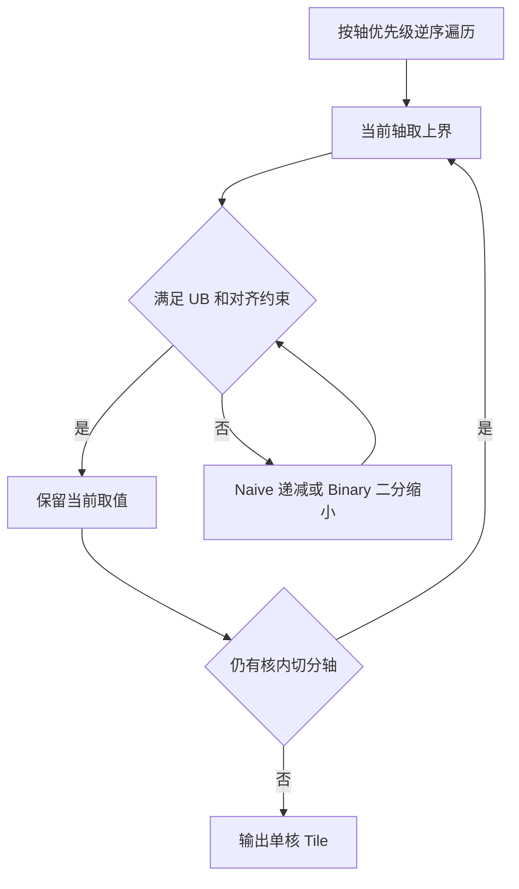
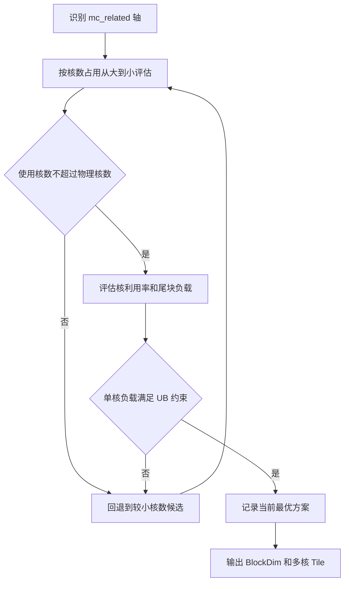
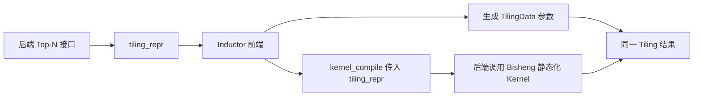
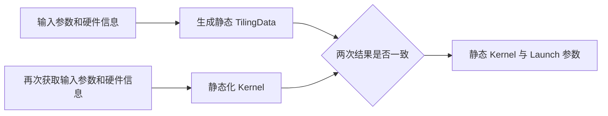

# Auto Tiling（ATT）特性文档

## 1. 特性背景

### 1.1 特性目标

本文档描述 Auto Tiling（ATT）的设计、实现边界及跨组件约束，面向 Autofuse、GE、TorchAir/Inductor、Runtime 和算子开发人员。文档重点记录无法仅通过代码推导的芯片适配、静态 Tiling 确定性、TilingData 大小和跨仓 ABI 约束。

### 1.2 分析范围

本文档覆盖 `autofuse/att`、`autofuse/v35/att`、`autofuse/codegen` 以及 `autofuse/common/autofuse_config` 的 ATT 相关流程，并说明与 Autofuse 图优化、GE Runtime、TorchAir Inductor 和 CANN 打包的关系。当前 Auto Tiling 的自动求解范围仅覆盖 Vector+Vector（VV）融合；CV 融合中 Cube 基本块 Tiling 由 Cube Tiling 模块提供，Auto Tiling 仅承担其职责范围内的 Vector Tiling 及组合代码集成。不覆盖 OOTD 离线芯片选择（尚未设计），也不定义用户自定义 Tiling 动态库 ABI。

## 2. 用户使用场景

### 2.1 软件概述

#### 2.1.1 项目定位

ATT 将 ASCIR 融合图和调度结果转换为 Tiling 函数、TilingData 定义及辅助接口。它在编译期枚举 ScheduleGroup/TilingCase，依据硬件资源约束和 API 性能模型求解候选方案；运行时由生成的 Tiling 函数根据实际输入选择 TilingData，随后由 GE 或 TorchAir 调用 Kernel。

ATT 是 Autofuse Codegen 的组成部分，不直接改写图。图融合范围由上游优化阶段控制，ATT 负责在既定融合图上生成可编译、可执行且具有确定选择结果的 Tiling 代码。

#### 2.1.2 产品环境

在线执行时，`PlatformContext` 通过 Runtime 平台能力接口查询芯片；当前实现以 `rtGetSocSpec("version", "NpuArch", ...)` 取得 SoC 架构，并查询 Vector Core 数、UB 和 L2 大小。离线 ATC 场景由 ATC 的 `--soc_version` 指定芯片；离线 OOTD 场景尚未设计和实现。

生成代码随 CANN/Autofuse 交付，由 GE Runtime 或 TorchAir Inductor 加载。GE 与 graph-autofusion 通常配套发布；TorchAir 与 Autofuse 分别随 torch_npu 和 CANN 包发布，必须保持生成代码和前端加载逻辑的 ABI 一致。

### 2.2 主要功能

- 从 `AscGraph` 或 `FusedScheduledResult` 生成 Tiling 函数和 TilingData 定义。
- 解析 Tensor、轴、内存、Workspace、BlockDim 和调度信息，建立可行域及性能目标。
- 使用 AxesReorder 求解器（默认）选择 Tiling；HighPerf 仅用于实验验证，后续可能废弃。
- 生成 VV 融合下单 Group、多 Group、Inductor 常量 TilingData 和 PGO 所需的辅助接口；CV 融合只集成外部提供的 Cube 基本块 Tiling，不由 Auto Tiling 求解该基本块。
- 提供 Tiling 缓存、符号 Shape 维测和 PGO 候选搜索能力。

- 在线推理或训练：GE Runtime 调用生成的 `TilingFunc`/`TilingFuncVec`，TorchAir/Inductor 调用 `AutofuseTiling`；生成函数根据平台信息和 Shape 选择 TilingData，随后由各自运行时启动融合 Kernel。
- 静态 Shape 编译：Inductor 或 GE 在编译期调用静态 key、常量 TilingData 接口，将固定结果固化到 Kernel。后续同一输入不得得到不同 key 或 TilingData。
- 动态 Shape：同一 Kernel 可包含多个候选 key；每个具体输入通过符号 Shape 缓存和 Tiling 逻辑确定唯一结果。
- PGO/Top-N 调优：当前仅支持静态 Shape。GE/TBE 通过独立 PGO 流程采集硬件耗时；TorchAir/Inductor 通过 Split-Compile 生成候选并在运行时按 modeled_perf（可选实测回调）选择；调优失败时回退普通 ATT 并上报 warning。
- CV/UBFuse 和多 Group 集成：Codegen 组合 Cube Tiling 模块给出的基本块 Tiling 与 Auto Tiling 负责的 Vector 结果，生成组合 TilingData、Cube key 和 Vector key；Auto Tiling 不决定 Cube 基本块，但必须保证其职责范围内的 Group 结果及最终组合 key 稳定。

## 3. 特殊限制与当前实现状态

### 3.1 状态定义

本节是全文关于能力边界和实现状态的唯一权威定义。后续章节只解释设计原因、流程和修改位置；出现状态差异时以本节为准。

- 有意设计：当前实现与设计约束一致，开发时必须保持。
- 当前限制：能力边界已经明确，当前版本不支持该范围。
- 实现缺口：设计约束已经明确，但当前代码尚未完整实现，不能作为现状保证。
- 规划能力：尚无完整方案或实现，不作为当前版本承诺。

### 3.2 权威状态表

| 编号 | 主题 | 当前实现 | 设计约束或目标 | 状态 |
|------|------|----------|----------------|------|
| S1 | 芯片识别与使能 | 在线场景由 `PlatformContext` 查询 Runtime 平台信息；ATC 由 `--soc_version` 指定；非 910B2/950PR 由上游 `GetAutofuseBackendSpec` 关闭融合。 | 芯片能力通过平台接口和注册机制选择，不在 ATT 入口硬编码芯片分支，也不在未适配芯片上复用已有模型。 | 有意设计 |
| S2 | 性能模型覆盖 | MTE2/MTE3 参数主要基于 910B2/950PR 采集，V1/V2 仅表示参数表版本；Vector 模型同样存在芯片相关性。当前不支持 MTE1、Cube、Pipe 独立模型，也不记录性能数据来源。 | 模型接口和注册方式在芯片适配时保持一致；校准误差超过 5 倍按建模问题处理。 | 当前限制 |
| S3 | 融合范围 | Auto Tiling 自动求解仅覆盖 VV 融合；CV 融合的 Cube 基本块由 Cube Tiling 模块给出，ATT 只处理职责范围内的 Vector Tiling 和组合集成。 | ATT 不推导或替代 Cube 基本块 Tiling；模型视图必须与 Codegen 实际调度描述一致。 | 当前限制 |
| S4 | TilingData 大小 | Runtime `KernelLaunch` 的已知上限为 32768 B，目前仅在 910B 上验证；当前 Autofuse 生成阶段只生成 `sizeof(TilingData)` 查询接口，尚未执行 32768 B 上限检查。 | 应在 TilingData 生成阶段检查总大小，超限直接报错并说明原因；同时通过融合范围和字段复用控制结构体大小。 | 实现缺口 |
| S5 | 静态 Tiling 确定性 | 静态 Kernel 源码可以包含多个候选 key；运行时对同一具体输入应选择同一 key 和完整 TilingData。 | 单 Group、多 ScheduleGroup、CV/UBFuse、Inductor 常量 TilingData 和 PGO 均要求结果稳定；多 Group 的组内结果和最终组合结果都必须稳定。 | 有意设计 |
| S6 | 静态编译同源性 | Inductor 使用同一 `tiling_repr` 生成 Launch 参数并静态化 Kernel；GE 的 TilingData 获取和 Kernel 静态化当前分别获取输入参数及硬件信息。 | 两条链路必须使用同一份不可变 Tiling 结果；GE 在同源改造前至少校验 key、BlockDim 和完整 TilingData，控核场景重点校验 BlockDim。 | GE 为实现缺口 |
| S7 | Tiling Cache 默认值 | GE Runtime 不依赖 Autofuse 后端 Cache，默认关闭；Inductor 依赖后端 Cache，默认开启。 | 场景默认值必须由 `is_inductor_scene` 或等价信息决定，显式配置优先于场景默认值。 | 有意设计 |
| S8 | Tiling Cache 身份 | 当前符号 Shape Cache key 未纳入 dtype、融合图结构、芯片型号和配置项。 | 命中后必须复用相同布局和 key；新增跨条件复用场景前需要扩展 key，禁止把当前 key 解释为完整编译身份。 | 当前限制 |
| S9 | PGO 支持范围 | 当前只支持静态 Shape；动态 Shape 和 CV 的候选采集、缓存键及结果固化方案尚未定义。 | 未定义可靠身份和固化规则前不得在动态 Shape/CV 上复用 PGO 结果；调优失败应回退普通 ATT 并上报 warning。 | 当前限制 |
| S10 | PGO 结果身份 | GE/TBE 当前以 `<pgo_dir>/<graph_name>_config.txt` 是否存在判断复用；采样使用的设备、AIV 数、UB 和 Kernel 名称未作为缓存身份在命中时校验。Inductor 协议包含候选 hash/repr，但也不能据此宣称已绑定全部运行环境。 | PGO 结果至少应绑定芯片型号、影响执行的硬件输入和算子 hash；身份不完整时不得承诺跨进程、跨机器或跨芯片安全复用。 | 实现缺口 |
| S11 | TilingData 与 ABI | 字段顺序、对齐和类型宽度不作为独立跨版本 ABI；类型名、生成函数名和命名空间自动生成，不支持用户自定义或注入 Tiling 动态库。 | TilingData、TilingFunc 和 Kernel 必须同版本成套发布；正式 ABI 以 GE/TorchAir 实际加载的符号为准。 | 有意设计 |
| S12 | 配置 | `AutoFuseConfig` 是进程级单例，不支持编译过程中动态修改；优先级为调用 options、环境配置、默认值。`force_*` 和 HighPerf 为调试/实验能力，Golden 未开放。 | 业务代码不得依赖实验配置的稳定性；ATT options 后续计划废弃。 | 当前限制 |
| S13 | OOTD 离线场景 | 尚未设计和实现芯片信息注入方式。 | 完成平台信息来源、模型选择和交付协议设计前，不承诺 OOTD 离线兼容。 | 规划能力 |
| S14 | 失败语义 | 输入非法或无可行解时返回 `false`/`af::FAILED`，不生成 invalid Tiling stub；Host/Device 编译错误向 TBE 或 Inductor 前端传播。 | PGO 失败属于可回退错误并上报 warning；TilingData 超限在 S4 缺口补齐后应提前失败。 | 有意设计；S4 除外 |

### 3.3 假设和依赖关系

- GE、TorchAir 和 Autofuse 使用配套版本；跨包混用时由集成方保证正式 ABI 和 TilingData/TilingFunc/Kernel 三件套匹配。
- Runtime 的 TilingData 上限当前按 32768 B 处理；若后续按芯片或接口版本变化，需要同步调整生成阶段校验和测试。
- 910B2/950PR 产品名与代码中 `NpuArch` 编码的完整映射由平台或发布配套资料提供，本文档不根据编号推测产品映射。
- OOTD 离线芯片识别、PGO 在 CV/动态 Shape 上的扩展均需独立设计后才能改变表中状态。

## 4. 整体架构

### 4.1 分层架构

ATT 数据流如下：

`AscGraph/FusedScheduledResult → GraphParser → TuningSpace → GenerateTilingExpr → ModelInfo → Solver → TilingData/TilingFunc 源码 → Compiler 编译打包 → GE/TorchAir 加载与 KernelLaunch`



当前生产 Codegen 的 GE 与 Inductor 流程均调用 `GenTilingImplAutoFuseV3`，通过 `is_inductor_scene` 区分场景。该入口接收已调度的 `FusedScheduledResult`，复用 Codegen 的调度结果和二维描述，避免 ATT 建模视图与实际 Kernel 代码不一致。`GenTilingImpl` 保留为传统 AscGraph/兼容入口，不应作为 GE 生产主流程的默认修改入口。Codegen 负责拼接 Host/Device 源码和生成静态、动态入口；`autofuse/compiler` 负责实际编译与打包。

ATT 由五层组成：

| 层次 | 主要组件 | 职责 |
|------|----------|------|
| 输入层 | `AscGraph`、`FusedScheduledResult`、`PlatformContext` | 提供融合图、调度结果和硬件资源信息。 |
| 建模层 | `AscendGraphParser`、`ModelInfo`、`GenerateTilingExpr`、API 性能注册表 | 将图和硬件约束转换为可求解的资源约束及性能表达式。 |
| 求解与生成层 | `TilingCodeGenerator`、`solver_pass`、cache、PGO、TilingData 生成器 | 搜索 TilingCase，组合多 Group 结果并生成 Host/Device Tiling 代码。 |
| 编译交付层 | `autofuse/codegen`、`autofuse/compiler` | Codegen 拼接源码，Compiler 调用编译器并打包动态库和 Kernel 产物。 |
| 运行集成层 | GE Runtime、TorchAir/Inductor | 加载正式 ABI，执行 Tiling、缓存、PGO 和 KernelLaunch。 |

### 4.2 编译期与运行时边界

编译期确定 TilingData 类型、候选 Case、Group 组合规则和 Kernel 实现；运行时仅根据输入 Shape、平台资源和可选 PGO/缓存状态填充 TilingData，并调用 Kernel。运行时不能替换生成的 TilingData 类型或自行解释字段布局。

### 4.3 生命周期与控制流

1. 上游完成图融合和调度，得到 `AscGraph` 或 `FusedScheduledResult`。
2. ATT 初始化进程级配置和平台信息，解析 TuningSpace 并生成 ModelInfo。
3. 求解器生成候选 TilingData，Codegen 拼接 Host/Device 源码；当前仅生成大小查询接口，生成阶段上限校验状态见 S4。
4. Compiler 编译和打包 Host/Device 产物，GE/TorchAir 按静态、动态、缓存或 PGO 路径加载相应符号。
5. GE Runtime 调用 `TilingFunc`/`TilingFuncVec` 后启动 Kernel；Inductor 调用 `AutofuseTiling` 获取参数并通过 `AutofuseLaunch` 启动 Kernel。

## 5. 核心子特性设计

本章按 ATT 的六个关键子特性说明“为何这样设计、如何实现以及边界在哪里”。其中图解析、建模和求解在 Torch/GE 两条入口上共用；代码生成和 PGO 则因前端加载方式不同而存在分支。能力状态和术语定义统一以第 3 章为准。

### 5.1 图解析与模型信息生成

#### 设计目标与动机

ATT 不直接在 ASCIR 上搜索。`AscendGraphParser` 先把图转换为 `TuningSpace`，再由 `GenerateTilingExpr` 和 `GetModelInfoMap` 生成求解器消费的 `ModelInfo`。这样可以把“图语义/调度关系”与“参数搜索”隔离：解析阶段保证 Tensor、轴、Queue/Buf、复用和内存共存关系完整，求解器只处理显式变量和约束，避免模型视图与最终 Kernel 代码不一致。

#### 处理流程

```text
AscGraph/ImplGraph
  → ParserOriginAxis（原始轴及父子关系）
  → ParserSchedInfo（调度、循环和 mc_related 信息）
  → CreateSubAxisInfo（切分轴、规约/广播属性）
  → ParseTensorMemInfo（Queue、Buf、tmp/builtin reserve、Workspace）
  → SetAxisPriority（轴优先级）
  → ConvertToTuningSpace
  → GenerateTilingExpr/GetModelInfoMap
  → ModelInfo（ScheduleGroup/TilingCase/资源约束/性能表达式）
```

`AscGraph → ImplGraph → ScheduleResult → ScheduleGroup → TilingCase → ModelInfo` 是层级关系：`ImplGraph` 表示一份可执行实现，`ScheduleGroup` 表示可复用的调度组，`TilingCase` 是组内候选，`ModelInfo` 汇总候选的约束和代价。`ReuseScheduleGroup` 仅在 `EquivalentGraphRecognizer` 判定图严格等价时复用 ModelInfo，避免错误共享。

#### 关键约束

- UB 可用空间不仅是 Tensor 大小，还要扣除 Queue、Buf、临时 Buffer、builtin reserve 和 SIMT dcache 等保留量；Container/Queue/Buf 的复用和共存关系必须与 Codegen 一致。
- 轴优先级由父轴、规约轴、广播轴、非最内轴等规则确定；顺序必须稳定，不能依赖无序容器遍历。
- CV/UBFuse 组合场景中，Auto Tiling 负责的 Vector 部分使用 Codegen 产出的二维调度描述；若解析阶段采用 raw 1D 视图，属于模型与 Kernel 不一致的设计缺陷。Cube 基本块不在 Auto Tiling 图解析和求解范围内。
- ModelInfo 是求解器内部结构，不作为跨仓 ABI；只有后续生成的 extern C 符号和三件套版本需要跨仓配套。

#### Torch/GE 路径

生产 Codegen 的 GE 与 TorchAir/Inductor 路径均向 `GenTilingImplAutoFuseV3` 传入已调度的 `FusedScheduledResult`，通过 `is_inductor_scene` 区分后续生成方式。`GenTilingImpl` 是传统 AscGraph/兼容入口。两条生产路径共享解析器和 ModelInfo 规则，但生成的加载入口及静态化流程不同。

#### 边界属性

这是有意设计的分层。当前限制是 OOTD 尚未提供离线平台信息、部分高阶 API 的专用解析仍依赖 Codegen 描述；若出现复用误判或调度描述缺失，应视为解析/等价图识别缺陷，而不是让求解器放宽约束。

### 5.2 性能建模体系

#### 设计目标与动机

ATT 需要在编译期从大量 Tiling 候选中快速淘汰明显劣解，不能对每个候选都执行硬件 Kernel。因此采用 ASCIR→AscendC API→Micro API 三级建模体系，在可接受编译时间内逐级细化性能估算，最终逼近真实流水线瓶颈。模型只负责候选排序，硬约束仍由资源检查单独判定。

#### 分层模型与计算流程

```text
ASCIR 层：图级算子、Shape/Stride、循环次数
  → AscendC API 层：Load/Store/Nddma 等 API 的搬运和调度代价
  → Micro API 层：Vf/Regbase 微指令 latency、throughput 和 repeat
  → PerfOutputInfo.pipe_res[PipeType]
  → 取瓶颈流水线代价（通常为各 Pipe 最大值）
```

下图展示 MTE2、Vector 和 MTE3 三条流水的重叠关系。当前整体 Cost 采用瓶颈流水线近似，即假设瓶颈流水的执行能够掩盖非瓶颈流水的主要耗时：



三级结构的设计意图是让每一层只依赖本层可观测信息，并通过统一的 `Expr`/`PerfOutputInfo` 向上层传递符号化代价：

- ASCIR 层面向图语义，负责从节点和 Tensor 提取数据类型、Shape、Stride、合轴结果及外层循环次数；它不感知具体硬件指令。
- AscendC API 层面向可调用 API，负责把 Load、Store、Nddma 等接口映射为 MTE2/MTE3 搬运代价，处理 blockDim 带宽竞争、32B/CacheLine 对齐、GM/UB stride、尾块和 Nddma 多轴惩罚。
- Micro API 层面向硬件微指令，负责将 Add、Sigmoid、Reduce、Cast 等计算 API 展开为 Vf/Regbase 指令序列，按 latency/throughput 和 repeat 次数计算 Vector Pipe 代价。

分层后，新增 ASCIR 算子只需补充图级映射，新增 AscendC 搬运 API 不必改动图解析，新增芯片指令参数只需替换 Micro API 参数表；这正是 API 级与指令级解耦的设计目的。MTE2 表示 GM→UB，MTE3 表示 UB→GM。当前 Auto Tiling 不支持 MTE1、Cube、Pipe 独立性能模型；Cube 基本块 Tiling 及其性能信息由 Cube Tiling 模块负责。搬运模型采用 `((DataSize / T + h) × Count) + H` 形式，其中 `T` 随 blockDim/带宽变化，`h` 是单次指令头开销，`H` 是 Pipe 头开销，`Count` 是循环次数。

V1/V2 是注册表参数版本而非芯片型号：V1 的计算类 API 在 ASCIR/AscendC 层主要使用 SimpleLinear 经验公式（CacheLine 512B），V2 进一步下沉到 Micro API，将计算拆为 Vf 指令序列（CacheLine 128B），两者都使用 256B vector length。MTE2/MTE3 参数主要由 910B2、950PR 采集校准，误差超过 5 倍即认为建模问题；当前不支持在模型元数据中标识数据来源。

#### Torch/GE 路径

GE 与 TorchAir 共用同一套 ModelInfo 和 modeled cost。GE 的 PGO 可在此基础上再用硬件实测校准；Inductor 的 Top-N 主要依据 modeled_perf 进行候选筛选，实测由其 PGO runner 通过回调完成，不改变模型定义。

#### 边界属性

ASCIR→AscendC API→Micro API 的分层和 V1/V2 注册机制是有意设计，便于新增算子或芯片时保持上层注册接口不变。MTE1、Cube、Pipe 独立模型以及性能数据来源标识均为当前不支持能力，不作为本文档承诺的待补齐项。非 910B2/950PR 芯片由上游 `GetAutofuseBackendSpec` 关闭融合，不使用未经验证的模型继续生成。

### 5.3 Tiling 算法与求解器

#### 设计目标与动机

求解器的目标是在有限编译时间内找到“满足资源约束且接近最优”的 Tiling，而不是穷举所有整数解。默认 `AxesReorder` 采用确定性的轴排序、局部贪心和约束收缩；`HighPerf` 保留更激进的实验搜索，暂不作为正式用户能力。

#### 当前算法清单

| 算法 | 所属阶段/实现 | 主要特点 | 使用场景与边界 |
|------|---------------|----------|----------------|
| `AxesReorder` | 默认求解器编排 | 按轴优先级逐级求解，结果稳定、搜索空间小、编译开销可控 | 通用 Vector/Elementwise/Reduce 融合；不追求全空间最优。 |
| `LocalBufferTiling` | 核内切分 | 在 UB/LocalBuffer 约束下确定单核 Tile；可选 `NaiveLocalBufTiling` 或 `BinaryLocalBufTiling` | 所有需要 UB 分块的 Group；Binary 适合搜索区间较大或约束单调的场景，Naive 适合规则简单的场景。 |
| `MultiCoreTiling` | 多核切分 | 识别 `mc_related` 轴，结合物理核数、尾块和 UB 负载确定 BlockDim | 可并行执行且存在外层工作量的融合图；小 Shape 或无可分核轴时收益有限。 |
| 双阈值算法 | LocalBuffer/MultiCore 协同 | 联合 `att_ub_threshold` 与 `att_corenum_threshold`，在单核 UB 利用率和核数利用率之间权衡 | UB 占用与并行度冲突的中大型算子；不是独立求解器，依赖前两阶段结果。 |
| 同等优先级 Tiling | AxesReorder 特殊分支 | 对两根同优先级轴联合搜索，并结合对齐和双阈值策略 | 当前主要用于 Transpose 的 Load/Store 双尾轴；仅支持两根轴，三根及以上不处理。 |
| `AutoTuning` | 求解后微调 | 按性能公式对 BlockDim/邻近 Tile 做步长搜索，改善多核头开销场景 | `att_accuracy_level>0` 且未开启多核 UB trade-off 时启用；属于编译期调优，不是硬件 PGO。 |
| `HighPerf`/`GeneralSolver` | 实验求解器 | 不依赖轴排序，采用 LocateRegion 指数粗调、FineTune 线性精调和早停，性能上限较高但耗时和模型敏感度更大 | 性能极致要求且模型可信的实验场景；正式版本不承诺，后续可能废弃。 |

这些算法不是互相替代的多个入口，而是“求解器模式 + 切分阶段 + 特殊策略”的组合：`AxesReorder` 或 `HighPerf` 决定总体搜索方式，LocalBuffer/MultiCore 负责资源可行域，双阈值、同等优先级和 AutoTuning 负责特定冲突场景的局部优化。

#### 处理流程

```text
轴排序与同优先级识别
  → LocalBufferTiling（UB 贪心/二分）
  → MultiCoreTiling（mc_related 与 BlockDim）
  → 双阈值权衡（att_ub_threshold/att_corenum_threshold）
  → 同等优先级双轴搜索（Transpose 等）
  → 生成 Group TilingCase
  → 在 ImplGraph/ScheduleGroup 间按 Cost 选优
```

LocalBufferTiling 先尝试扩大 Tile，违反 UB 时由 `NaiveLocalBufTiling` 或 `BinaryLocalBufTiling` 缩小；Binary 路径利用可行性单调性二分定位边界，Naive 路径按轴顺序递进调整。典型核内切分过程如下：



MultiCoreTiling 根据核内循环识别 `mc_related` 变量，核数不得超过物理核数，并通过 WorkloadBalance 处理尾块不均衡。典型多核切分过程如下：



双阈值算法在 UB 利用率和核数利用率之间做显式权衡：双阈值均达标时继续扩大 Tile，UB 不足时优先增大 Tile，核数不足时缩小 Tile 换取更多核。同等优先级算法当前主要处理 Transpose 的两根轴；AutoTuning 在上述阶段完成后对邻近方案做有限步长微调。

#### 稳定性与失败语义

求解结果按稳定的 ScheduleGroup/Case 顺序编号，得到 ATT tiling key；Cube key 使用独立语义，不能假设与 ATT key 共用位域。静态 Shape 对同一具体输入必须得到固定 key 和完整 TilingData，多 Group 还要求每个 Group 及最终组合结果都固定。无可行解直接返回 `false/af::FAILED`，不生成 invalid stub。

#### Torch/GE 路径与边界

两条前端路径共用求解器；差异只体现在 GE 可直接执行动态 Tiling，而 Inductor 可能要求枚举多个候选并静态编译。动态 Shape 允许多个候选 key，但每个具体符号实例仍必须唯一。候选空间过大时通过融合范围、LocalBuffer 二分、双阈值和缓存控制编译时间，这是有意的搜索边界；HighPerf 后续可能废弃，属于实验能力。当前同等优先级策略仅覆盖 Transpose 双轴，不能推广到任意多轴或 Cube 专用切分。

### 5.4 代码生成与 TilingData

#### 设计目标与动机

代码生成必须让 TilingData 定义、Tiling 函数和 Kernel 使用完全一致的字段布局，同时为静态、动态、缓存、CV/Cube 和 PGO 提供统一入口。生成器采用模板化 Head/Body/Tail 拼接，避免手写每个算子组合，并生成大小查询接口供集成侧校验；生成阶段的上限检查尚未补齐，状态见 S4。

#### 处理流程

```text
ATT 求解结果
  → `TilingDataGenerator` 生成结构体字段
  → 按 Group/Case 组织子结构及 API 专用字段
  → `codegen_tiling.cpp` 生成 Tiling 函数、静态 key、辅助接口
  → 生成缓存/维测/PGO 包装
  → Codegen 拼接 Host/Device 源码
  → Compiler 编译并打包动态库与 Kernel 产物
```

`codegen_tiling_data.cpp` 负责 TilingData 定义和字段序列化；`codegen_tiling.cpp` 负责 Tiling 函数主体、Group 组合、静态 key、常量 TilingData、Cache/维测接口；PGO 相关包装位于 `codegen_tiling_pgo_*.cpp`。单 Group 字段可平铺，多 Group 按 Group 嵌套；Transpose/Pad 等高阶 API 使用专用字段，CV/Cube 生成 Vector/Cube 组合入口。

#### ABI 与大小约束

TilingData 的三件套兼容规则以 S11 为准。大小约束及生成阶段检查缺口以 S4 为准：当前代码生成 `GetTilingDataSize`/`GetTilingDataSizeVec` 返回实际结构体大小，但尚未在 Autofuse 生成阶段执行上限检查。

#### 静态 Kernel 编译流程

Inductor 与 GE 的静态 Kernel 编译不是同一流程，其关键差异是 TilingData 参数和静态 Kernel 是否使用同一份 Tiling 结果。

Inductor 使用 `tiling_repr` 作为两条链路的共同输入：



Top-N 接口将 `tiling_repr` 返回给前端，前端一方面用它生成 KernelLaunch 所需的 TilingData 参数，另一方面通过后端 `kernel_compile` 接口把同一 `tiling_repr` 传回，后端再调用 Bisheng 完成 Kernel 静态化。两条链路同源，因此输入参数、硬件信息、tiling key、BlockDim 和字段值天然一致。

GE 当前分别执行 TilingData 获取和 Kernel 静态化：



两条链路都需要独立获取输入参数和硬件信息，当前缺少类似 `tiling_repr` 的单一数据源。这不是期望的长期形态：尤其在控核场景，若两次获得的核数、UB 或 Tiling 结果不同，会造成静态 Kernel 与 Launch 参数不一致。后续设计应让 GE 的 TilingData 生成和 Kernel 静态化复用同一份不可变 Tiling 结果，或引入等价的中间表示，并在编译阶段校验 key、BlockDim 和 TilingData 一致性。

#### Torch/GE 路径与边界

GE 使用 Host Tiling 动态库在运行时填充结构体；Inductor 通过 `GetTilingDataRepr`/Top-N 接口交换候选，并以同一 `tiling_repr` 生成 TilingData 参数和静态 Kernel。两条路径共享结构体生成规则，但结果传递和固化方式不同。字段新增和大小处理分别遵循 S11、S4；TilingData 过大时应优先收敛融合范围和字段，不能静默截断。

### 5.5 PGO 机制

#### 设计目标与共同约束

PGO 用硬件执行反馈修正模型排序，但候选生成、编译和结果固化成本较高，因此当前限定静态 Shape：编译时输入和采样输入可建立一一对应关系，测得的 TilingData 能直接固化到静态 Kernel。动态 Shape 下同一符号范围可能对应多个最优 key，候选采集、缓存键和结果固化规则尚未定义，贸然复用会导致错误选择，因此暂不支持；CV 场景同理，具体状态见 S9。

PGO 结果的目标身份至少包括芯片型号、影响执行时间的硬件输入和算子 hash，但当前实现没有完整落实该约束，不能宣称结果已经具备跨环境安全复用能力，具体缺口见 S10。

#### GE/TBE 路径

```text
GE 编译子进程
  → ATT 生成候选与 PGO runner
  → `asc_pgo_exec`/运行时包装执行候选
  → 硬件采样得到 search.txt
  → second optimization 按采样结果搜索
  → 输出 config.txt 并生成最终 Kernel
```

该路径以实际硬件时间为选择依据，`core_select` 为默认算法，`pruning` 用于剪枝；失败或候选超过 10000 时回退普通 ATT 并上报 warning。当前 `config.txt` 以 graph name 命名，文件存在即跳过调优，没有校验芯片、AIV 数、UB 或算子 hash；因此结果文件只应在调用方确认环境一致后复用。

#### TorchAir/Inductor 路径

```text
Inductor Split-Compile
  → `GenerateTopnSolutions` 枚举候选
  → `GetTilingDataRepr` 去重/序列化
  → 静态编译多个候选 Kernel
  → PGO runner 通过 `SetTopnPgoContext` 回调运行候选
  → `FindBestTilingKey` 选择并固化最优 key
```

Inductor 路径使用独立 DSO 加载和协议文件（Top-N 记录包含 TilingData、workspace、block_dim、hash 和 repr），并受 Top-N 数量及协议版本限制；当前默认候选排序主要依赖 modeled_perf，实测回调用于校验和选择。协议中的候选 hash/repr 不等同于完整环境身份，它与 GE 的 `search.txt/config.txt` 流程也不是同一 ABI，不能交叉使用结果。

#### 边界属性

“仅静态 Shape”及动态/CV 边界见 S9；候选或实测失败回退普通 ATT 并 warning 是有意的可用性策略。PGO 身份完整性是 S10 所列实现缺口，开发者不能把当前命中行为视为已经满足该设计约束。

### 5.6 维测能力

#### 设计目标与原则

ATT 维测面向“1 小时定界、2 小时定位”：先区分功能、Tiling 耗时和 Kernel 性能问题，再沿图解析→TuningSpace→ModelInfo→模型代价→TilingCase→Codegen→Compiler→Runtime 的链路收集证据。维测默认关闭高频日志，通过显式开关、结构化文件和符号接口输出，避免影响正常编译和执行。

#### 观测点与定位流程

1. 图解析：检查 `AscendGraphParser` 的轴合并、父子轴、Stride、Swap、Queue/Buf 共存和 ReuseGroup 等价性，使用 `att_analyze` 解析图和调度日志。
2. 模型与求解：记录 API 模型版本、MTE2/MTE3/Vf 代价、Pipe 瓶颈、UB/Core 阈值、候选淘汰原因和最终 Cost；模型误差超过 5 倍优先按建模问题处理。
3. 代码生成：核对 Group/Case 字段、TilingData 实际大小、Workspace、BlockDim、静态 key 和 Kernel 类型，确认 TilingData/TilingFunc/Kernel 三件套来自同一版本；上限检查缺口见 S4。
4. 运行时：通过 `DfxInputSymbolInfo` 输出符号输入，通过 `GetSymbolTilingCacheKey` 检查缓存键和命中；检查 Runtime 返回的 TilingData 大小与 `GetTilingDataSize` 一致。
5. 强制复现：使用 `force_tiling_case`、`force_schedule_result`、`force_template_op_name` 固定模板，对比未融合 Kernel、不同 Case 和 PGO 结果；这些配置在正式包中存在但不承诺稳定兼容。
6. PGO：GE 检查 `search.txt/config.txt` 和硬件采样；Inductor 检查 Top-N 协议、候选 repr、DSO 加载和 warning。静态 Shape 重复 Tiling 若 key/TilingData 不一致，应按功能风险升级处理。

#### Torch/GE 路径与边界

GE 维测以符号 Cache、Runtime/TBE 日志和 `att_analyze` 为主；TorchAir/Inductor 维测增加 Python 编译日志、Top-N repr、候选实测记录和 DSO 生命周期。两条路径共用解析/模型日志，但不能用 GE 的 PGO 文件直接诊断 Inductor。当前不支持在模型元数据中标识性能数据来源；维测需通过采集版本和外部记录确认数据来源。

### 5.7 子特性与权威状态表的对应关系

图解析和性能建模对应 S1～S3，代码生成及静态化对应 S4～S6、S11，Cache 和 PGO 对应 S7～S10，配置与失败语义对应 S12～S14。本章不另行定义能力状态；开发前必须回查第 3 章的当前实现、约束和缺口。

## 6. Tiling 设计机制

### 6.1 Schedule 与 ATT 的职责边界

Schedule 负责生成多份满足基本执行条件的 `ImplGraph`，表达轴切分、内存位置、Tensor 复用和调度关系；ATT 不重新决定图语义，而是在这些候选计划上完成 Tiling 参数搜索。ATT 的输入已经是“可以执行的计划”，输出是每份计划的最佳 Tiling，以及所有候选计划中预计性能最优的方案。

该边界是有意设计：将图级变换与参数级搜索解耦，可以限制 ATT 搜索空间，并确保性能模型使用的调度描述与 Codegen 生成的 Kernel 一致。若 ATT 重新改写 ImplGraph，模型、TilingData 和 Kernel 可能失配，因此不属于 ATT 当前职责。

### 6.2 ATT 主流程

```text
ImplGraph 候选
    ↓ 图解析
TuningSpace（轴、Tensor、内存、复用、Workspace、BlockDim）
    ↓ 建模
硬约束 + 流水线性能表达式
    ↓ 求解
核内分 Tile → 多核切分 → 候选 Tiling 评估
    ↓ 选择
每个 ImplGraph 的最优 Tiling → 候选 ImplGraph 间选择
    ↓ 生成
TilingData、TilingFunc、Tiling key、Kernel
```

ATT 先排除不可执行方案，再比较可行方案的预计耗时；性能模型不能替代资源约束。该顺序保证了“先能运行，再比较快慢”。

### 6.3 切分策略

#### 6.3.1 核内分 Tile

求解器按照轴优先级依次尝试较大的 Tile，在 UB、对齐和循环约束允许的范围内扩大切分值；超过约束时缩小对应变量。连续轴可以合并以减少搜索空间并降低非连续搬运，但合并结果必须与 Codegen 的实际二维描述一致。

#### 6.3.2 多核切分

核内循环确定后，ATT 根据工作量推导多核切分和 BlockDim。核数不能超过平台物理核数；核数增大并不必然带来收益，还需要计入核启动开销、尾块不均衡和 UB 占用。因此多核求解同时考虑核利用率与 UB 利用率。

#### 6.3.3 候选模板选择

同一输入可能对应多个 `ImplGraph`、多个 `ScheduleGroup` 和多个 Tiling key。ATT 对每个候选图独立求解并评估，再选择全局最优模板。静态 Shape 的约束是最终选择稳定，而不是候选 key 数量必须为 1。

### 6.4 建模机制

#### 6.4.1 硬约束

求解器硬约束用于判定方案是否可执行，包括 LocalBuffer/UB、Workspace、BlockDim/CoreNum、父子轴、对齐、Tensor 共存与复用、Reduce/Broadcast 冲突和 Cache Line。任一求解约束不满足时，候选直接淘汰，不进入性能排序。TilingData 总大小属于生成与 Runtime 集成约束，不是当前求解器已经实现的过滤项，状态见 S4。

#### 6.4.2 性能目标

性能模型描述 MTE2、Vector、MTE3、核内循环、核数与 UB 权衡、流水线等待和 Kernel 启动开销。当前 MTE2/MTE3 模型主要基于 910B2 与 950PR 的数据采集；V1/V2 表示版本化参数表，不代表完整 SoC 覆盖。模型校准误差通常应控制在 5 倍以内，超过该范围按建模问题处理。

#### 6.4.3 模型与 Kernel 的一致性

ATT 必须使用 Codegen 最终采用的 ScheduleResult 和维度描述。特别是 CV/UBFuse 组合场景的 Vector 部分，若 ATT 按 raw 1D 结构建模而 Codegen 生成固定 2D 访问，模型结果将不能代表实际 Kernel，属于设计错误而非性能波动；Cube 基本块模型不在 ATT 范围内。

### 6.5 求解器选择

`AxesReorder` 是默认求解器，通过轴优先级、贪心扩张和约束收缩在有限编译时间内获得稳定结果；`HighPerf` 用于实验性探索，面向性能上限而非正式用户接口，后续可能废弃。ATT 无可行解时提前失败，不生成 invalid tiling stub。

### 6.6 关键设计决策

| 设计决策 | 设计原因 | 状态索引 |
|----------|----------|----------|
| Schedule 先生成可执行 ImplGraph，ATT 再优选 | 解耦图变换和参数搜索，降低搜索复杂度。 | S3 |
| 先硬约束过滤，再进行性能排序 | 防止不可执行方案进入性能比较，避免 CostModel 掩盖资源错误。 | S14 |
| 连续轴合并 | 缩小搜索空间并改善访存连续性，但合并结果必须与 Codegen 描述一致。 | S3 |
| 静态 Shape 的 key/TilingData 保持确定 | 防止静态编译结果与 KernelLaunch 参数不一致。 | S5 |
| V1/V2 使用注册式性能模型 | 保持芯片适配时的上层接口和注册方式稳定。 | S1、S2 |
| Cache 默认值按前端场景选择 | GE Runtime 不依赖后端 Cache，Inductor 需要后端 Cache 控制 Tiling 时延。 | S7、S8 |
| Inductor 使用 `tiling_repr` 作为静态化单一数据源 | 保证 Launch 参数与静态 Kernel 同源。 | S6 |
| PGO 当前限定静态 Shape | 静态输入可以将实测结果确定地固化到 Kernel；动态/CV 尚缺少可靠固化规则。 | S9、S10 |

### 6.7 平台识别与性能模型实现

#### 6.7.1 平台识别

在线场景由 `PlatformContext` 通过 Runtime 平台查询接口获取 SoC 架构、Vector Core 数、UB 和 L2 大小；当前代码使用 `rtGetSocSpec` 查询 `NpuArch`。ATC 离线场景由上层接口指定 SoC，OOTD 离线场景尚未实现。SoC 识别与模型版本选择保持解耦，性能模型通过 V1/V2 注册表获取参数，不在 ATT 入口硬编码芯片分支。

`AscendGraphParser` 将 `ImplGraph` 转换为 `TuningSpace`，`GenerateTilingExpr` 建立资源和流水线表达式，API 性能注册工厂通过 `GetApiRegisterVerName` 选择版本化参数表。V1 使用 512 B cache line 和 256 B vector length，V2 使用 128 B cache line 和 256 B vector length。当前不支持在 V1/V2 模型元数据中标识数据来源，模型校准误差通常应控制在 5 倍以内。

芯片识别、模型覆盖和 OOTD 状态统一见 S1、S2、S13。

#### 6.7.2 Tiling 求解和代码生成

求解器输入为 ModelInfo、调度结果、平台资源和策略配置。`AxesReorder` 按轴优先级和硬约束搜索，生成每个 Group 的候选 Tiling，并进一步组合为 Kernel 级 key；相同 ScheduleGroup 可复用 TilingData。无可行解直接返回失败，不生成 invalid tiling stub；TilingData 生成阶段的大小检查状态见 S4。

静态场景额外生成 `GetTilingKeyForStatic`、`GetTilingKeyKernelTypeForStatic` 和常量 TilingData；动态场景允许多个 key，但对同一具体输入必须得到确定选择。Codegen 生成源码，Compiler 执行 Host/Device 编译；编译失败时错误信息向 TBE 或 Inductor 前端传播。

#### 6.7.3 缓存与 PGO

Tiling Cache 用于复用符号 Shape 下已经求得的 TilingData；命中时必须复用相同布局和 key。缓存是否默认启用由前端流程决定：

| 流程 | 是否依赖后端 Tiling Cache | 当前默认值 | 设计原因 |
|------|---------------------------|------------|----------|
| GE Runtime | 否 | 关闭 | GE Runtime 流程不依赖 Autofuse 后端缓存完成 Tiling 复用，默认开启只会引入额外状态和查找开销。 |
| TorchAir/Inductor | 是 | 开启 | Inductor 流程依赖 Autofuse 后端复用已求得的 TilingData，关闭会导致重复求解并影响 Tiling 时延。 |

因此“默认启用 Tiling Cache”不是跨场景统一默认值，文档、配置和测试必须携带 `is_inductor_scene` 或等价场景信息。当前 Cache key 尚未纳入 dtype、融合图结构、芯片型号和配置项，后续出现跨条件复用需求时需要扩展键定义。

PGO 先使用启发式规则和 CostModel 从 Tiling 全空间筛选 Top-N，再对候选进行实测并选择最优结果。支持范围、回退语义和结果身份分别以 S9、S10、S14 为准；当前代码不能保证结果已经绑定全部环境信息。

#### 6.7.4 配置管理

ATT 配置由 `AutoFuseConfig` 进程级单例维护，来源优先级为调用 `options`、`AUTOFUSE_DFX_FLAGS`/配置对象、默认值。环境变量采用分号分隔的 `key=value` 项，允许带 `--` 前缀；同一进程初始化后不支持动态修改。

| 配置项 | 当前有效值或范围 | 默认值 | 说明 |
|--------|------------------|--------|------|
| `autofuse_att_algorithm` | `AxesReorder`、`HighPerf` | `AxesReorder` | HighPerf 仅实验使用。 |
| `att_accuracy_level` | 0～1 | 1 | 数值越高，求解精度目标越高。 |
| `att_ub_threshold` | 0～100 | 20 | 多核与 UB 权衡阈值。 |
| `att_corenum_threshold` | 0～100 | 40 | 核数利用率阈值。 |
| `autofuse_enable_tiling_cache` | `true`、`false` | GE：`false`；Inductor：`true` | GE Runtime 不依赖后端缓存；Inductor 依赖后端缓存。显式配置高于场景默认值。 |
| `autofuse_enable_pgo` | `true`、`false` | `false` | 开启 PGO 候选搜索。 |
| `force_tiling_case` | Case 标识 | 空 | 强制选择，仅调试用途。 |
| `force_schedule_result` | 0～100 | -1 | 强制调度结果，仅调试用途。 |
| `force_template_op_name` | 算子名 | 空 | 限定强制模板的算子，仅调试用途。 |

环境配置值超出声明范围时，`AutoFuseConfigValue` 恢复对应默认值；生成接口传入未注册 option 或不满足格式校验时直接返回失败。`Golden` 不属于有效算法值，也不作为用户接口提供。

### 6.8 工程属性与交叉影响

#### 可维护性

ATT 的模型注册、图解析、表达式生成、求解器和代码生成保持分层；新增芯片应沿用现有注册工厂和接口实现方式，不在入口增加芯片字符串分支。生成代码通过文件名、结构体名和函数名定位，避免在文档中引用行号。

#### 可测试性

UT 覆盖 VV 图解析、模型注册、配置校验和 key 稳定性；S4 的生成阶段大小检查实现时必须同步增加超限用例。ST/E2E 覆盖 910B2、950PR 的 Host/Device 编译与运行，并覆盖 GE Runtime、TorchAir Inductor、多 Group、动态 Shape 和静态 Shape PGO 路径。CV/UBFuse 仅验证 Auto Tiling 与外部 Cube 基本块 Tiling 的组合集成，不将 Cube 基本块求解纳入 Auto Tiling 验收。动态 Shape PGO 当前作为不支持能力验证，不应要求生成实测固化结果。

#### 可移植性

当前硬件验证以 910B2/950PR 为主。非支持芯片默认关闭 Autofuse；Runtime、CANN Toolkit、GE 和 TorchAir 版本需按各仓版本配套表选择。TorchAir 主线配套关系由其 README 版本表维护，例如 master 对应在研 CANN/TorchNPU，发布版本按对应 CANN 版本交付。

#### 可靠性

设计要求所有来自图、Shape、配置和 Runtime 的大小、索引、偏移在用于内存申请或 KernelLaunch 前校验，并对无解、符号缓存键生成失败和动态库符号缺失返回明确错误。TilingData 超限的生成阶段校验尚未实现，见 S4；进程级配置不支持运行中修改，见 S12。

#### 特性交叉影响

| 场景 | 适用性 | 分析说明 |
|------|--------|----------|
| SuperKernel Python 接口 | 不适用 | ATT 不修改 SuperKernel Python API、wheel 或 pytest 路径。 |
| SuperKernel C++/AOT 接口 | 不适用 | 不改变 `libascendsk.so` 和 AOT ABI；仅需在整包构建时确认依赖未被破坏。 |
| Autofuse 图优化 | 适用 | 融合范围、ScheduleResult 顺序和图改写确定性直接决定 ModelInfo 与 TilingData；需保持数据/控制边等价。 |
| Autofuse Codegen/Backend | 适用 | ATT 生成 VV Tiling、静态 key 和 KernelLaunch 所需符号；CV/Cube 包装只组合外部提供的 Cube 基本块 Tiling。 |
| AscendC API / Runtime 交互 | 适用 | Runtime 查询 SoC、校验 TilingData 大小并执行 KernelLaunch；需满足异步资源生命周期和错误码约束。 |
| Python/C++ 混合绑定 | 适用 | TorchAir Inductor 通过 Python 生成/加载 Host 实现并传播编译、Tiling 错误。 |
| 构建与打包 | 适用 | ATT 与 v35 ATT 编入 `aihac_codegen`，需验证 CMake、run 包及 `--no-autofuse` 构建路径。 |
| 测试与覆盖率 | 适用 | 需要 ATT UT、Codegen E2E、GE Runtime 和 TorchAir 兼容性验证。 |
| 性能与日志 | 适用 | 需评估模型求解、缓存、PGO 和维测日志对编译时长、运行时和产物大小的影响。 |
| 兼容性 | 适用 | extern C 符号、TilingData 三件套版本、配置优先级和跨包发布必须保持兼容。 |

## 7. 性能牵引指标

本章指标用于牵引后续设计和优化，不表示当前版本已经达到，也不作为本文档对现状能力的承诺。当前版本的实际数据应以对应发布版本的测试报告为准。

### 7.1 编译时长

后续设计目标是：Inductor 默认启用 Tiling Cache 以减少重复求解，GE Runtime 不依赖后端缓存；VV 融合场景不产生独立 Tiling 文件编译过程。模型表达式和求解器应限制融合规模，避免候选数量导致 Host bound。单 TilingCase 平均 Tiling 耗时以 3 us 量级作为牵引目标，具体口径需通过基准测试定义。

### 7.2 执行性能

后续设计以 PGO Kernel 性能为参考，最优解达成率以超过 85% 为牵引目标，并以消除因 Tiling 导致相较未融合性能劣化超过 50% 的场景为优化方向。上述数值不是当前达成情况。Tiling key 对同一输入不稳定会使静态编译结果与 KernelLaunch 使用的 TilingData 不一致，可能采用不同计算路径或精度策略，属于现状功能约束，必须视为功能风险而非单纯性能波动。

### 7.3 内存和产物大小

TilingData 大小的 Runtime 约束与生成阶段实现状态见 S4，不属于性能目标。后续设计应通过复用和精简字段控制多 Group 结构体大小，并控制 Tiling 源码、缓存和 PGO 候选带来的编译期临时产物；调试 dump 仅在显式配置时开启，禁止默认产生海量日志。这些产物和内存方向暂未定义现状量化指标。

## 8. 对外接口

### 8.1 编译期入口

ATT 主入口（编译期，C++ 调用）包括：

- `att::GenTilingImplAutoFuseV3(op_name, fused_schedule_result, options, tiling_func, is_inductor_scene)`：当前生产 Codegen 入口，从已调度结果生成 Tiling 代码；GE 与 Inductor 均使用该入口。
- `att::GenTilingImpl(op_name, graphs, options)`：传统 AscGraph/兼容入口，不代表 GE 当前生产主流程。

两个入口均返回布尔成功状态。输入图为空、图校验失败、未注册 option 或 ModelInfo 无可行解时提前失败，生成结果不会以 invalid tiling stub 形式继续下发。TilingData 超限的生成阶段失败仍是 S4 所列实现缺口。

### 8.2 调用时序与约束

GE Runtime 加载 Host Tiling 动态库后，先调用 `GetTilingDataSize`（CV/Cube 组合场景使用 `GetTilingDataSizeVec`）取得结构体大小，再调用 `TilingFunc`（CV/Cube 组合场景使用 `TilingFuncVec`）获取 TilingData、Workspace、BlockDim 和 Tiling key。动态 Shape 相关流程还会加载 `TilingParse`、`InferShape`、`GetSymbolTilingCacheKey` 和 `DfxInputSymbolInfo`。GE 不以 `AutofuseTiling` 作为正式加载入口。GE 静态编译路径中的 TilingData 获取和 Kernel 静态化当前分别获取输入参数及硬件信息，同源性要求及缺口见 S6。

TorchAir Inductor 的 Top-N/PGO 路径通过 `GenerateTopnSolutions` 枚举候选，使用 `GetTilingDataRepr` 去重和序列化；前端将所得 `tiling_repr` 同时用于生成 TilingData 参数，并通过 `kernel_compile` 传入后端，由 Bisheng 静态化 Kernel。候选数量超过 10000 或 PGO 测量失败时回退普通 ATT，并上报 warning。GE 符号 Shape 路径通过 `GetSymbolTilingCacheKey` 生成缓存键，通过 `DfxInputSymbolInfo` 提供维测信息。

静态确定性、大小和三件套兼容要求分别见 S5、S4、S11。

### 8.3 生成代码的正式 ABI

正式 ABI 按 GE 或 TorchAir/Inductor 源码实际加载的符号确定，而不是按生成代码中是否出现 `extern "C"` 确定。

#### 8.3.1 GE 正式加载接口

| 接口 | 签名类别 | 用途与约束 |
|------|----------|------------|
| `GetTilingDataSize` | `size_t ()` | 返回普通场景 TilingData 字节数，GE 在执行 Tiling 前加载。 |
| `GetTilingDataSizeVec` | `size_t ()` | 返回 CV/Cube 组合场景 Vector TilingData 字节数。 |
| `TilingFunc` | `ge::graphStatus (gert::TilingSymbolEvalContext *)` | GE 普通场景 Host Tiling 正式入口。 |
| `TilingFuncVec` | `ge::graphStatus (gert::TilingSymbolEvalContext *)` | GE CV/Cube 组合场景 Vector Tiling 正式入口。 |
| `TilingParse` | `ge::graphStatus (gert::SymbolTilingParseContext *)` | 解析平台及符号 Tiling 所需上下文。 |
| `InferShape` | `ge::graphStatus (InferShapeSymbolEvalContext *)` | 动态 Shape 推导入口。 |
| `GetSymbolTilingCacheKey` | `ge::graphStatus (gert::TilingSymbolEvalContext *)` | 生成 GE 符号 Shape Cache key。 |
| `DfxInputSymbolInfo` | `ge::graphStatus (gert::TilingSymbolEvalContext *, char *, size_t)` | 输出 GE 符号输入维测信息。 |

#### 8.3.2 TorchAir/Inductor 正式加载接口

| 接口 | 签名类别 | 用途与约束 |
|------|----------|------------|
| `AutofuseTiling` | `int64_t (<shape参数>, TilingData *, uint32_t *, uint32_t *, ResLimit *)` | Inductor Host Tiling 入口，生成 TilingData、Workspace 和 BlockDim；shape 参数和 TilingData 类型按融合图生成。 |
| `AutofuseLaunch` | 按融合 Kernel 输入输出生成 | Inductor 动态或静态 Kernel 启动入口，调用方必须保持参数内存和 Stream 生命周期。 |
| `GenerateTopnSolutions` | C++ 容器参数接口 | 枚举 Top-N TilingData、Workspace 和 BlockDim 候选。 |
| `GetTilingDataRepr` | `std::string (const TilingData *)` | 将候选序列化为可构造的 `tiling_repr`，用于去重和静态编译同源传递。 |

`GenerateTopnSolutions` 使用 `std::vector<std::map<std::string, std::string>>`、`std::vector<TilingData>` 等 C++ 类型，`GetTilingDataRepr` 返回 `std::string`。两者虽然采用 C linkage 固定符号名，仍属于 C++ ABI，必须配套编译器、libstdc++ 和 `_GLIBCXX_USE_CXX11_ABI` 配置；不能把 `extern "C"` 理解为消除了 C++ 二进制兼容约束。

#### 8.3.3 生成产物主要内部接口

下表用于开发导航，不是稳定 ABI 的完整清单。

| 接口 | 内部用途 |
|------|----------|
| `GetTiling` | 生成 Host 代码内部执行指定或默认 TilingCase。 |
| `AutofuseTilingWithConfig` | GE PGO 搜索代码内部按配置执行 Tiling。 |
| `GetTilingKeyCount`、`FindBestTilingKey` | PGO runner 与候选 DSO 间枚举和组合 key。 |
| `GetTilingKeyForStatic`、`GetTilingKeyKernelTypeForStatic` | Compiler 静态化流程获取 key 和 Kernel 类型。 |
| `GenConstTilingData` | Compiler 内部生成常量 TilingData 表示。 |
| `AutofuseIsStaticShape` | Compiler 判断生成产物是否为静态 Shape。 |
| `GetCVUBFusionStageSizeName`、`GenCVFusionTilingKey`、`GenTilingDataValueBlockDimAndWss` | Compiler 的 CV/UBFuse 静态化和组合数据处理。 |
| `GenerateMeasuredTopnSolutions` | Inductor PGO runner 与候选 DSO 间的实测协议。 |
| `SetTopnPgoContext`、`ClearTopnPgoContext` | 管理 Inductor PGO 实测回调上下文。 |

以上内部符号不是 GE/TorchAir 前端正式 ABI，不承诺跨版本独立兼容。当前源码未生成或加载 `AutofuseTilingWithConfigFile`，本文将其视为已删除的历史符号，不纳入接口清单；如需恢复，必须重新完成跨仓接口评审。若外部仓库新增符号加载，也必须先完成 ABI 评审并同步本节。

### 8.4 接口检查项

| 检查项 | 子检查项 | 是否涉及 | 说明 |
|--------|----------|----------|------|
| 接口说明 | 是否需要接口评审 | 是 | 需由 GE、TorchAir 和 Autofuse 共同评审正式加载符号及 C++ ABI。 |
| 接口说明 | 是否需要补充文档 | 是 | 本文档归档接口用途、时序和失败语义。 |
| 接口兼容 | 行为是否兼容 | 是 | 生成代码与前端必须使用同一 TilingData/TilingFunc/Kernel 版本。 |
| 接口兼容 | ABI/API 是否兼容 | 是 | 外部仓实际加载的符号属于正式 ABI；其他符号不承诺。 |
| 接口约束 | 约束不满足时是否清晰报错 | 是 | 无解、编译失败和符号缺失应返回并上报 error message；超限的生成阶段处理见 S4。 |
| 接口测试 | 是否需要独立接口用例 | 是 | 需覆盖 GE Runtime、TorchAir Inductor、静态 key 和 Top-N/PGO。 |

## 9. 核心实现

### 9.1 关键数据结构

- `ModelInfo`：描述 ScheduleGroup 的 TilingCase、表达式、资源和性能信息。
- `TuningSpace`：由 `AscendGraphParser` 从 ASCIR 提取的轴、Tensor、Queue/Buf、Workspace、BlockDim 和复用约束。
- 生成的 `AutofuseTilingData`（或自动命名类型）：承载各 Group 的 Tiling 参数、key、Workspace 和 BlockDim。其布局不是独立 ABI，但必须与同版本 TilingFunc 和 Kernel 一致。
- 平台信息：由 `PlatformContext` 单例维护 SoC、AIV 数、UB 和 L2，支持在线查询及 ATC 离线注入。

### 9.2 关键技术/算法

轴优先级遵循父轴、规约轴、广播轴、非最内轴优先。核内 Tiling 在资源约束内将变量调至较大值，多核 Tiling 在物理核数限制内平衡核利用率和 UB 利用率。表达式考虑 MTE2/MTE3、Vector、瓶颈流水聚合、Cache line、Workspace、Reduce/Broadcast split 和多核 UB trade-off；当前不提供 MTE1、Cube、Pipe 独立模型。Cube key 使用独立位域语义；ATT key 是 Group/Case 组合索引，不能假设与 Cube key 共用编码空间。

### 9.3 模块实现

- `gen_tiling_impl.*`：校验输入图或调度结果，初始化配置和平台信息，调用 `TilingCodeGenerator`。
- `gen_model_info/`：`AscendGraphParser` 提取轴、Tensor、内存和调度约束；`GenerateTilingExpr` 生成资源及性能表达式；`GetModelInfoMap` 汇总各 ScheduleGroup 并处理复用。
- `codegen_tiling.*`：将 ATT 结果拼接为 Host/Device 源码，生成静态 key、符号缓存、维测、CV/Cube 和 Inductor Top-N 入口。
- `autofuse/compiler/python/asc_codegen_compile.py`：调用 Host/Device 编译器，管理 PGO 文件并打包编译产物。
- `common/autofuse_config/`：`AutoFuseEnvConfigParser` 解析 `AUTOFUSE_FLAGS`/`AUTOFUSE_DFX_FLAGS`，`AutoFuseConfig` 以进程单例保存配置。

### 9.4 流程设计

主流程为：输入校验 → 配置单例初始化 → 平台信息获取 → ASCIR 解析 → TuningSpace → ModelInfo/性能表达式 → 求解及候选合并 → 生成 Tiling/静态/缓存/PGO 源码 → Compiler 编译打包 → GE/TorchAir 加载。TilingData 生成阶段上限校验尚未进入该主流程，见 S4。

异常流程包括：空图或非法选项直接失败；无可行解提前失败；PGO 失败或候选超限回退非 PGO 并 warning；Host/Device 编译失败将完整错误传递前端；Runtime 符号缺失或 TilingData 大小不匹配时禁止 KernelLaunch。TilingData 超限提前报错是待补齐流程，不能作为当前实现保证。

### 9.5 开发变更导航

开发者或 Agent 应先在第 3 章确认能力状态，再从下表的“首要入口”开始修改。每一行的联动点都是同一变更的必要检查范围，不代表需要无关重构。

| 变更场景 | 首要入口 | 必须联动检查 | 最小验证 |
|----------|----------|--------------|----------|
| 修改图解析、轴或内存语义 | `autofuse/att/gen_model_info/parser/`、`gen_model_info.cpp` | `TuningSpace` 字段、`GenerateTilingExpr`、ReuseGroup 等价条件、Codegen 二维调度描述 | `autofuse/tests/ut/att/testcase/gen_model_info/`；涉及生成结果时增加 ATT ST |
| 新增或调整 V1 性能模型 | `autofuse/att/gen_model_info/api_perf_register/v1/` | `api_perf_factory.*`、`PerfParamTable`、ASCIR/AscendC API 注册、`autofuse/ascir/generator/ascir_builtin_ops_v1.cpp` 的版本注册 | `autofuse/tests/ut/att/testcase/gen_model_info/api_perf_register/`，并在该版本注册的 NpuArch 对应硬件上校准 |
| 新增或调整 V2/Micro API 模型 | `autofuse/v35/att/api_perf_register/` | `ascir_api_perf_v2.*`、AscendC API 模型、`ascendc_regbase_perf.*`、`perf_param_v2.*`、`autofuse/v35/ascir/generator/ascir_builtin_ops_v2.cpp` 的版本注册 | `autofuse/tests/v35/ut/att/gen_model_info/api_perf_register/`，并在该版本注册的 NpuArch 对应硬件上校准 |
| 新增求解算法或 SolverPass | `autofuse/att/generator/solver_pass/`、`solver_pass_gen/` | `SolverPassManager` 注册与生成入口、配置枚举和校验、TilingCase 编号稳定性、PGO 候选生成 | `autofuse/tests/ut/att/testcase/solver_pass*` 和 `generator/`；必要时增加 ATT ST |
| 修改核内或多核切分 | `solver_pass/axes_reorder_solver_code/`、`solver_pass_gen/axes_reorder_solver/` | UB/Core 硬约束、尾块、BlockDim、双阈值、静态 key 稳定性 | 对应 solver UT；910B2/950PR ATT ST 和 Kernel 性能对比 |
| 新增或修改 TilingData 字段 | `autofuse/att/generator/tiling_data_gen/`、`autofuse/codegen/codegen_tiling_data.cpp` | `codegen_tiling.cpp` 序列化和常量 repr、`codegen_kernel.cpp` 消费端、静态编译参数、S4 大小约束、S11 三件套一致性 | TilingData 生成 UT、Codegen UT/E2E、GE/Inductor 加载与精度验证 |
| 修改 GE 正式 ABI | `autofuse/codegen/codegen_tiling.cpp`、`codegen_infershape.cpp` | GE `op_tiling_rt2.cc`、`autofuse_op_kernel.cc` 的加载名、签名、调用时序和错误码 | Codegen 符号生成 UT、GE 动态加载 ST/E2E、旧版本兼容检查 |
| 修改 Inductor 正式 ABI | `codegen_tiling.cpp`、`codegen_tiling_inductor_topn.cpp`、`codegen_kernel.cpp` | TorchAir `_asc_codegen.py` 的 typedef/dlsym、C++ 标准库 ABI、`tiling_repr` 同源性 | Inductor Top-N/静态 Kernel E2E 和跨包兼容检查 |
| 修改 GE/TBE PGO | `codegen_tiling_pgo_*.cpp`、`autofuse/compiler/python/asc_codegen_compile.py` | `search.txt/config.txt` 协议、S10 缓存身份、失败回退、临时文件清理 | `autofuse/tests/st/backend_e2e/pgo_*`；切换硬件输入验证缓存失效 |
| 修改 Inductor PGO | `codegen_tiling_inductor_pgo_proxy.cpp`、`codegen_tiling_inductor_topn.cpp`、`codegen_tiling_inductor_pgo_runner.cpp` | Top-N 协议版本、候选 hash/repr、DSO 生命周期、TorchAir 调用方 | Inductor PGO E2E、协议异常、超时和回退测试 |
| 修改 Tiling Cache 或配置 | `autofuse/att/generator/cache/`、`autofuse/common/autofuse_config/` | `GenTilingCacheFunc`、Cache key 身份、GE/Inductor 场景默认值、进程单例初始化时序 | 配置 UT、两条前端默认值 ST、同输入重复 Tiling 对比 |
| 修改维测能力 | `autofuse/tools/att_analyze/`、`DfxInputSymbolInfo` 生成逻辑 | 日志开关、证据格式、符号信息边界、高频路径开销、GE/Inductor 日志差异 | `att_analyze` unit/integration tests 和异常日志样例 |

跨仓 ABI 变更必须先确认调用方版本配套；芯片适配不得仅修改参数表，还必须完成注册、数据校准和对应硬件验证。修改完成后回查 S1～S14，确认没有把实现缺口误写成已实现能力。

### 9.6 对子模块的修改

- `autofuse/att/gen_model_info`：图解析、TuningSpace、ModelInfo 和性能表达式。
- `autofuse/att/gen_model_info/api_perf_register`、`autofuse/v35/att/api_perf_register`：V1/V2 性能模型注册和参数表。
- `autofuse/att/generator`：AxesReorder/HighPerf 求解、Group 组合、缓存、PGO 及 TilingData 生成。
- `autofuse/codegen`：拼接 Host/Device 源码，生成正式加载符号、内部接口、CV/Cube 包装和 Inductor Top-N 代理。
- `autofuse/compiler`：Host/Device 编译、PGO 文件管理和产物打包。
- `autofuse/common/autofuse_config`：环境变量解析、配置优先级和进程级单例。
- GE/TorchAir（外部仓）：加载正式 ABI、执行 Tiling/缓存/KernelLaunch；修改正式 ABI 时必须同步评审调用方。

### 9.7 错误处理

#### 9.7.1 系统错误

内存、文件、Runtime 查询、动态库加载和 Host/Device 编译失败均保留底层错误上下文并转换为 ATT/Codegen 状态码；不得吞掉错误或继续生成不可执行 Kernel。异步 KernelLaunch 使用的 TilingData、Workspace 和输入输出内存在任务完成前保持有效。

#### 9.7.2 接口错误

生成接口失败返回 `false`/`af::FAILED`；运行时 Tiling 失败返回非零结果，GE/TorchAir 将其转换为前端 error message。PGO 回退属于可执行结果，但必须输出 warning；调试强制配置不满足时应明确提示配置名和值。

## 10. 安全检查

- 不硬编码芯片字符串决定核心逻辑，芯片能力来自 PlatformContext/上游 BackendSpec。
- 设计要求所有 Shape、TilingData、Workspace 和 BlockDim 大小在索引、偏移、分配和拷贝前校验，防止整数溢出和 0 长度申请；TilingData 生成阶段的上限校验状态见 S4。
- 动态库句柄、Runtime 资源、临时文件和异步内存遵循异常路径释放和生命周期约束。
- 静态 key、Group 组合和缓存键使用稳定顺序，不能依赖无序容器或指针地址。
- 正式加载符号变更必须同步 GE/TorchAir；带 STL 类型的 C linkage 接口还必须保持 C++ ABI 配套。不支持用户注入自定义 Tiling 动态库。
- 默认关闭高频海量日志；维测信息通过显式配置和受控接口输出。

## 11. 兼容性检查

- GE 与 graph-autofusion 按配套版本发布；TorchAir 与 CANN/torch_npu 按其版本配套表发布。部署 Runtime 版本不得低于模型转换环境要求。
- 外部仓实际加载的接口为正式 ABI，接口签名和调用时序需保持兼容；其中 Top-N/repr 接口还受 C++ 标准库 ABI 约束。其他测试或内部扩展接口可变化。
- TilingData 兼容规则以 S11 为准；旧 Kernel 不得加载新布局。
- 环境变量由 `AutoFuseEnvConfigParser` 解析，`--key=value` 和 `key=value` 均可被解析（解析器会去除可选 `--` 前缀），多项以分号分隔。内部 options 仍按生成接口白名单校验。
- 当前环境配置默认值以代码为准，具体取值见 6.7.4；Tiling Cache 的场景差异以 S7 为准。
- 芯片覆盖和 OOTD 边界分别见 S1、S2、S13。

## 12. 测试设计

### 12.1 测试边界

测试入口包括 `autofuse/tests/ut/att`、`autofuse/tests/ut/common`、`autofuse/tests/st/att`、`autofuse/tests/st/backend_e2e` 以及 GE/TorchAir 外部仓对应测试。硬件验证以 910B2/950PR 为主，需使用与发布包一致的 Runtime、GE 和 TorchAir。

### 12.2 测试用例设计

| 测试类别 | 关键测试项 | 测试方法 | 用例类型 |
|----------|------------|----------|----------|
| 功能 | VV 单/多 Group、静态/动态 Shape、TilingData 生成；CV/UBFuse 组合集成 | 断言生成代码、编译并执行 Kernel；CV 不验收 Cube 基本块求解 | UT/ST/E2E |
| 异常 | 空图、非法 option、无解、符号缺失；S4 补齐后的 TilingData 超限 | 检查返回值、error message 和无 stub 产物 | UT/ST |
| 性能 | 模型求解、缓存命中、PGO、VV 融合 | 采集 Tiling/Kernel 时间和劣化比例 | Benchmark |
| 兼容性 | GE/TorchAir 正式 ABI、C++ 标准库 ABI、版本配套、静态 key 稳定性 | 跨仓编译、动态加载和重复 Tiling 对比 | ST/E2E |
| 特性交叉 | Runtime 大小校验、符号 Shape 维测、配置优先级 | 端到端执行并核对日志 | ST/E2E |
| 场景默认值 | GE 关闭后端 Cache、Inductor 开启后端 Cache | 分别初始化两条前端流程并检查配置与缓存行为 | UT/ST |
| 静态编译同源性 | Inductor 的 `tiling_repr` 双路复用；GE 的 TilingData/Kernel 两次取参一致 | 对比 tiling key、BlockDim 和完整 TilingData | ST/E2E |

### 12.3 测试命令

```bash
sh build.sh -u --module=autofuse_framework -j 8
sh build.sh -s --module=autofuse_e2e -j 8
```

预期结果：UT/ST 编译和执行成功；无解和 ABI 不匹配用例返回预期错误；910B2/950PR 硬件 E2E 完成精度及性能校验。TilingData 超限用例在 S4 缺口实现后纳入必过项。

## 13. 验收标准

### 13.1 当前能力验收

- ATT 在支持芯片上生成的 TilingData、TilingFunc 和 Kernel 可通过第 8 章所列 GE/Inductor 正式接口加载并执行；不支持芯片由上游关闭融合。
- Auto Tiling 自动求解范围仅覆盖 VV；CV 集成使用 Cube Tiling 模块给出的基本块，不由 ATT 重新求解。
- 无可行解提前失败，不生成 invalid tiling stub；PGO 失败或候选超限时回退非 PGO 并上报 warning。
- 对相同输入，单 Group、多 Group、CV/UBFuse、Inductor 常量和 PGO 的 key/TilingData 选择稳定；缓存命中复用相同布局。
- GE Runtime 默认关闭 Autofuse 后端 Tiling Cache，Inductor 默认开启；Inductor 静态 Kernel 和 TilingData 参数共用同一 `tiling_repr`。
- 完成 910B2/950PR 硬件验证以及 GE/TorchAir 跨仓兼容测试；其他芯片适配和 OOTD 支持以独立版本计划交付。

### 13.2 实现缺口关闭标准

- S4：生成阶段拒绝超过 Runtime 上限的 TilingData 并给出明确原因，补充边界和超限 UT/ST。
- S6：GE 的 TilingData 获取与 Kernel 静态化使用同一结果，或在编译阶段完整校验 key、BlockDim 和 TilingData。
- S10：PGO 缓存身份写入并校验芯片型号、影响执行的硬件输入和算子 hash；环境变化时失效并重新调优。

### 13.3 后续牵引指标

- PGO Kernel 最优解达成率超过 85%，消除相较未融合劣化超过 50% 的明显场景。
- VV 融合场景无独立 Tiling 文件编译过程，支持 Tiling 时间与 Kernel 时间权衡，单 TilingCase 平均耗时达到 3 us 量级。
- Tiling 性能问题具备 1 小时定界、2 小时定位所需的日志、符号 Shape 维测和 PGO 诊断信息。

以上指标用于后续设计牵引，不表示当前版本已经达到；实际数据以对应发布版本的测试报告为准。

## 14. 设计文档检查结果

- [x] 跨特性交叉影响：已按 `cross_feature_check.md` 检查 Autofuse 图优化、Codegen/Backend、Runtime、Python/C++、构建交付、测试、性能和兼容性，结论见 6.8。
- [x] 编码红线：已检查大小与索引、资源生命周期、ABI/API、图确定性、Runtime 接口和高频日志约束；S4、S6、S10 已明确标记为实现缺口。
- [x] 测试设计：已给出 ATT UT/ST、Codegen E2E、GE/Inductor 跨仓验证，以及实现缺口关闭后的新增用例要求。
- [x] 性能评估：编译时长、执行性能、内存和产物指标均作为后续牵引目标，不作为当前达成情况。
