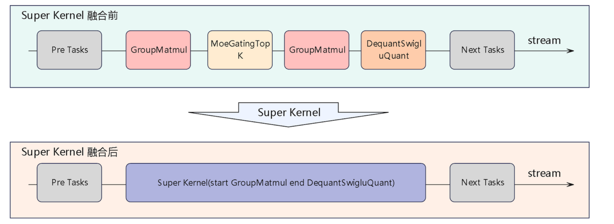
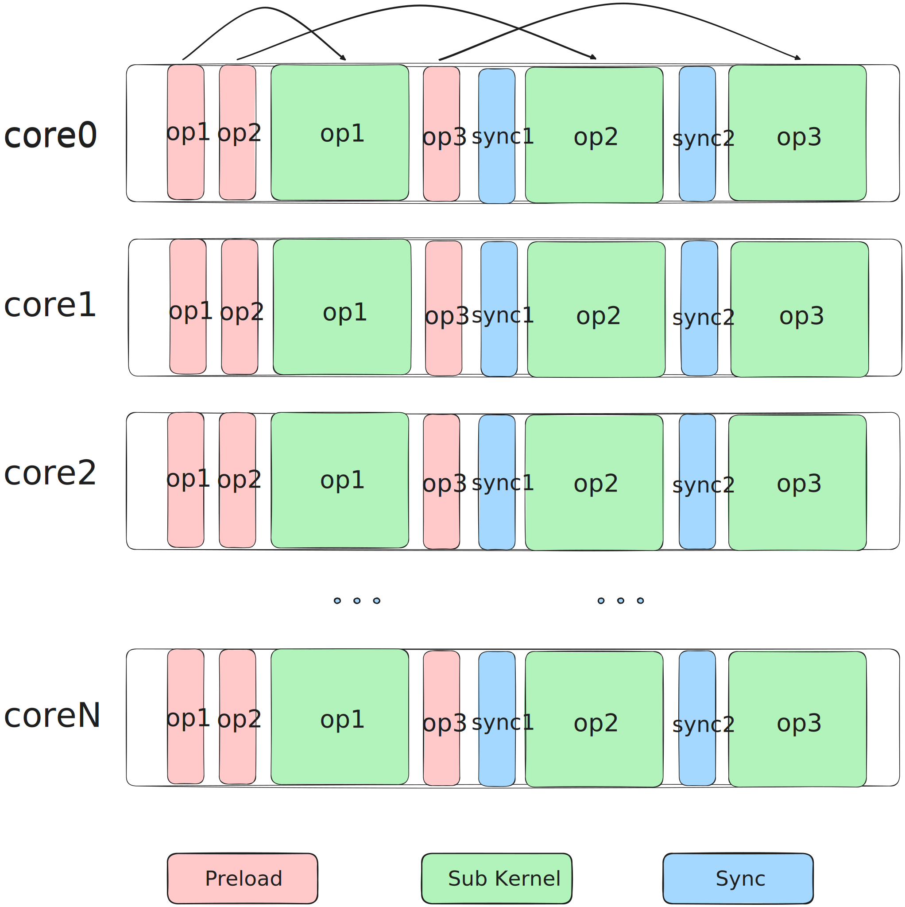
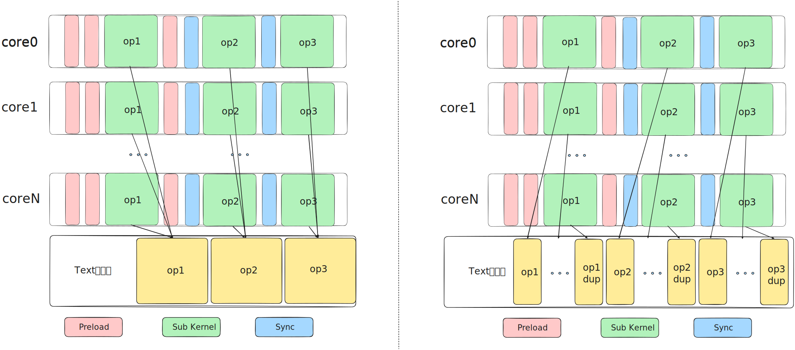
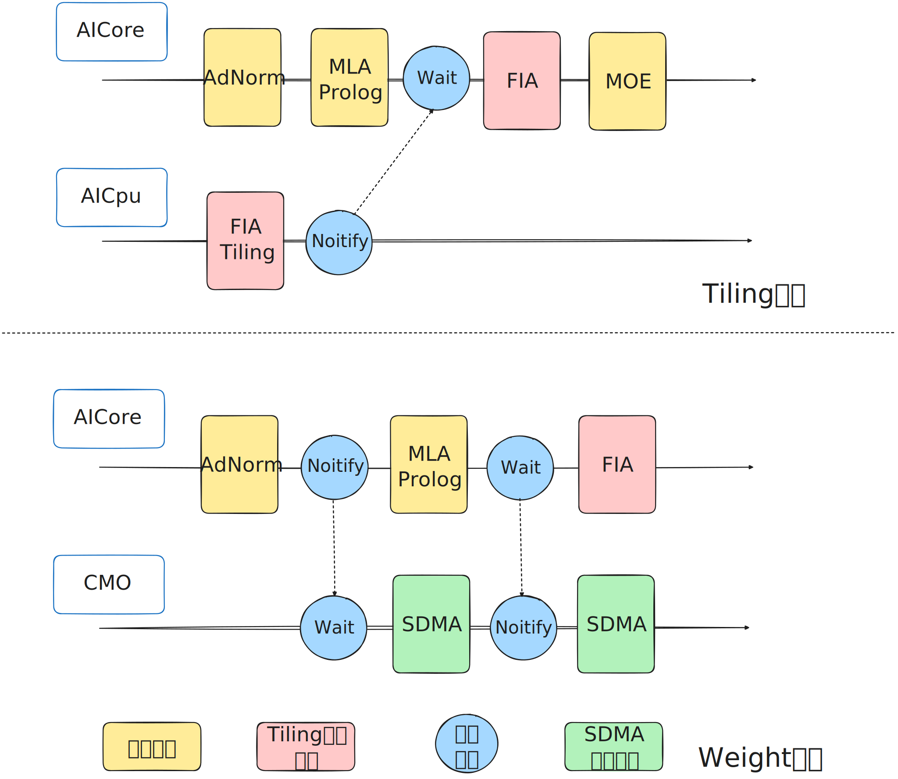

# SuperKernel


## 原理介绍
   SuperKernel 是一种面向网络图模型的调度优化技术。其核心思想是：基于网络图模型中算子的先验信息（如算子类型、前后序依赖关系等），结合即时编译（JIT）能力，将整个网络模型重新编译为单一算子，从而显著降低算子调度开销，并借助 ICache 预取、Early-Start、同步优化、子 Kernel 拆分等优化手段进一步提升性能。

   <div align="center">
      
   </div>

***
   SuperKernel 的设计初衷是将多个子算子融合成一个 SuperKernel，以节省 N-1 次算子调度开销。然而，为维持子算子间的执行顺序，通常需插入全核同步操作，这在一定程度上削弱了调度优化的收益。得益于编译阶段即可获取全部子算子的先验信息，SuperKernel 可在此基础上实施更多深层优化。

​​1. **ICache Preload 优化​**
​

   SuperKernel 融合全部算子后，其二进制体积较大。系统在加载算子时通常仅预取入口处指令，导致 SuperKernel 内部大量指令未被预加载至指令缓存（ICache），从而引发较高的 ICache Miss。为此，我们引入 ICache Preload 机制：在当前子算子开始执行前，预加载其后续子算子的代码段，从而有效减少后续算子执行时的 ICache Miss。

   <div align="center">
      
   </div>


​​2. **Early-Start 优化​​**

   在常规调度中，必须等待前序算子全部执行完成后，才能启动后续算子。然而，多数前序算子的末尾指令为 MTE 数据搬运指令，而后续算子的起始指令通常为与输入数据无关的初始化标量指令。由于这两类指令分属不同计算单元，具备并发执行的条件。Early-Start 技术在前序算子的搬运指令前插入 Set 同步点，在后续算子的初始化指令后插入 Wait 同步点，从而实现两个子算子的部分指令并发执行，提升整体执行效率。


​3. **同步优化**
​​

   为保障执行顺序正确，SuperKernel 在各子算子调度之间会插入全核同步操作。对于 Kernel Type 为 Mix 1:2 的混合类型算子，完整的全核同步需等待所有 Aicore 的 Vector 核与 Cube 核均完成同步。SuperKernel 在编译时能够识别每个子算子的类型，因此可针对前后子算子的 Kernel Type 定制同步范围。例如，对于连续的 Vector 算子，仅需执行全 Vector 核同步即可。通过细粒度控制同步范围，可有效降低子算子间的同步开销。

​​4. **子 Kernel 拆分**
​​

在多核系统中，当多个计算核心执行同一段代码时，会并发访问内存中的同一指令地址。这种对同一地址的并发访问会在共享的 L2 Cache 层面形成串行化访问队列，引发资源争用，削弱多核并行带来的性能增益。为解决该问题，SuperKernel 将子 Kernel 代码复制为多份副本，使不同核心能根据核 ID 映射到不同的物理地址执行。这一方法有效缓解了多核对同一指令地址的争用，显著提升算子执行效率。
​   <div align="center">
      
   </div>

此外，SuperKernel 还支持基于内存语义的 Notify 与 Wait 事件，以适配 Tiling 下沉与 Weight 预取等场景。Tiling 下沉算子指的是 Tiling 计算依赖前序算子的输出结果，为避免主机与设备间的频繁交互，将 Tiling 计算部署于 AICpu 执行的算子。若 SuperKernel 融合了该 Tiling 算子的前序算子，则需在前序算子执行完成后通过 Notify 事件通知 AICpu 启动 Tiling 计算；若融合了 Tiling 下沉算子本身，则需通过 Wait 事件等待 AICpu 完成 Tiling 计算后再执行 Device 侧计算。Weight 预取则借助 CMO 任务调用专用硬件单元 SDMA，将数据提前加载至 L2 Cache，以提升计算效率。SDMA 与 Aicore 之间的协作正是通过内存语义的 Notify/Wait 事件实现的。

​   <div align="center">
      
   </div>


***


## 目录结构

```
super_kernel/
├── docs                   # 文档介绍
├── examples               # 示例脚本或 Notebook，演示典型用法
├── scripts                # 脚本路径
├── src                    # 业务代码入口，后续根据功能划分模块
│   └── superkernel        # SuperKernel 业务代码
├── tests                  # 测试工程目录
│   ├── st                 # System Test
│   └── ut                 # Unit Test
├── CMakeLists.txt         # CMake 配置文件
├── pyproject.toml         # 项目元信息与打包配置
├── README.md
└── requirements-dev.txt   # python 依赖配置文件
```

## 构建与安装

参考[执行构建](../doc/build.md#执行构建)。

## 开发者

开发者请查阅《[Developer Guide](docs/developer_guide.md)》，了解代码实现、测试方法等信息。
