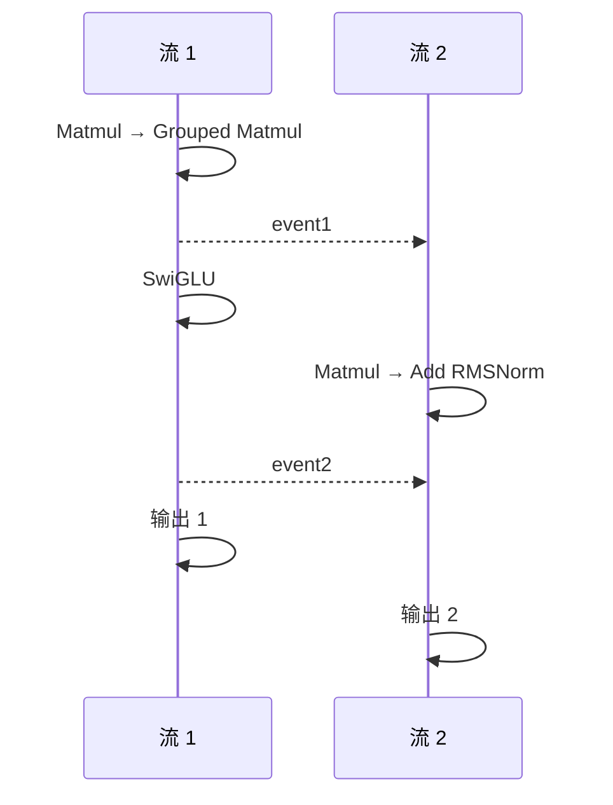

# example01_dual_stream

## 用例功能

该样例展示了 SuperKernel 对双流计算图的融合优化能力，包括跨流控制依赖处理、自动算子并行和静态编译，
并验证融合优化前后的执行结果一致性。

核心特点：

- 支持双流场景，可正确处理两个 NPU `stream` 之间由 `event` 建立的控制依赖。
- 通过 `auto_op_parallel` 启用自动算子并行，简化双流计算图的 SuperKernel 优化配置。
- 自动对比 SK 与 Non-SK 的执行结果，验证融合优化后的结果一致性。



## 目录结构

```text
example01_dual_stream/
├── README.md                             # 中文说明文档
├── README_en.md                          # 英文说明文档
├── main.py                               # 构造双流模型，运行 SK/Non-SK 版本并对比精度
└── run.sh                                # 运行样例
```

## 环境依赖

支持如下产品型号：

- Ascend 950PR/Ascend 950DT
- Atlas A3 训练系列产品/Atlas A3 推理系列产品
- Atlas A2 训练系列产品/Atlas A2 推理系列产品

请先参考[源码构建指南](../../../../docs/zh/build.md)完成环境准备，并按照官方发布的 PyTorch 与 TorchNPU 版本进行配套安装，
参见《[Ascend Extension for PyTorch 用户指南](https://www.hiascend.com/document/redirect/pytorchuserguide)》，
再安装对应的 Python 依赖：

```bash
pip install -r super_kernel/examples/requirements.txt
```

## 执行命令

| `--npu-arch` 取值 | 对应产品 |
| --- | --- |
| `dav-3510` | Ascend 950 系列产品（如 Ascend 950PR、Ascend 950DT） |
| `dav-2201` | Atlas A3 训练/推理系列产品、Atlas A2 训练/推理系列产品 |

在样例目录下，Ascend 950 系列产品执行：

```bash
bash run.sh --npu-arch=dav-3510
```

Atlas A3 或 Atlas A2 系列产品执行：

```bash
bash run.sh --npu-arch=dav-2201
```

## 预期执行结果

样例执行成功时会输出如下关键日志：

```text
execute sample success
```
