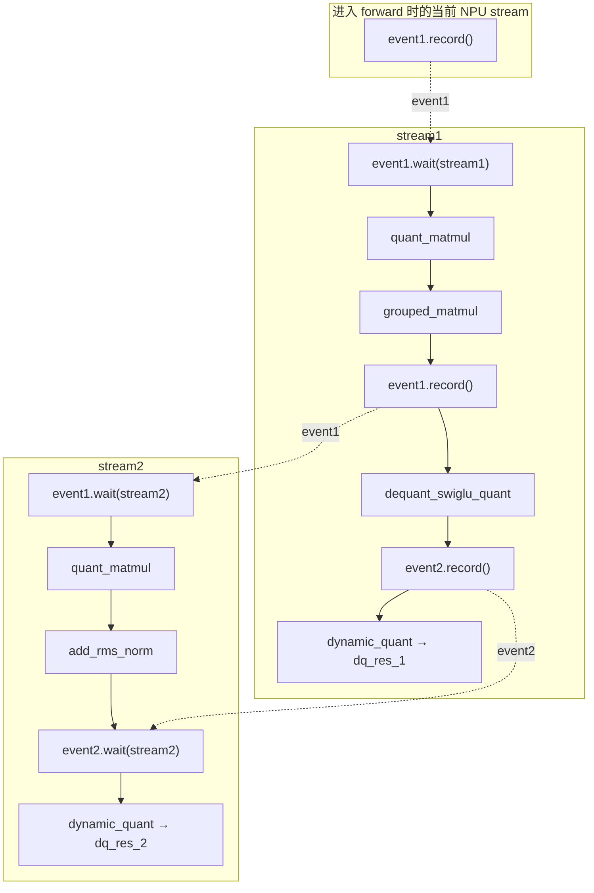

# example01_dual_stream

## 用例功能

该样例展示了 SuperKernel 对双流计算图的融合优化能力，包括跨流控制依赖处理、自动算子并行、静态编译
和执行结果校验。

核心特点：

- 支持双流场景，可正确处理两个 NPU `stream` 之间由 `event` 建立的控制依赖。
- 通过 `auto_op_parallel` 启用自动算子并行，简化双流计算图的 SuperKernel 优化配置。
- 自动对比 SK 与 Non-SK 的执行结果，验证融合优化后的结果一致性。

## 目录结构

```text
example01_dual_stream/
├── README.md                             # 中文说明文档
├── README_en.md                          # 英文说明文档
├── main.py                               # 构造双流模型，运行 SK/Non-SK 版本并对比精度
├── run.sh                                # 解析 --npu-arch，运行 main.py 并检查编译产物
├── log/                                  # 日志目录（运行时生成）
├── tmp/                                  # 保存 run.log（运行时生成）
└── static_kernel_compile_outputs/        # 静态 kernel 编译产物，包含 .run 包（运行时生成）
```

## 前置依赖

支持如下产品型号：

- Ascend 950PR/Ascend 950DT
- Atlas A3 训练系列产品/Atlas A3 推理系列产品
- Atlas A2 训练系列产品/Atlas A2 推理系列产品

请先参考[源码构建指南](../../../../docs/zh/build.md)完成环境准备，并按照官方发布的 PyTorch 与 TorchNPU 版本进行配套安装，
参见《[Ascend Extension for PyTorch 用户指南](https://www.hiascend.com/document/redirect/pytorchuserguide)》，
再安装对应的 Python 依赖：

```bash
pip install -r super_kernel/examples/requirements.txt
```

## 用例介绍



实线表示同一 `stream` 内的任务下发顺序，虚线表示由 `event` 建立的同步关系。`event1` 首先同步进入
`forward` 时的当前 NPU `stream` 与 `stream1`，随后在 `grouped_matmul` 后被再次记录，用于同步 `stream1`
与 `stream2`；`event2` 在 `dequant_swiglu_quant` 后同步两个 `stream`。

该用例的执行流程如下：

1. 构造输入数据，创建两个 NPU `stream` 与两个 `event`。
2. 开启 `static_kernel_compile`、`super_kernel_optimize` 与 `auto_op_parallel`，运行 SK 版本。
3. 关闭 SuperKernel 优化，运行 Non-SK 基线版本。
4. 使用 `atol=1e-3`、`rtol=1e-3` 对比两个版本的 `dq_res_2` 输出。
5. 检查静态 Kernel 编译产物中是否生成 `.run` 包。

## 执行命令

`--npu-arch` 指定样例的目标 NPU 架构，应根据实际运行样例的产品型号选择：

| `--npu-arch` 取值 | 对应产品 |
| --- | --- |
| `dav-3510` | Ascend 950 系列产品（如 Ascend 950PR、Ascend 950DT） |
| `dav-2201` | Atlas A3 训练/推理系列产品、Atlas A2 训练/推理系列产品 |

在样例目录下，Ascend 950 系列产品执行：

```bash
bash run.sh --npu-arch=dav-3510
```

Atlas A3 或 Atlas A2 系列产品执行：

```bash
bash run.sh --npu-arch=dav-2201
```

样例使用当前可见 NPU。SuperKernel 选项说明参见
[TorchAir SuperKernel 使用说明](https://gitcode.com/Ascend/torchair/blob/master/docs/zh/npugraph_ex/advanced/superkernel.md)。

## 预期执行结果

精度对比通过且成功生成 `.run` 包时，命令退出码为 0，输出包含：

```text
  output[0] allclose(atol=0.001, rtol=0.001): PASS
  output[1] allclose(atol=0.001, rtol=0.001): PASS

Test passed: SK and Non-SK outputs match!
execute sample success
```

结果查看方式：

- 运行日志同时输出到终端与 `tmp/run.log`。
- 静态 Kernel 编译产物位于 `static_kernel_compile_outputs/`。`run.sh` 检查其中是否至少生成一个
  `.run` 包；未生成时返回失败，若同时存在 `*_compile_error.log`，则输出其路径。
