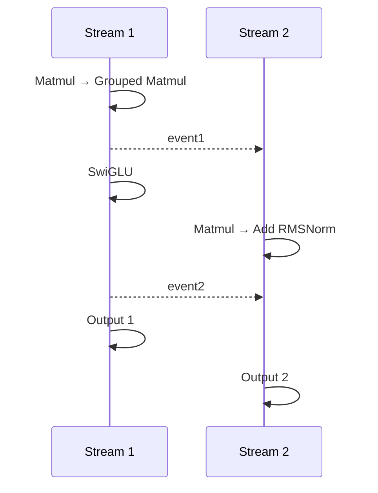

# example01_dual_stream

## Use Case

This sample demonstrates SuperKernel fusion optimization for dual-stream computation graphs, including cross-stream
control dependency handling, automatic operator parallelism, and static compilation, while verifying result
consistency before and after fusion optimization.

Key features:

- Supports dual-stream scenarios and correctly handles `event`-based control dependencies between two NPU `stream`
  objects.
- Enables automatic operator parallelism through `auto_op_parallel`, simplifying SuperKernel optimization for
  dual-stream computation graphs.
- Automatically compares SK and Non-SK results to verify consistency after fusion optimization.



## Directory Structure

```text
example01_dual_stream/
├── README.md                             # Chinese documentation
├── README_en.md                          # English documentation
├── main.py                               # Builds the dual-stream model, runs SK/Non-SK, and compares accuracy
└── run.sh                                # Runs the sample
```

## Prerequisites

This sample supports the following product models:

- Ascend 950PR/Ascend 950DT
- Atlas A3 training series products/Atlas A3 inference series products
- Atlas A2 training series products/Atlas A2 inference series products

Follow the [source build guide](../../../../docs/en/build.md) and install the officially released matching
PyTorch and TorchNPU versions. See the
[Ascend Extension for PyTorch user guide](https://www.hiascend.com/document/redirect/pytorchuserguide).
Finally, install the sample's Python dependencies:

```bash
pip install -r super_kernel/examples/requirements.txt
```

## Execution Command

| `--npu-arch` | Corresponding Products |
| --- | --- |
| `dav-3510` | Ascend 950 series products, such as Ascend 950PR and Ascend 950DT |
| `dav-2201` | Atlas A3 training/inference series products and Atlas A2 training/inference series products |

In the sample directory, run the following command for Ascend 950 series products:

```bash
bash run.sh --npu-arch=dav-3510
```

For Atlas A3 or Atlas A2 products:

```bash
bash run.sh --npu-arch=dav-2201
```

## Expected Result

When the sample runs successfully, it outputs the following key log:

```text
execute sample success
```
