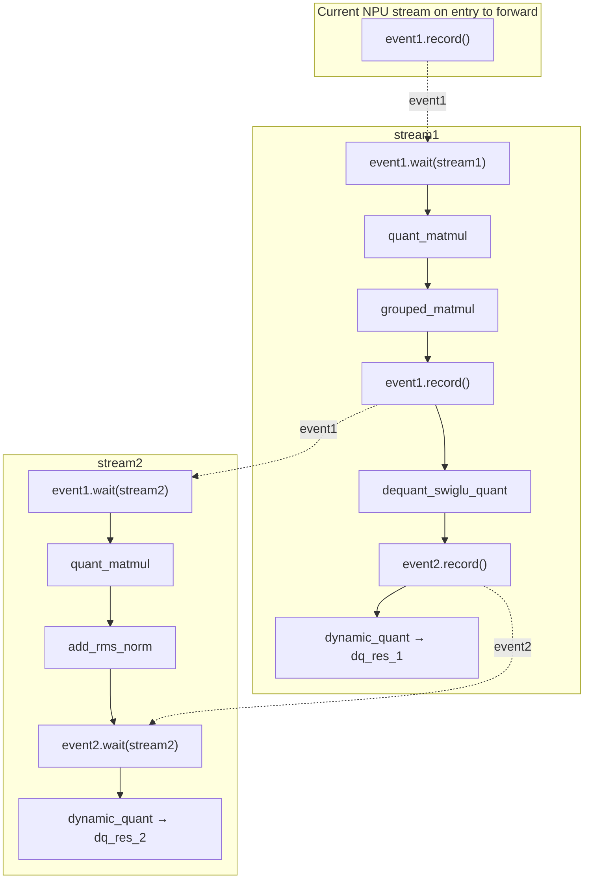

# example01_dual_stream

## Use Case

This sample demonstrates SuperKernel fusion optimization for dual-stream computation graphs, including cross-stream
control dependency handling, automatic operator parallelism, static compilation, and result verification.

Key features:

- Supports dual-stream scenarios and correctly handles `event`-based control dependencies between two NPU `stream`
  objects.
- Enables automatic operator parallelism through `auto_op_parallel`, simplifying SuperKernel optimization for
  dual-stream computation graphs.
- Automatically compares SK and Non-SK results to verify consistency after fusion optimization.

## Directory Structure

```text
example01_dual_stream/
├── README.md                             # Chinese documentation
├── README_en.md                          # English documentation
├── main.py                               # Builds the dual-stream model, runs SK/Non-SK, and compares accuracy
├── run.sh                                # Parses --npu-arch, runs main.py, and checks compilation artifacts
├── log/                                  # Log directory (generated at runtime)
├── tmp/                                  # Contains run.log (generated at runtime)
└── static_kernel_compile_outputs/        # Static kernel artifacts, including a .run package (generated at runtime)
```

## Prerequisites

This sample supports the following product models:

- Ascend 950PR/Ascend 950DT
- Atlas A3 training series products/Atlas A3 inference series products
- Atlas A2 training series products/Atlas A2 inference series products

Follow the [source build guide](../../../../docs/en/build.md) and install the officially released matching
PyTorch and TorchNPU versions. See the
[Ascend Extension for PyTorch user guide](https://www.hiascend.com/document/redirect/pytorchuserguide).
Finally, install the sample's Python dependencies:

```bash
pip install -r super_kernel/examples/requirements.txt
```

## Use Case Details



Solid arrows indicate task submission order within a `stream`; dashed arrows indicate synchronization through an
`event`. `event1` first synchronizes the current NPU `stream` on entry to `forward` with `stream1`. It is recorded again
after `grouped_matmul` to synchronize `stream1` with `stream2`. `event2` synchronizes the two `stream` objects after
`dequant_swiglu_quant`.

The sample performs these steps:

1. Builds the inputs and creates two NPU `stream` objects and two `event` objects.
2. Enables `static_kernel_compile`, `super_kernel_optimize`, and `auto_op_parallel`, then runs the SK version.
3. Disables SuperKernel optimization and runs the Non-SK baseline.
4. Compares the two `dq_res_2` outputs with `atol=1e-3` and `rtol=1e-3`.
5. Checks that static kernel compilation generated a `.run` package.

## Execution Command

`--npu-arch` specifies the target NPU architecture and must match the product model in use:

| `--npu-arch` | Corresponding Products |
| --- | --- |
| `dav-3510` | Ascend 950 series products, such as Ascend 950PR and Ascend 950DT |
| `dav-2201` | Atlas A3 training/inference series products and Atlas A2 training/inference series products |

In the sample directory, run the following command for Ascend 950 series products:

```bash
bash run.sh --npu-arch=dav-3510
```

For Atlas A3 or Atlas A2 products:

```bash
bash run.sh --npu-arch=dav-2201
```

This sample uses the currently visible NPU. For SuperKernel options, see the
[TorchAir SuperKernel guide](https://gitcode.com/Ascend/torchair/blob/master/docs/zh/npugraph_ex/advanced/superkernel.md).

## Expected Result

When the accuracy comparison passes and a `.run` package is generated, the command exits with status 0 and includes:

```text
  output[0] allclose(atol=0.001, rtol=0.001): PASS
  output[1] allclose(atol=0.001, rtol=0.001): PASS

Test passed: SK and Non-SK outputs match!
execute sample success
```

To inspect the results:

- The run log is written to both the terminal and `tmp/run.log`.
- Static kernel compilation artifacts are under `static_kernel_compile_outputs/`. `run.sh` checks that at least one
  `.run` package exists. If none exists, it fails and reports the path of `*_compile_error.log` when available.
