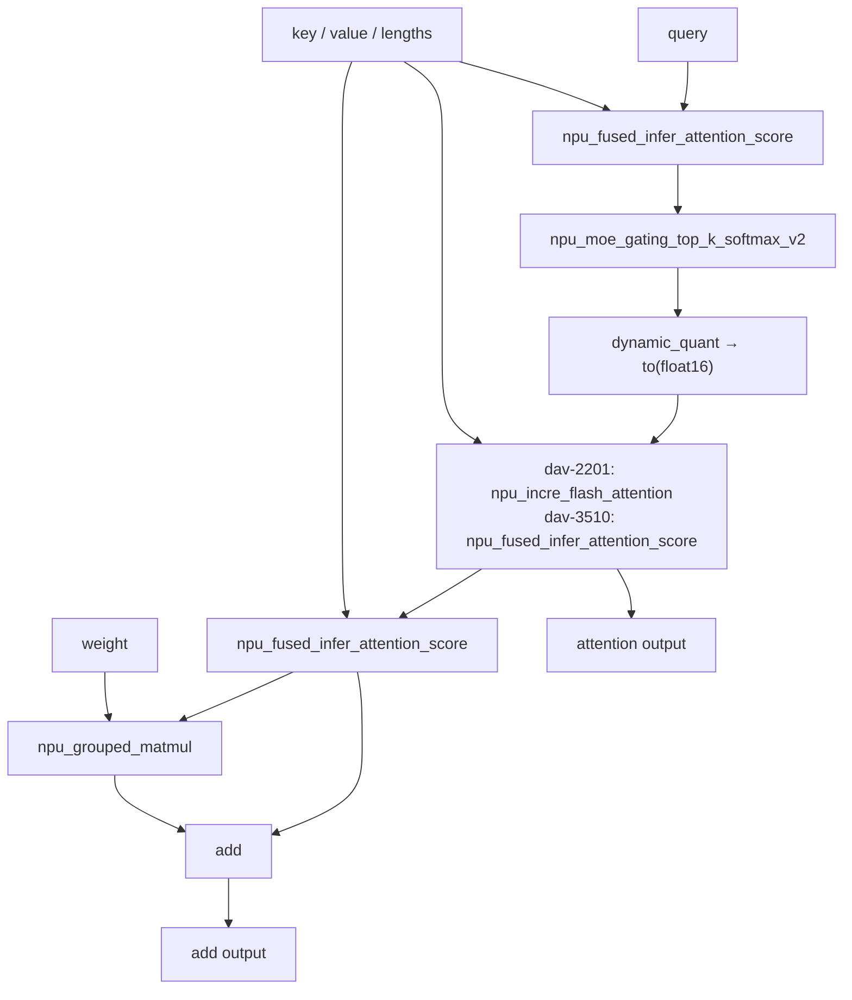

# example02_sk_options

## 用例功能

该样例展示 SuperKernel 面向复杂融合场景的灵活调优与诊断能力，以及相关选项在 TorchAir `npugraph_ex`
静态编译（AOT）场景中的配置方式。样例编译 attention 网络并与 eager 基线对比，验证选项组合下的结果一致性。

核心特点：

- 优化选项覆盖算子并行、DCCI 缓存一致性、提前启动和激进融合策略。
- 调试选项覆盖全核同步、算子执行跟踪、跨核同步检查和单算子最大核数运行。
- 通过统一的 `torch.compile` 配置入口组合优化与调试开关，并以 eager 基线校验结果一致性。

## 目录结构

```text
example02_sk_options/
├── README.md                             # 中文说明文档
├── README_en.md                          # 英文说明文档
├── main-dav-2201.py                      # dav-2201 attention 网络与选项配置
├── main-dav-3510.py                      # dav-3510 attention 网络与选项配置
├── run.sh                                # 选择目标架构、运行样例并检查编译产物
├── log/                                  # 日志目录（运行时生成）
├── tmp/                                  # 保存 run.log（运行时生成）
└── static_kernel_compile_outputs/        # 静态 kernel 编译产物，包含 .run 包（运行时生成）
```

## 前置依赖

支持如下产品型号：

- Ascend 950PR/Ascend 950DT
- Atlas A3 训练系列产品/Atlas A3 推理系列产品
- Atlas A2 训练系列产品/Atlas A2 推理系列产品

请先参考[源码构建指南](../../../../docs/zh/build.md)完成环境准备，并按照官方发布的 PyTorch 与 TorchNPU 版本进行配套安装，
参见《[Ascend Extension for PyTorch 用户指南](https://www.hiascend.com/document/redirect/pytorchuserguide)》，
再安装对应的 Python 依赖：

```bash
pip install -r super_kernel/examples/requirements.txt
```

## 用例介绍



两个样例网络的主干拓扑一致，仅中间的 attention 算子因架构而异。样例先执行 eager 基线，再使用相同输入执行
SuperKernel 静态编译版本，并以 `rtol=1e-3`、`atol=1e-2` 校验两个输出。

## 选项说明

样例通过 `torch.compile` 的 `options` 展示三类开关：

| 类别 | 配置入口 | 作用 |
| --- | --- | --- |
| 基础开关 | `options` 顶层 | 启用静态 kernel 编译和 SuperKernel 融合优化。 |
| 优化开关 | `super_kernel_optimize_options` | 控制算子调度、缓存一致性、提前启动和融合策略。 |
| 调试开关 | `super_kernel_debug_options` | 控制同步、执行跟踪、跨核检查和单算子调试方式。 |

### 基础开关

| 选项 | 样例值 | 功能与效果 |
| --- | --- | --- |
| `static_kernel_compile` | `True` | 启用静态 kernel 编译并生成 `.run` 包。 |
| `super_kernel_optimize` | `True` | 启用 SuperKernel 融合优化。 |

### 优化开关

`super_kernel_optimize_options` 配置融合与执行策略：

| 选项 | 样例值 | 功能与效果 |
| --- | --- | --- |
| `auto_op_parallel` | `0` | 控制自动算子并行；样例关闭该能力，使用默认优先级调度。 |
| `dcci_before_kernel_start` | `[".*"]` | 对所有匹配的子 `kernel`，在执行前增加 DCCI，显式维护缓存一致性。 |
| `dcci_after_kernel_end` | `[".*"]` | 对所有匹配的子 `kernel`，在执行后增加 DCCI。 |
| `dcci_disable_on_kernel` | `[".*"]` | 关闭匹配子 `kernel` 内部的 DCCI，由前后两个选项显式控制 DCCI 时机。 |
| `early_start` | `1` | 启用提前启动路径，使后续任务可在满足同步约束时提前启动。 |
| `aggressive_opt_strategies.value_breaker_bypass` | `0b10` | 允许规则校验后的非配对 value/memory wait 继续参与融合。 |
| `aggressive_opt_strategies.task_breaker_bypass` | `0b00` | 不绕过 task breaker，保留默认任务边界。 |

### 调试开关

`super_kernel_debug_options` 控制诊断行为。本样例均设为 `0`，保持调试能力关闭；下表同时说明设为 `1`
时的开启效果：

| 选项 | 样例值 | 样例行为及开启效果 |
| --- | --- | --- |
| `debug_sync_all` | `0` | 本样例关闭；设为 `1` 时，将同步任务切换为全核同步，用于定位执行时序问题。 |
| `debug_op_exec_trace` | `0` | 本样例关闭；设为 `1` 时，记录 SuperKernel 及其子算子的启动、结束状态，用于定位卡死位置。 |
| `debug_cross_core_sync_check` | `0` | 本样例关闭；设为 `1` 时，检查 MIX 子 `kernel` 的跨核同步状态，并启用算子执行跟踪。 |
| `debug_per_op_max_core_num` | `0` | 本样例关闭；设为 `1` 时，将每个可融合算子拆分为独立 scope，并按设备最大可用核数构造调试执行配置。 |

上述取值用于展示选项配置，不是所有网络的通用推荐。完整约束参见
[TorchAir SuperKernel 使用说明](https://gitcode.com/Ascend/torchair/blob/master/docs/zh/npugraph_ex/advanced/superkernel.md)。

## 执行命令

`--npu-arch` 用于指定目标 NPU 架构，样例会根据该参数选择对应的 attention 网络。应根据实际使用的产品型号选择参数值：

| `--npu-arch` 取值 | 对应产品 |
| --- | --- |
| `dav-3510` | Ascend 950 系列产品（如 Ascend 950PR、Ascend 950DT） |
| `dav-2201` | Atlas A3 训练/推理系列产品、Atlas A2 训练/推理系列产品 |

在样例目录下，Ascend 950 系列产品执行：

```bash
bash run.sh --npu-arch=dav-3510
```

Atlas A3 或 Atlas A2 系列产品执行：

```bash
bash run.sh --npu-arch=dav-2201
```

脚本根据 `--npu-arch` 选择对应的 `main-dav-2201.py` 或 `main-dav-3510.py`，并使用当前可见 NPU。

## 预期执行结果

eager 与静态编译结果校验通过且成功生成 `.run` 包时，命令退出码为 0，输出包含：

```text
eager add_out: shape=(3, 1, 1024), dtype=torch.float16, mean=<value>
eager ifa_out: shape=(3, 1, 1024), dtype=torch.float16, mean=<value>
compiled add_out: shape=(3, 1, 1024), dtype=torch.float16, mean=<value>
compiled ifa_out: shape=(3, 1, 1024), dtype=torch.float16, mean=<value>
Golden check passed
Test completed!
execute sample success
```

结果查看方式：

- 运行日志同时输出到终端与 `tmp/run.log`，其中包含两个输出的形状、数据类型和均值。
- 静态 kernel 编译产物位于 `static_kernel_compile_outputs/`。`run.sh` 检查其中是否至少生成一个
  `.run` 包；未生成时返回失败，若同时存在 `*_compile_error.log`，则输出其路径。
