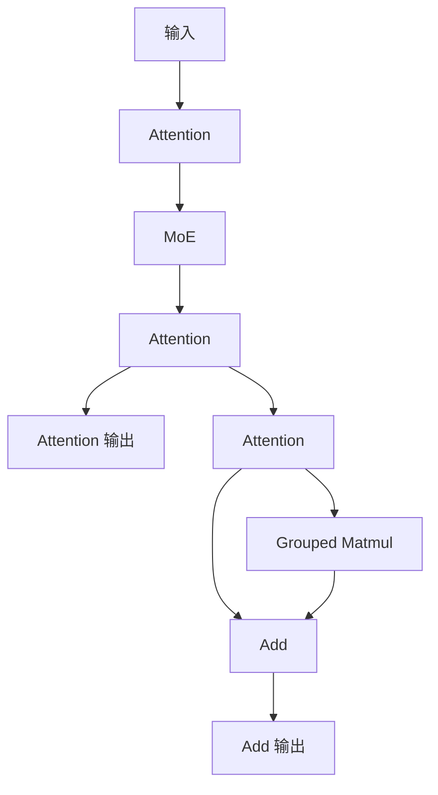

# example02_sk_options

## 用例功能

该用例展示 SuperKernel 面向复杂 Attention 网络融合场景的融合优化、执行调优与问题诊断能力，以及相关选项
在 TorchAir `npugraph_ex` 静态编译（AOT）场景中的配置方式。用例编译 Attention 网络并与 eager 基线
对比，验证选项组合下的结果一致性。

核心特点：

- 优化选项覆盖算子并行、DCCI 缓存一致性、提前启动和激进融合策略。
- 调试选项覆盖全核同步、算子执行跟踪、跨核同步检查和单算子最大核数运行。
- 通过统一的 `torch.compile` 配置入口组合优化与调试选项，并以 eager 基线校验结果一致性。



### 选项说明

用例通过 `torch.compile` 的 `options` 展示 SuperKernel 的静态编译、融合优化、执行调优和问题诊断能力。

| 类别 | 配置入口 | 作用 |
| --- | --- | --- |
| 基础选项 | `options` 顶层 | 静态编译和 SuperKernel 融合。 |
| 优化选项 | `super_kernel_optimize_options` | 算子调度、缓存一致性、提前启动和融合策略。 |
| 调试选项 | `super_kernel_debug_options` | 同步、执行跟踪、跨核检查和单算子诊断。 |

#### 基础选项

| 选项 | 样例值 | 作用 |
| --- | --- | --- |
| `static_kernel_compile` | `True` | 启用静态 kernel 编译。 |
| `super_kernel_optimize` | `True` | 启用 SuperKernel 融合优化。 |

#### 优化选项

以下配置用于展示 SuperKernel 面向复杂融合场景的执行优化能力：

| 选项 | 样例值 | 作用 |
| --- | --- | --- |
| `auto_op_parallel` | `0` | 控制算子自动并行调度。 |
| `dcci_before_kernel_start` | `[".*"]` | 为匹配的子 kernel 配置执行前的缓存一致性处理。 |
| `dcci_after_kernel_end` | `[".*"]` | 为匹配的子 kernel 配置执行后的缓存一致性处理。 |
| `dcci_disable_on_kernel` | `[".*"]` | 控制匹配的子 kernel 是否执行内部缓存一致性处理。 |
| `early_start` | `1` | 控制相邻任务的提前启动优化。 |
| `aggressive_opt_strategies.value_breaker_bypass` | `0b10` | 控制融合时是否绕过 value 相关边界。 |
| `aggressive_opt_strategies.task_breaker_bypass` | `0b00` | 控制融合时是否绕过 task 相关边界。 |

#### 调试选项

以下配置用于展示 SuperKernel 的问题诊断能力。本用例中的调试选项均设为 `0`：

| 选项 | 样例值 | 作用 |
| --- | --- | --- |
| `debug_sync_all` | `0` | 控制全核同步调试，用于定位执行时序问题。 |
| `debug_op_exec_trace` | `0` | 控制算子执行跟踪，用于定位异常执行位置。 |
| `debug_cross_core_sync_check` | `0` | 控制跨核同步检查。 |
| `debug_per_op_max_core_num` | `0` | 控制单算子最大核数运行，用于单算子诊断。 |

## 目录结构

```text
example02_sk_options/
├── README.md                             # 中文说明文档
├── README_en.md                          # 英文说明文档
├── main-dav-2201.py                      # dav-2201 attention 网络与选项配置
├── main-dav-3510.py                      # dav-3510 attention 网络与选项配置
└── run.sh                                # 运行用例
```

## 环境依赖

支持如下产品型号：

- Ascend 950PR/Ascend 950DT
- Atlas A3 训练系列产品/Atlas A3 推理系列产品
- Atlas A2 训练系列产品/Atlas A2 推理系列产品

请先参考[源码构建指南](../../../../docs/zh/build.md)完成环境准备，并按照官方发布的 PyTorch 与 TorchNPU 版本进行配套安装，
参见《[Ascend Extension for PyTorch 用户指南](https://www.hiascend.com/document/redirect/pytorchuserguide)》，
再安装对应的 Python 依赖：

```bash
pip install -r super_kernel/examples/requirements.txt
```

## 执行命令

| `--npu-arch` 取值 | 对应产品 |
| --- | --- |
| `dav-3510` | Ascend 950 系列产品（如 Ascend 950PR、Ascend 950DT） |
| `dav-2201` | Atlas A3 训练/推理系列产品、Atlas A2 训练/推理系列产品 |

在用例目录下，Ascend 950 系列产品执行：

```bash
bash run.sh --npu-arch=dav-3510
```

Atlas A3 或 Atlas A2 系列产品执行：

```bash
bash run.sh --npu-arch=dav-2201
```

## 预期执行结果

用例执行成功时会输出如下关键日志：

```text
execute sample success
```
