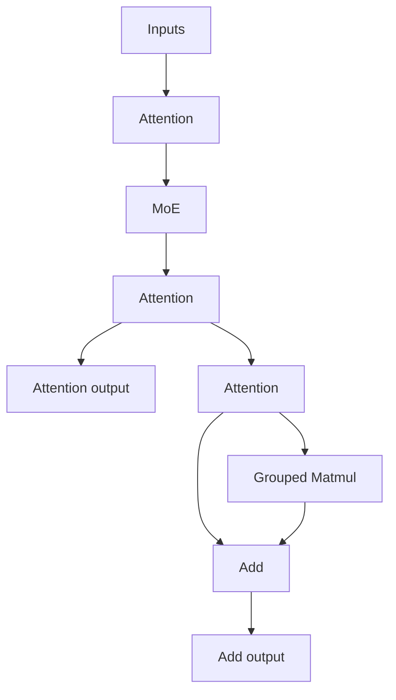

# example02_sk_options

## Use Case

This sample demonstrates SuperKernel fusion optimization, execution tuning, and diagnostics for complex Attention
network fusion scenarios, as well as how to configure the related options for TorchAir `npugraph_ex` ahead-of-time
(AOT) compilation. It compares a compiled Attention network with an eager baseline to verify result consistency under
the configured option set.

Key features:

- Optimization options cover operator parallelism, DCCI cache coherency, early start, and aggressive fusion strategies.
- Debug options cover full-core synchronization, operator execution tracing, cross-core synchronization checks, and
  per-operator maximum-core execution.
- Uses one `torch.compile` entry point to combine optimization and debug switches, with eager execution as the
  consistency baseline.



### Option Reference

The sample uses `torch.compile` `options` to demonstrate SuperKernel capabilities in static compilation, fusion
optimization, execution tuning, and diagnostics.

| Group | Configuration entry | Demonstrated capability |
| --- | --- | --- |
| Basic options | Top-level `options` | Static compilation and SuperKernel fusion. |
| Optimization options | `super_kernel_optimize_options` | Operator scheduling, cache coherency, early start, and fusion strategies. |
| Debug options | `super_kernel_debug_options` | Synchronization, execution tracing, cross-core checks, and per-operator diagnostics. |

#### Basic Options

| Option | Sample value | Purpose |
| --- | --- | --- |
| `static_kernel_compile` | `True` | Enables static kernel compilation. |
| `super_kernel_optimize` | `True` | Enables SuperKernel fusion optimization. |

#### Optimization Options

The following configuration demonstrates SuperKernel execution optimization for complex fusion scenarios:

| Option | Sample value | Purpose |
| --- | --- | --- |
| `auto_op_parallel` | `0` | Controls automatic parallel scheduling of operators. |
| `dcci_before_kernel_start` | `[".*"]` | Configures cache coherency handling before matched sub-kernels run. |
| `dcci_after_kernel_end` | `[".*"]` | Configures cache coherency handling after matched sub-kernels run. |
| `dcci_disable_on_kernel` | `[".*"]` | Controls internal cache coherency handling for matched sub-kernels. |
| `early_start` | `1` | Controls early-start optimization between adjacent tasks. |
| `aggressive_opt_strategies.value_breaker_bypass` | `0b10` | Controls whether value-related boundaries are bypassed during fusion. |
| `aggressive_opt_strategies.task_breaker_bypass` | `0b00` | Controls whether task-related boundaries are bypassed during fusion. |

#### Debug Options

The following configuration demonstrates SuperKernel diagnostic capabilities. All debug options are set to `0` in
this sample:

| Option | Sample value | Purpose |
| --- | --- | --- |
| `debug_sync_all` | `0` | Controls full-core synchronization diagnostics for execution-order issues. |
| `debug_op_exec_trace` | `0` | Controls operator execution tracing to locate abnormal execution. |
| `debug_cross_core_sync_check` | `0` | Controls cross-core synchronization checks. |
| `debug_per_op_max_core_num` | `0` | Controls per-operator maximum-core execution for isolated diagnostics. |

## Directory Structure

```text
example02_sk_options/
├── README.md                             # Chinese documentation
├── README_en.md                          # English documentation
├── main-dav-2201.py                      # dav-2201 attention network and option configuration
├── main-dav-3510.py                      # dav-3510 attention network and option configuration
└── run.sh                                # Runs the sample
```

## Prerequisites

This sample supports the following product models:

- Ascend 950PR/Ascend 950DT
- Atlas A3 training series products/Atlas A3 inference series products
- Atlas A2 training series products/Atlas A2 inference series products

Follow the [source build guide](../../../../docs/en/build.md) and install the officially released matching
PyTorch and TorchNPU versions. See the
[Ascend Extension for PyTorch user guide](https://www.hiascend.com/document/redirect/pytorchuserguide).
Finally, install the sample's Python dependencies:

```bash
pip install -r super_kernel/examples/requirements.txt
```

## Execution Command

| `--npu-arch` | Corresponding Products |
| --- | --- |
| `dav-3510` | Ascend 950 series products, such as Ascend 950PR and Ascend 950DT |
| `dav-2201` | Atlas A3 training/inference series products and Atlas A2 training/inference series products |

In the sample directory, run the following command for Ascend 950 series products:

```bash
bash run.sh --npu-arch=dav-3510
```

For Atlas A3 or Atlas A2 products:

```bash
bash run.sh --npu-arch=dav-2201
```

## Expected Result

When the sample runs successfully, it outputs the following key log:

```text
execute sample success
```
