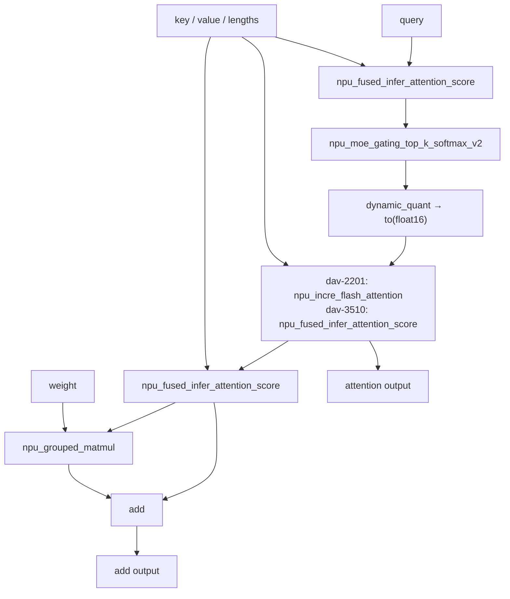

# example02_sk_options

## Use Case

This sample demonstrates SuperKernel's flexible tuning and diagnostic capabilities for complex fusion scenarios and
how to configure the related options for TorchAir `npugraph_ex` ahead-of-time (AOT) compilation. It compares a compiled
attention network with an eager baseline to verify result consistency under the configured option set.

Key features:

- Optimization options cover operator parallelism, DCCI cache coherency, early start, and aggressive fusion strategies.
- Debug options cover full-core synchronization, operator execution tracing, cross-core synchronization checks, and
  per-operator maximum-core execution.
- Uses one `torch.compile` entry point to combine optimization and debug switches, with eager execution as the
  consistency baseline.

## Directory Structure

```text
example02_sk_options/
├── README.md                             # Chinese documentation
├── README_en.md                          # English documentation
├── main-dav-2201.py                      # dav-2201 attention network and option configuration
├── main-dav-3510.py                      # dav-3510 attention network and option configuration
├── run.sh                                # Selects the target architecture, runs the sample, and checks artifacts
├── log/                                  # Log directory (generated at runtime)
├── tmp/                                  # Contains run.log (generated at runtime)
└── static_kernel_compile_outputs/        # Static kernel artifacts, including a .run package (generated at runtime)
```

## Prerequisites

This sample supports the following product models:

- Ascend 950PR/Ascend 950DT
- Atlas A3 training series products/Atlas A3 inference series products
- Atlas A2 training series products/Atlas A2 inference series products

Follow the [source build guide](../../../../docs/en/build.md) and install the officially released matching
PyTorch and TorchNPU versions. See the
[Ascend Extension for PyTorch user guide](https://www.hiascend.com/document/redirect/pytorchuserguide).
Finally, install the sample's Python dependencies:

```bash
pip install -r super_kernel/examples/requirements.txt
```

## Use Case Details



The network backbones in the two sample scripts share the same topology and differ only in the middle attention
operator. The sample first runs an eager baseline and then runs the SuperKernel statically compiled version with the
same inputs. The two outputs are
checked with `rtol=1e-3` and `atol=1e-2`.

## Option Reference

The sample demonstrates three groups of switches through `torch.compile` `options`:

| Group | Configuration entry | Purpose |
| --- | --- | --- |
| Basic switches | Top-level `options` | Enable static kernel compilation and SuperKernel fusion optimization. |
| Optimization switches | `super_kernel_optimize_options` | Control scheduling, cache coherency, early start, and fusion strategies. |
| Debug switches | `super_kernel_debug_options` | Control synchronization, execution tracing, cross-core checks, and per-operator diagnostics. |

### Basic Switches

| Option | Sample value | Function and effect |
| --- | --- | --- |
| `static_kernel_compile` | `True` | Enables static kernel compilation and generates a `.run` package. |
| `super_kernel_optimize` | `True` | Enables SuperKernel fusion optimization. |

### Optimization Switches

`super_kernel_optimize_options` configures fusion and execution strategies:

| Option | Sample value | Function and effect |
| --- | --- | --- |
| `auto_op_parallel` | `0` | Controls automatic operator parallelism; the sample disables it and uses default priority scheduling. |
| `dcci_before_kernel_start` | `[".*"]` | Adds DCCI before every matched sub-`kernel` to maintain cache coherency explicitly. |
| `dcci_after_kernel_end` | `[".*"]` | Adds DCCI after every matched sub-`kernel`. |
| `dcci_disable_on_kernel` | `[".*"]` | Disables internal DCCI for matched sub-`kernel` objects so the preceding options control its placement. |
| `early_start` | `1` | Enables the early-start path so subsequent tasks can start early after synchronization constraints are met. |
| `aggressive_opt_strategies.value_breaker_bypass` | `0b10` | Allows validated unpaired value/memory waits to remain eligible for fusion. |
| `aggressive_opt_strategies.task_breaker_bypass` | `0b00` | Keeps default task boundaries by disabling task-breaker bypass. |

### Debug Switches

`super_kernel_debug_options` controls diagnostic behavior. The sample keeps every option at `0`, with the related
debug capability disabled. The table also describes the effect of setting each option to `1`:

| Option | Sample value | Sample behavior and enabled effect |
| --- | --- | --- |
| `debug_sync_all` | `0` | Disabled in this sample; when set to `1`, replaces synchronization tasks with full-core synchronization to diagnose execution ordering. |
| `debug_op_exec_trace` | `0` | Disabled in this sample; when set to `1`, records SuperKernel and sub-operator start/end states to locate a hang. |
| `debug_cross_core_sync_check` | `0` | Disabled in this sample; when set to `1`, checks cross-core synchronization for MIX sub-`kernel` objects and enables execution tracing. |
| `debug_per_op_max_core_num` | `0` | Disabled in this sample; when set to `1`, splits each fusible operator into its own scope and builds a debug configuration with the maximum available cores. |

These values demonstrate option configuration and are not general recommendations for every network. For complete
constraints, see the
[TorchAir SuperKernel guide](https://gitcode.com/Ascend/torchair/blob/master/docs/zh/npugraph_ex/advanced/superkernel.md).

## Execution Command

`--npu-arch` specifies the target NPU architecture. The sample selects the corresponding attention network based on
this argument, so choose the value that matches the product model in use:

| `--npu-arch` | Corresponding Products |
| --- | --- |
| `dav-3510` | Ascend 950 series products, such as Ascend 950PR and Ascend 950DT |
| `dav-2201` | Atlas A3 training/inference series products and Atlas A2 training/inference series products |

In the sample directory, run the following command for Ascend 950 series products:

```bash
bash run.sh --npu-arch=dav-3510
```

For Atlas A3 or Atlas A2 products:

```bash
bash run.sh --npu-arch=dav-2201
```

The script selects `main-dav-2201.py` or `main-dav-3510.py` based on `--npu-arch` and uses the currently visible NPU.

## Expected Result

When eager validation passes and a `.run` package is generated, the command exits with status 0 and includes:

```text
eager add_out: shape=(3, 1, 1024), dtype=torch.float16, mean=<value>
eager ifa_out: shape=(3, 1, 1024), dtype=torch.float16, mean=<value>
compiled add_out: shape=(3, 1, 1024), dtype=torch.float16, mean=<value>
compiled ifa_out: shape=(3, 1, 1024), dtype=torch.float16, mean=<value>
Golden check passed
Test completed!
execute sample success
```

To inspect the results:

- The run log is written to both the terminal and `tmp/run.log`, including the shape, data type, and mean of both outputs.
- Static kernel compilation artifacts are under `static_kernel_compile_outputs/`. `run.sh` checks that at least one
  `.run` package exists. If none exists, it fails and reports the path of `*_compile_error.log` when available.
