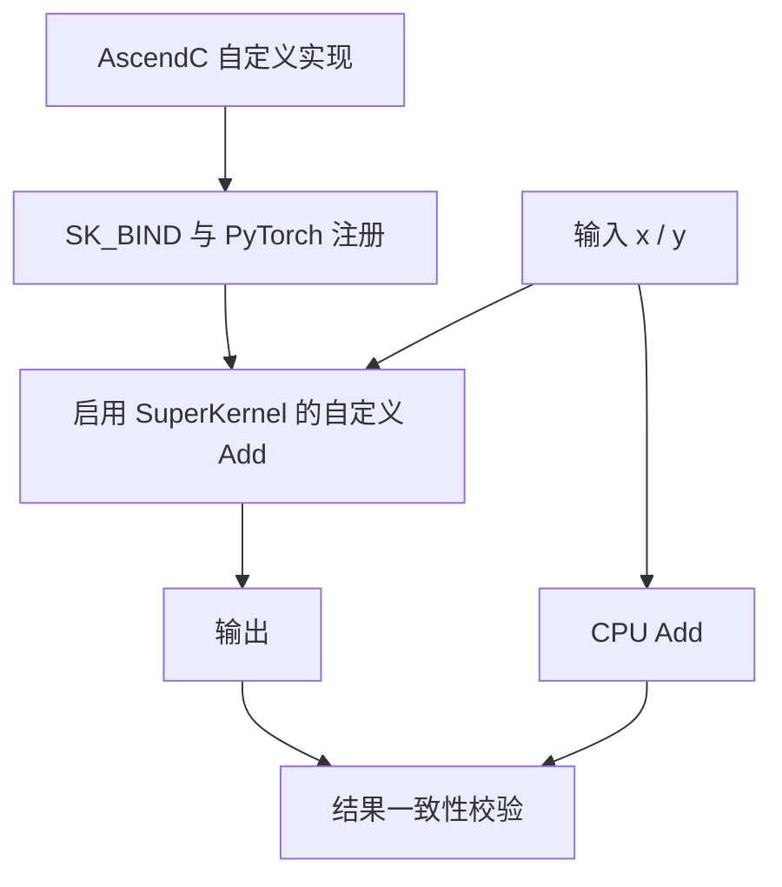

# example03_kernel_pybind

## 用例功能

该样例展示 SuperKernel 对自定义算子的支持：开发者自行编写的 AscendC 算子可以接入 PyTorch，并通过
TorchAir `npugraph_ex` 参与 SuperKernel 优化。样例的核心计算使用自行实现的加法算子 `add_custom`，
并通过与 CPU 基线对比验证结果一致性，覆盖从算子编译、注册到 SuperKernel 执行的完整流程。

核心特点：

- 使用 `SK_BIND` 为自定义 AscendC 算子绑定 SuperKernel 入口。
- 通过 pybind 和 `torch.library` 将算子注册为 `torch.ops.ascendc_ops.add_custom`。
- 在显式 SuperKernel scope 中调用自定义算子，并与 CPU `torch.add` 结果校验一致性。



样例启用 SuperKernel 优化和单算子调试能力：

| 选项 | 样例值 |
| --- | --- |
| `super_kernel_optimize` | `True` |
| `debug_per_op_max_core_num` | `1` |

## 目录结构

```text
example03_kernel_pybind/
├── README.md                              # 中文说明文档
├── README_en.md                           # 英文说明文档
├── main.py                                # 注册、编译、运行并校验自定义算子
├── run.sh                                 # 运行样例
└── ops/aclgraph_add_ops/
    ├── csrc/
    │   ├── add_custom.asc                 # AscendC 算子、SuperKernel 入口及 SK_BIND
    │   └── pybind11.asc                   # pybind 模块定义
    ├── op_extension/
    │   ├── __init__.py                    # 加载 pybind 扩展
    │   └── _torch_library.py              # 注册 PyTorch 自定义算子
    ├── setup.py                           # 调用 bisheng 构建扩展
    ├── install.sh                         # 安装自定义算子扩展
    └── uninstall.sh                       # 卸载自定义算子扩展
```

## 环境依赖

支持如下产品型号：

- Ascend 950PR/Ascend 950DT
- Atlas A3 训练系列产品/Atlas A3 推理系列产品
- Atlas A2 训练系列产品/Atlas A2 推理系列产品

请先参考[源码构建指南](../../../../docs/zh/build.md)完成环境准备，并按照官方发布的 PyTorch 与 TorchNPU 版本进行配套安装，
参见《[Ascend Extension for PyTorch 用户指南](https://www.hiascend.com/document/redirect/pytorchuserguide)》，
再安装对应的 Python 依赖：

```bash
pip install -r super_kernel/examples/requirements.txt
```

执行样例前需加载 CANN 环境，确保 `bisheng` 命令可用。

## 执行命令

| `--npu-arch` 取值 | 对应产品 |
| --- | --- |
| `dav-3510` | Ascend 950 系列产品（如 Ascend 950PR、Ascend 950DT） |
| `dav-2201` | Atlas A3 训练/推理系列产品、Atlas A2 训练/推理系列产品 |

在样例目录下，Ascend 950 系列产品执行：

```bash
bash run.sh --npu-arch=dav-3510
```

Atlas A3 或 Atlas A2 系列产品执行：

```bash
bash run.sh --npu-arch=dav-2201
```

## 预期执行结果

样例执行成功时会输出如下关键日志：

```text
execute sample success
```
