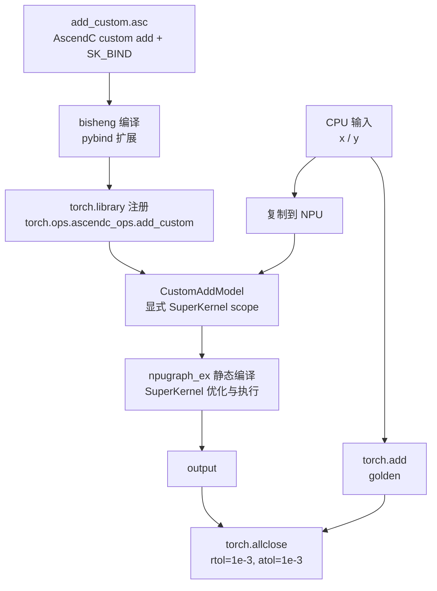

# example03_kernel_pybind

## 用例功能

该样例展示 SuperKernel 对自定义算子的支持：开发者自行编写的 AscendC 算子同样可以接入 PyTorch，
并参与 TorchAir `npugraph_ex` 静态编译和 SuperKernel 优化。样例的核心计算使用自行实现的加法算子
`add_custom`，而非调用 `torch_npu` 提供的同类算子，覆盖从算子编译、注册到 SuperKernel 执行的完整流程。

核心特点：

- 使用 `SK_BIND` 为自定义 AscendC 算子绑定 SuperKernel 入口。
- 通过 pybind 和 `torch.library` 将算子注册为 `torch.ops.ascendc_ops.add_custom`。
- 在显式 SuperKernel scope 中调用自定义算子，并与 CPU `torch.add` 结果校验一致性。

## 目录结构

```text
example03_kernel_pybind/
├── README.md                              # 中文说明文档
├── README_en.md                           # 英文说明文档
├── main.py                                # 注册、编译、运行并校验自定义算子
├── run.sh                                 # 构建扩展、运行样例并检查编译产物
├── ops/aclgraph_add_ops/
│   ├── csrc/
│   │   ├── add_custom.asc                 # AscendC 算子、SuperKernel 入口及 SK_BIND
│   │   └── pybind11.asc                   # pybind 模块定义
│   ├── op_extension/
│   │   ├── __init__.py                    # 加载 pybind 扩展
│   │   └── _torch_library.py              # 注册 PyTorch 自定义算子
│   ├── setup.py                           # 调用 bisheng 构建扩展
│   ├── install.sh                         # 将扩展安装到样例临时目录
│   └── uninstall.sh                       # 清理临时扩展
├── log/                                   # 编译日志目录（运行时生成）
├── tmp/                                   # 保存 run.log（运行时生成）
└── static_kernel_compile_outputs/         # 静态 kernel 编译产物（运行时生成）
```

## 前置依赖

支持如下产品型号：

- Ascend 950PR/Ascend 950DT
- Atlas A3 训练系列产品/Atlas A3 推理系列产品
- Atlas A2 训练系列产品/Atlas A2 推理系列产品

请先参考[源码构建指南](../../../../docs/zh/build.md)完成环境准备，并按照官方发布的 PyTorch 与 TorchNPU 版本进行配套安装，
参见《[Ascend Extension for PyTorch 用户指南](https://www.hiascend.com/document/redirect/pytorchuserguide)》，
再安装对应的 Python 依赖：

```bash
pip install -r super_kernel/examples/requirements.txt
```

执行样例前需加载 CANN 环境，确保 `bisheng` 命令可用。

## 用例介绍



`add_custom.asc` 同时定义普通 kernel 入口和 `__sk__` SuperKernel 入口，并通过 `SK_BIND` 建立绑定。
构建后的 pybind 扩展负责调用 kernel，`torch.library` 则提供 Meta 和 NPU 实现，使自定义算子能够被
`torch.compile` 捕获。`CustomAddModel` 将算子放入 `custom_add_sk` scope 后，由 `npugraph_ex` 完成
静态编译和 SuperKernel 执行。

## 关键配置

| 配置 | 样例值 | 功能与效果 |
| --- | --- | --- |
| `static_kernel_compile` | `True` | 启用静态 kernel 编译。 |
| `super_kernel_optimize` | `True` | 启用 SuperKernel 优化。 |
| `debug_per_op_max_core_num` | `1` | 将可融合算子分别构造为独立 scope，并按设备最大可用核数生成调试配置。 |

完整选项说明参见
[TorchAir SuperKernel 使用说明](https://gitcode.com/Ascend/torchair/blob/master/docs/zh/npugraph_ex/advanced/superkernel.md)。

## 执行命令

`--npu-arch` 指定样例的目标 NPU 架构，应根据实际运行样例的产品型号选择：

| `--npu-arch` 取值 | 对应产品 |
| --- | --- |
| `dav-3510` | Ascend 950 系列产品（如 Ascend 950PR、Ascend 950DT） |
| `dav-2201` | Atlas A3 训练/推理系列产品、Atlas A2 训练/推理系列产品 |

在样例目录下，Ascend 950 系列产品执行：

```bash
bash run.sh --npu-arch=dav-3510
```

Atlas A3 或 Atlas A2 系列产品执行：

```bash
bash run.sh --npu-arch=dav-2201
```

脚本会将该参数传给 `setup.py`，用于设置 `bisheng --npu-arch`，并使用当前可见 NPU。自定义算子扩展安装到
`tmp/python_packages/`，通过
`PYTHONPATH` 导入，样例退出时自动清理，不影响当前 Python 环境中的同名包。

## 预期执行结果

自定义算子输出与 CPU `torch.add` 结果校验通过时，输出包含：

```text
Test passed: the with sk output matches the golden result
execute sample success
```

结果查看方式：

- 运行日志同时输出到终端与 `tmp/run.log`。
- 静态 kernel 编译产物位于 `static_kernel_compile_outputs/`。未生成 `.run` 且存在
  `*_compile_error.log` 时，`run.sh` 返回失败并输出错误日志路径。
