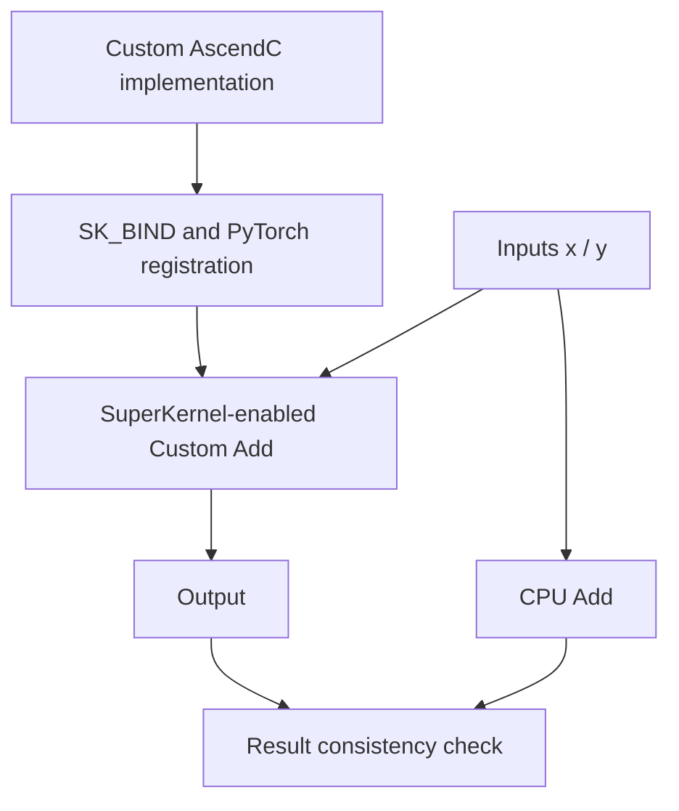

# example03_kernel_pybind

## Use Case

This sample demonstrates SuperKernel support for custom operators: an AscendC operator implemented by a developer can
be integrated with PyTorch and participate in SuperKernel optimization through TorchAir `npugraph_ex`. The sample uses
its own `add_custom` implementation for the core computation and verifies result consistency against the CPU baseline,
covering the complete path from operator compilation and registration to SuperKernel execution.

Key features:

- Uses `SK_BIND` to bind a SuperKernel entry point to the custom AscendC operator.
- Registers the operator as `torch.ops.ascendc_ops.add_custom` through pybind and `torch.library`.
- Invokes the custom operator in an explicit SuperKernel scope and validates its output against CPU `torch.add`.



The sample enables SuperKernel optimization and per-operator diagnostics:

| Option | Sample value |
| --- | --- |
| `super_kernel_optimize` | `True` |
| `debug_per_op_max_core_num` | `1` |

## Directory Structure

```text
example03_kernel_pybind/
├── README.md                              # Chinese documentation
├── README_en.md                           # English documentation
├── main.py                                # Register, compile, run, and validate the custom operator
├── run.sh                                 # Runs the sample
└── ops/aclgraph_add_ops/
    ├── csrc/
    │   ├── add_custom.asc                 # AscendC operator, SuperKernel entry point, and SK_BIND
    │   └── pybind11.asc                   # pybind module definition
    ├── op_extension/
    │   ├── __init__.py                    # Load the pybind extension
    │   └── _torch_library.py              # Register the custom PyTorch operator
    ├── setup.py                           # Build the extension with bisheng
    ├── install.sh                         # Install the custom operator extension
    └── uninstall.sh                       # Uninstall the custom operator extension
```

## Prerequisites

This sample supports the following product models:

- Ascend 950PR/Ascend 950DT
- Atlas A3 training series products/Atlas A3 inference series products
- Atlas A2 training series products/Atlas A2 inference series products

Follow the [source build guide](../../../../docs/en/build.md) and install the officially released matching
PyTorch and TorchNPU versions. See the
[Ascend Extension for PyTorch user guide](https://www.hiascend.com/document/redirect/pytorchuserguide).
Finally, install the sample's Python dependencies:

```bash
pip install -r super_kernel/examples/requirements.txt
```

Source the CANN environment before running the sample and make sure the `bisheng` command is available.

## Execution Command

| `--npu-arch` | Corresponding Products |
| --- | --- |
| `dav-3510` | Ascend 950 series products, such as Ascend 950PR and Ascend 950DT |
| `dav-2201` | Atlas A3 training/inference series products and Atlas A2 training/inference series products |

In the sample directory, run the following command for Ascend 950 series products:

```bash
bash run.sh --npu-arch=dav-3510
```

For Atlas A3 or Atlas A2 products:

```bash
bash run.sh --npu-arch=dav-2201
```

## Expected Result

When the sample runs successfully, it outputs the following key log:

```text
execute sample success
```
