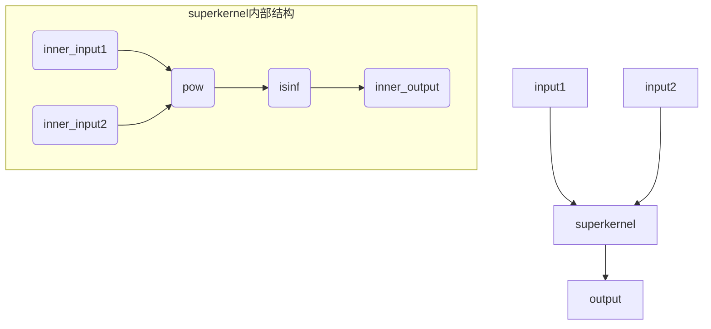

# super_kernel极简sample

## 用例功能：
该sample展示了如何使用super_kernel完成算子融合，包括算子融合的定义、编译、执行等。
核心特点：
- 依赖简单，仅依赖AscendC与runtime环境。
- 使用python封装底层c接口，简化开发流程。

## 目录结构
```
├── super_kernel_runtime_ascendc_only             # 目录
   └── superkernel_runtime_ascendc_basic.py       # 主入口，流程上包含子kernel编译、superkernel编译、内存分配、加载执行等
   └── compile_sk.py                              # 编译sub_kernel、super_kernel算子
   └── utils.py                                   # 工具函数

```

## 用例介绍



该用例通过编译时依赖ascendc，执行时依赖runtime，展示了super_kernel的基本功能。主要分为几步：
- 1. 初始化
- 2. 编译sub_kernel，编译super_kernel，设置super kernel中子kernel的topo关系，便于内存分配
- 3. 内存分配，输入数据构造
- 4. kernel加载
- 5. launch执行，包含args排布等
- 6. 打印输出, 输出结果校验
- 7. 资源清理释放，包括内存、kernel、stream等

> 解释说明：
> 1. 子kernel的拓扑关系，通过字符串表示，比如pow的输出是isinf的输入，则pow的output与isinf的input使用相同字符串表示
> 2. 分配内存时通过字符串来表达内存相同的内存地址
> 3. launch args时，按照[pow_in1, pow_in2, pow_ws, isinf_in1, isinf_out1, isinf_ws]排布

## 执行命令

```
python3 superkernel_runtime_ascendc_basic.py
```

## 预期执行结果

执行后打印显示success
```
execute sample success
```
